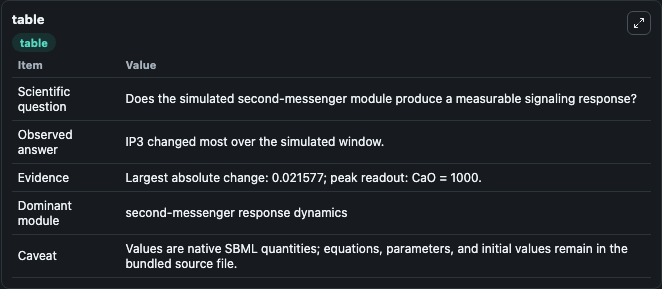
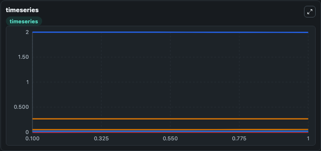
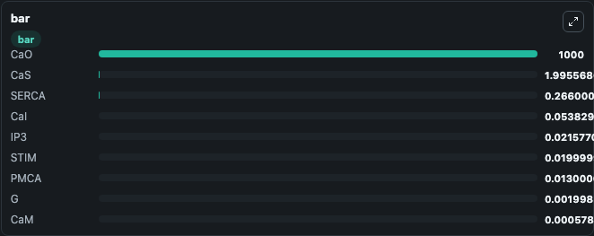

# Abell2011_CalciumSignaling_WithAdaptation

This Biosimulant lab wraps `Abell2011_CalciumSignaling_WithAdaptation` as a runnable signaling model with a companion visualization module.
Clean Biosimulant lab for calcium and second-messenger signaling. It can be used to explore second-messenger and pathway-signaling dynamics and compare scenario outcomes across configurations.

## What You'll See

The lab asks: How do calcium-linked states respond in Abell2011 CalciumSignaling WithAdaptation? It runs for 1.0 time units with a communication step of 0.1. The run uses the model defaults declared by the curated SBML wrapper. The generated visualizations focus on intracellular calcium, IP3, source-defined G state, PMCA calcium pump, SERCA calcium pump, and STIM calcium sensor, and related outputs, combining trajectory, endpoint-comparison, and summary-table views from one completed dark-mode run.

In this captured run, **IP3** moved from 0 to 0.0216 across 1.0 simulation windows.

<!-- BIOSIMULANT_VISUALS_START -->
### Output Visualizations



*Summary table for Abell2011_CalciumSignaling_WithAdaptation, reporting the scientific question, observed answer, dominant module, and caveat.*



*Trajectories of IP3, CaS, CaI, CaM, G, and PMCA across the 1.0 simulation. In this run **IP3** climbed from 0 to 0.0216 and **CaS** fell from 2.000 to 1.996 — the largest movements among the focused observables.*



*Largest-excursion ranking of the focused observables — the absolute movement magnitude during the run. Top 3: **CaO** = 1000.0, **CaS** = 1.996, **SERCA** = 0.2660, with 6 more observables below.*

<!-- BIOSIMULANT_VISUALS_END -->

## Model Context

- Core model: `models/core`
- Visualization model: `models/visualisation`
- Standard: `other`
- Upstream source: `biomodels_ebi:BIOMD0000000355`
- License: `CC0`
- Visual scope: calcium second-messenger signaling
- Caveat: Values are native SBML quantities; equations, parameters, units, and initial values remain in the bundled source file.

## Inputs

| Input | Maps To | Default | Notes |
|---|---|---|---|
| Initial intracellular calcium | `signaling_sbml_abell2011_calciumsignaling_withadaptation_biomd0000000355_model.initial_intracellular_calcium` |  | Initial level of intracellular calcium. Maps to SBML symbol `CaI`; exposed as a traceable initial-condition perturbation. |

## Outputs

| Output | Maps To | Role |
|---|---|---|
| `intracellular_calcium` | `signaling_sbml_abell2011_calciumsignaling_withadaptation_biomd0000000355_model.intracellular_calcium` | intracellular calcium. |
| `pmca_calcium_pump` | `signaling_sbml_abell2011_calciumsignaling_withadaptation_biomd0000000355_model.pmca_calcium_pump` | PMCA calcium pump. |
| `serca_calcium_pump` | `signaling_sbml_abell2011_calciumsignaling_withadaptation_biomd0000000355_model.serca_calcium_pump` | SERCA calcium pump. |
| `state` | `signaling_sbml_abell2011_calciumsignaling_withadaptation_biomd0000000355_model.state` | Available to the visualization model and downstream workflows. |
| `summary` | `signaling_sbml_abell2011_calciumsignaling_withadaptation_biomd0000000355_model.summary` | Available to the visualization model and downstream workflows. |
| `species_labels` | `signaling_sbml_abell2011_calciumsignaling_withadaptation_biomd0000000355_model.species_labels` | Available to the visualization model and downstream workflows. |

## Runtime

- Duration: `1.0`
- Communication step: `0.1`

## Running Locally

```bash
biosimulant labs serve .
```
