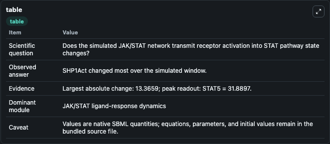
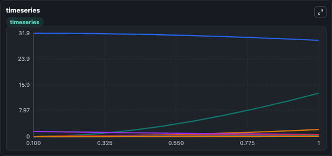
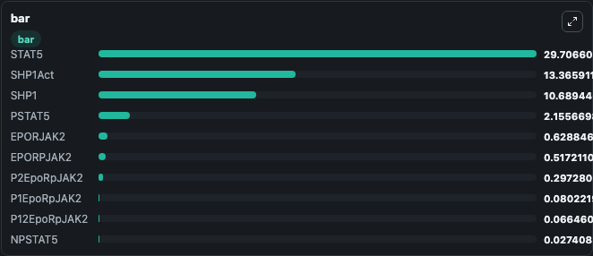

# Adlung2021 - Cell-to-cell variability in JAK2/STAT5 pathway

This Biosimulant lab wraps `Adlung2021 - Cell-to-cell variability in JAK2/STAT5 pathway` as a runnable signaling model with a companion visualization module.
Clean Biosimulant lab for JAK/STAT cytokine signaling. It can be used to explore second-messenger and pathway-signaling dynamics and compare scenario outcomes across configurations.

## What You'll See

The lab asks: How does Adlung2021 - Cell-to-cell variability in JAK2/STAT5 pathway transmit cytokine receptor activity into STAT pathway states? It runs for 1.0 time units with a communication step of 0.1. The run uses the model defaults declared by the curated SBML wrapper. The generated visualizations focus on EPO receptor-JAK2 complex, phosphorylated EPO receptor-JAK2 complex, site 1 phosphorylated EPO receptor-JAK2 complex, site 2 phosphorylated EPO receptor-JAK2 complex, dual-site phosphorylated EPO receptor-JAK2 complex, and SHP1 phosphatase, and related outputs, combining trajectory, endpoint-comparison, and summary-table views from one completed dark-mode run.

In this captured run, **SHP1Act** moved from 0 to 13.366 across 1.0 simulation windows.

<!-- BIOSIMULANT_VISUALS_START -->
### Output Visualizations



*Summary table for Adlung2021 - Cell-to-cell variability in JAK2/STAT5 pathway, reporting the scientific question, observed answer, dominant module, and caveat.*



*Trajectories of SHP1Act, STAT5, PSTAT5, EPORJAK2, EPORPJAK2, and P2EpoRpJAK2 across the 1.0 simulation. In this run **SHP1Act** climbed from 0 to 13.366 and **STAT5** fell from 31.890 to 29.707 — the largest movements among the focused observables.*



*Largest-excursion ranking of the focused observables — the absolute movement magnitude during the run. Top 3: **STAT5** = 29.707, **SHP1Act** = 13.366, **SHP1** = 10.689, with 7 more observables below.*

<!-- BIOSIMULANT_VISUALS_END -->

## Model Context

- Core model: `models/core`
- Visualization model: `models/visualisation`
- Standard: `other`
- Upstream source: `biomodels_ebi:BIOMD0000001077`
- License: `CC0`
- Visual scope: JAK/STAT receptor-to-transcription signaling
- Caveat: Values are native SBML quantities; equations, parameters, units, and initial values remain in the bundled source file.

## Inputs

| Input | Maps To | Default | Notes |
|---|---|---|---|
| Initial EPO receptor-JAK2 complex | `signaling_sbml_adlung2021_cell_to_cell_variability_in_jak2_stat_biomd0000001077_model.initial_epo_receptor_jak2_complex` |  | Initial level of EPO receptor-JAK2 complex. Maps to SBML symbol `EpoRJAK2`; exposed as a traceable initial-condition perturbation. |

## Outputs

| Output | Maps To | Role |
|---|---|---|
| `stat5` | `signaling_sbml_adlung2021_cell_to_cell_variability_in_jak2_stat_biomd0000001077_model.stat5` | STAT5. |
| `phosphorylated_stat5` | `signaling_sbml_adlung2021_cell_to_cell_variability_in_jak2_stat_biomd0000001077_model.phosphorylated_stat5` | phosphorylated STAT5. |
| `nuclear_phosphorylated_stat5` | `signaling_sbml_adlung2021_cell_to_cell_variability_in_jak2_stat_biomd0000001077_model.nuclear_phosphorylated_stat5` | nuclear phosphorylated STAT5. |
| `state` | `signaling_sbml_adlung2021_cell_to_cell_variability_in_jak2_stat_biomd0000001077_model.state` | Available to the visualization model and downstream workflows. |
| `summary` | `signaling_sbml_adlung2021_cell_to_cell_variability_in_jak2_stat_biomd0000001077_model.summary` | Available to the visualization model and downstream workflows. |
| `species_labels` | `signaling_sbml_adlung2021_cell_to_cell_variability_in_jak2_stat_biomd0000001077_model.species_labels` | Available to the visualization model and downstream workflows. |

## Runtime

- Duration: `1.0`
- Communication step: `0.1`

## Running Locally

```bash
biosimulant labs serve .
```
