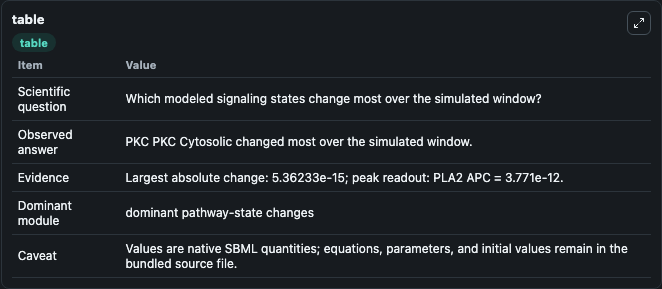
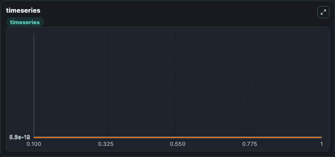
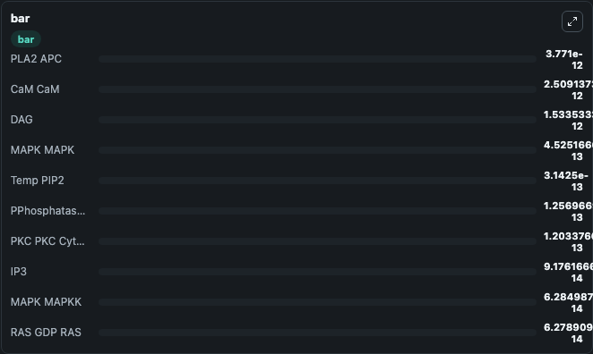

# Ajay_Bhalla_2007_Bistable

This Biosimulant lab wraps `Ajay_Bhalla_2007_Bistable` as a runnable signaling model with a companion visualization module.
Clean Biosimulant lab for systems signaling model: Ajay_Bhalla_2007_Bistable. It can be used to explore second-messenger and pathway-signaling dynamics and compare scenario outcomes across configurations.

## What You'll See

The lab asks: How does Ajay Bhalla 2007 Bistable express its source-modeled signaling motif over the baseline run? It runs for 1.0 time units with a communication step of 0.1. The run uses the model defaults declared by the curated SBML wrapper. The generated visualizations focus on Calcium bound PKC, DAG And Arachidonic Acid active PKC, Arachidonic Acid active Calcium bound PKC, Membrane active Calcium bound PKC, Membrane active DAG bound PKC, and Basal active PKC, and related outputs, combining trajectory, endpoint-comparison, and summary-table views from one completed dark-mode run.

In this captured run, **PKC PKC Cytosolic** moved from 1.26e-13 to 1.2e-13 across 1.0 simulation windows.

<!-- BIOSIMULANT_VISUALS_START -->
### Output Visualizations



*Summary table for Ajay_Bhalla_2007_Bistable, reporting the scientific question, observed answer, dominant module, and caveat.*



*Trajectories of PKC PKC Cytosolic, CaM CaM, CaM CaM TR2 CA2, Ca, PKC Active, and AA across the 1.0 simulation. In this run **CaM CaM TR2 CA2** climbed from 0 to 4.79e-15 and **PKC PKC Cytosolic** fell from 1.26e-13 to 1.2e-13 — the largest movements among the focused observables.*



*Largest-excursion ranking of the focused observables — the absolute movement magnitude during the run. Top 3: **PLA2 APC** = 3.77e-12, **CaM CaM** = 2.51e-12, **DAG** = 1.53e-12, with 7 more observables below.*

<!-- BIOSIMULANT_VISUALS_END -->

## Model Context

- Core model: `models/core`
- Visualization model: `models/visualisation`
- Standard: `other`
- Upstream source: `biomodels_ebi:MODEL9147091146`
- License: `CC0`
- Visual scope: phosphorylation and regulatory motif dynamics
- Caveat: Values are native SBML quantities; equations, parameters, units, and initial values remain in the bundled source file.

## Inputs

| Input | Maps To | Default | Notes |
|---|---|---|---|
| Initial calcium Input | `signaling_sbml_ajay_bhalla_2007_bistable_model9147091146_model.initial_calcium_input` |  | Initial level of calcium Input. Maps to SBML symbol `Ca_input`; exposed as a traceable initial-condition perturbation. |
| Initial DAG | `signaling_sbml_ajay_bhalla_2007_bistable_model9147091146_model.initial_dag` |  | Initial level of DAG. Maps to SBML symbol `DAG`; exposed as a traceable initial-condition perturbation. |
| Initial IP3 | `signaling_sbml_ajay_bhalla_2007_bistable_model9147091146_model.initial_ip3` |  | Initial level of IP3. Maps to SBML symbol `IP3`; exposed as a traceable initial-condition perturbation. |

## Outputs

| Output | Maps To | Role |
|---|---|---|
| `calcium_bound_pkc` | `signaling_sbml_ajay_bhalla_2007_bistable_model9147091146_model.calcium_bound_pkc` | Calcium bound PKC. |
| `arachidonic_acid_active_calcium_bound_pkc` | `signaling_sbml_ajay_bhalla_2007_bistable_model9147091146_model.arachidonic_acid_active_calcium_bound_pkc` | Arachidonic Acid active Calcium bound PKC. |
| `membrane_active_calcium_bound_pkc` | `signaling_sbml_ajay_bhalla_2007_bistable_model9147091146_model.membrane_active_calcium_bound_pkc` | Membrane active Calcium bound PKC. |
| `state` | `signaling_sbml_ajay_bhalla_2007_bistable_model9147091146_model.state` | Available to the visualization model and downstream workflows. |
| `summary` | `signaling_sbml_ajay_bhalla_2007_bistable_model9147091146_model.summary` | Available to the visualization model and downstream workflows. |
| `species_labels` | `signaling_sbml_ajay_bhalla_2007_bistable_model9147091146_model.species_labels` | Available to the visualization model and downstream workflows. |

## Runtime

- Duration: `1.0`
- Communication step: `0.1`

## Running Locally

```bash
biosimulant labs serve .
```
