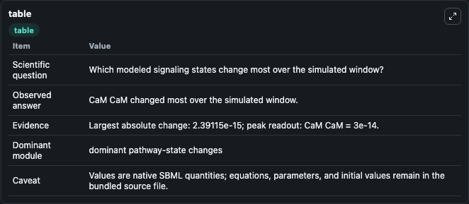
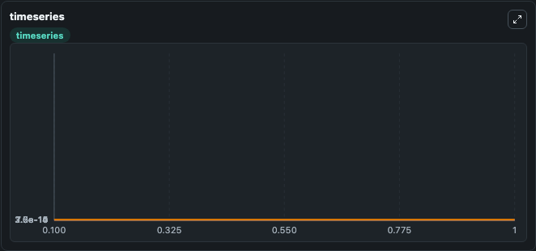
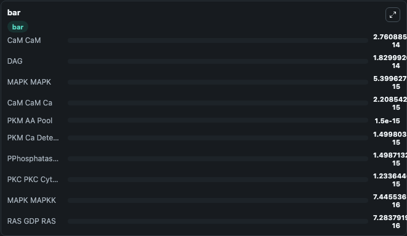

# Ajay_Bhalla_2007_PKM

This Biosimulant lab wraps `Ajay_Bhalla_2007_PKM` as a runnable signaling model with a companion visualization module.
Clean Biosimulant lab for systems signaling model: Ajay_Bhalla_2007_PKM. It can be used to explore second-messenger and pathway-signaling dynamics and compare scenario outcomes across configurations.

## What You'll See

The lab asks: What baseline signaling response is generated by Ajay Bhalla 2007 PKM? It runs for 1.0 time units with a communication step of 0.1. The run uses the model defaults declared by the curated SBML wrapper. The generated visualizations focus on Calcium bound PKC, Membrane active Calcium bound PKC, Membrane active DAG bound PKC, Calcium And DAG bound PKC, DAG bound PKC, and cytosolic PKC, and related outputs, combining trajectory, endpoint-comparison, and summary-table views from one completed dark-mode run.

In this captured run, **CaM CaM** moved from 3e-14 to 2.76e-14 across 1.0 simulation windows.

<!-- BIOSIMULANT_VISUALS_START -->
### Output Visualizations



*Summary table for Ajay_Bhalla_2007_PKM, reporting the scientific question, observed answer, dominant module, and caveat.*



*Trajectories of CaM CaM, CaM CaM Ca, PKC PKC Cytosolic, CaM CaM CA2, PKC PKC Ca, and PKC PKC DAG across the 1.0 simulation. In this run **CaM CaM Ca** climbed from 0 to 2.21e-15 and **CaM CaM** fell from 3e-14 to 2.76e-14 — the largest movements among the focused observables.*



*Largest-excursion ranking of the focused observables — the absolute movement magnitude during the run. Top 3: **CaM CaM** = 2.76e-14, **DAG** = 1.83e-14, **MAPK MAPK** = 5.4e-15, with 7 more observables below.*

<!-- BIOSIMULANT_VISUALS_END -->

## Model Context

- Core model: `models/core`
- Visualization model: `models/visualisation`
- Standard: `other`
- Upstream source: `biomodels_ebi:MODEL9147232940`
- License: `CC0`
- Visual scope: curated source-model signaling response
- Caveat: Values are native SBML quantities; equations, parameters, units, and initial values remain in the bundled source file.

## Inputs

| Input | Maps To | Default | Notes |
|---|---|---|---|
| Initial calcium Input | `signaling_sbml_ajay_bhalla_2007_pkm_model9147232940_model.initial_calcium_input` |  | Initial level of calcium Input. Maps to SBML symbol `Ca_input`; exposed as a traceable initial-condition perturbation. |
| Initial DAG | `signaling_sbml_ajay_bhalla_2007_pkm_model9147232940_model.initial_dag` |  | Initial level of DAG. Maps to SBML symbol `DAG`; exposed as a traceable initial-condition perturbation. |
| Initial active PKC | `signaling_sbml_ajay_bhalla_2007_pkm_model9147232940_model.initial_active_pkc` |  | Initial level of active PKC. Maps to SBML symbol `PKC_minus_active`; exposed as a traceable initial-condition perturbation. |

## Outputs

| Output | Maps To | Role |
|---|---|---|
| `calcium_bound_pkc` | `signaling_sbml_ajay_bhalla_2007_pkm_model9147232940_model.calcium_bound_pkc` | Calcium bound PKC. |
| `membrane_active_calcium_bound_pkc` | `signaling_sbml_ajay_bhalla_2007_pkm_model9147232940_model.membrane_active_calcium_bound_pkc` | Membrane active Calcium bound PKC. |
| `calcium_and_dag_bound_pkc` | `signaling_sbml_ajay_bhalla_2007_pkm_model9147232940_model.calcium_and_dag_bound_pkc` | Calcium And DAG bound PKC. |
| `state` | `signaling_sbml_ajay_bhalla_2007_pkm_model9147232940_model.state` | Available to the visualization model and downstream workflows. |
| `summary` | `signaling_sbml_ajay_bhalla_2007_pkm_model9147232940_model.summary` | Available to the visualization model and downstream workflows. |
| `species_labels` | `signaling_sbml_ajay_bhalla_2007_pkm_model9147232940_model.species_labels` | Available to the visualization model and downstream workflows. |

## Runtime

- Duration: `1.0`
- Communication step: `0.1`

## Running Locally

```bash
biosimulant labs serve .
```
