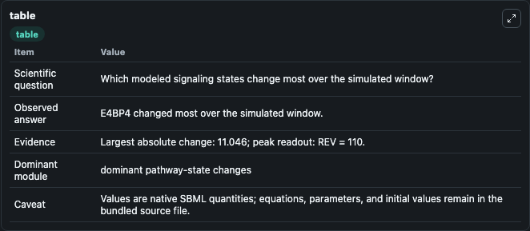
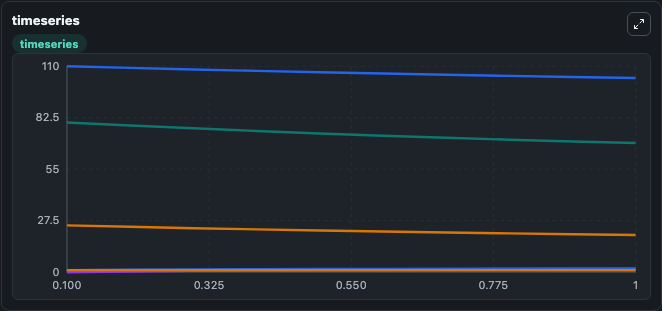
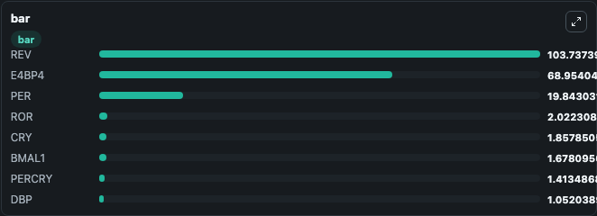

# Almeida2019 - Transcription-based circadian mechanism controls the duration of molecular clock states in response to signaling inputs

This Biosimulant lab wraps `Almeida2019 - Transcription-based circadian mechanism controls the duration of molecular clock states in response to signaling inputs` as a runnable signaling model with a companion visualization module.
Clean Biosimulant lab for circadian regulatory signaling. It can be used to explore second-messenger and pathway-signaling dynamics and compare scenario outcomes across configurations.

## What You'll See

The lab asks: How does Almeida2019 - Transcription-based circadian mechanism controls the duration of molecular clock states in response to signaling inputs transmit cytokine receptor activity into STAT pathway states? It runs for 1.0 time units with a communication step of 0.1. The run uses the model defaults declared by the curated SBML wrapper. The generated visualizations focus on source-defined BMAL1 state, source-defined ROR state, source-defined REV state, source-defined DBP state, E4BP4, and source-defined CRY state, and related outputs, combining trajectory, endpoint-comparison, and summary-table views from one completed dark-mode run.

In this captured run, **E4BP4** moved from 80.000 to 68.954 across 1.0 simulation windows.

<!-- BIOSIMULANT_VISUALS_START -->
### Output Visualizations



*Summary table for Almeida2019 - Transcription-based circadian mechanism controls the duration of molecular clock states in response to signaling inputs, reporting the scientific question, observed answer, dominant module, and caveat.*



*Trajectories of E4BP4, REV, PER, PERCRY, ROR, and CRY across the 1.0 simulation. In this run **PERCRY** climbed from 0 to 1.413 and **E4BP4** fell from 80.000 to 68.954 — the largest movements among the focused observables.*



*Largest-excursion ranking of the focused observables — the absolute movement magnitude during the run. Top 3: **REV** = 103.7, **E4BP4** = 68.954, **PER** = 19.843, with 5 more observables below.*

<!-- BIOSIMULANT_VISUALS_END -->

## Model Context

- Core model: `models/core`
- Visualization model: `models/visualisation`
- Standard: `other`
- Upstream source: `biomodels_ebi:BIOMD0000000839`
- License: `CC0`
- Visual scope: JAK/STAT receptor-to-transcription signaling
- Caveat: Values are native SBML quantities; equations, parameters, units, and initial values remain in the bundled source file.

## Inputs

| Input | Maps To | Default | Notes |
|---|---|---|---|
| Initial source-defined BMAL1 state | `signaling_sbml_almeida2019_transcription_based_circadian_mechan_biomd0000000839_model.initial_source_defined_bmal1_state` |  | Initial level of source-defined BMAL1 state. Maps to SBML symbol `BMAL1`; exposed as a traceable initial-condition perturbation. |

## Outputs

| Output | Maps To | Role |
|---|---|---|
| `source_defined_bmal1_state` | `signaling_sbml_almeida2019_transcription_based_circadian_mechan_biomd0000000839_model.source_defined_bmal1_state` | source-defined BMAL1 state. |
| `source_defined_ror_state` | `signaling_sbml_almeida2019_transcription_based_circadian_mechan_biomd0000000839_model.source_defined_ror_state` | source-defined ROR state. |
| `source_defined_rev_state` | `signaling_sbml_almeida2019_transcription_based_circadian_mechan_biomd0000000839_model.source_defined_rev_state` | source-defined REV state. |
| `state` | `signaling_sbml_almeida2019_transcription_based_circadian_mechan_biomd0000000839_model.state` | Available to the visualization model and downstream workflows. |
| `summary` | `signaling_sbml_almeida2019_transcription_based_circadian_mechan_biomd0000000839_model.summary` | Available to the visualization model and downstream workflows. |
| `species_labels` | `signaling_sbml_almeida2019_transcription_based_circadian_mechan_biomd0000000839_model.species_labels` | Available to the visualization model and downstream workflows. |

## Runtime

- Duration: `1.0`
- Communication step: `0.1`

## Running Locally

```bash
biosimulant labs serve .
```
