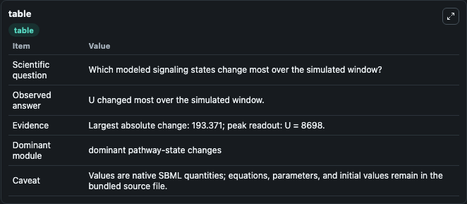
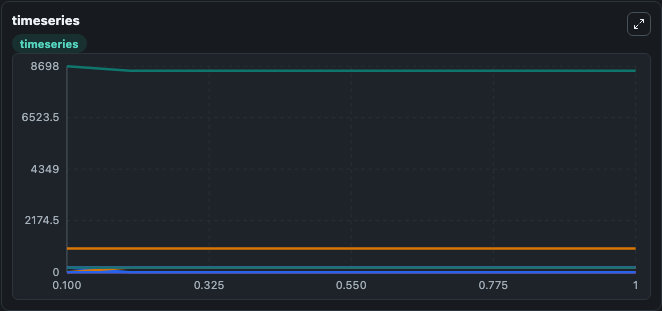
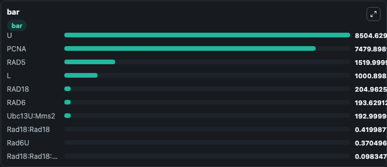

# Amara2013 - PCNA ubiquitylation in the activation of PRR pathway

This Biosimulant lab wraps `Amara2013 - PCNA ubiquitylation in the activation of PRR pathway` as a runnable signaling model with a companion visualization module.
Clean Biosimulant lab for systems signaling model: Amara2013 - PCNA ubiquitylation in the activation of PRR pathway. It can be used to explore second-messenger and pathway-signaling dynamics and compare scenario outcomes across configurations.

## What You'll See

The lab asks: How does Amara2013 - PCNA ubiquitylation in the activation of PRR pathway shift hormone-linked signaling readouts? It runs for 1.0 time units with a communication step of 0.1. The run uses the model defaults declared by the curated SBML wrapper. The generated visualizations focus on source-defined L state, PCNA, active PCNA, Rad18 Rad18, Rad18, and Rad6, and related outputs, combining trajectory, endpoint-comparison, and summary-table views from one completed dark-mode run.

In this captured run, **U** moved from 8698.0 to 8504.6 across 1.0 simulation windows.

<!-- BIOSIMULANT_VISUALS_START -->
### Output Visualizations



*Summary table for Amara2013 - PCNA ubiquitylation in the activation of PRR pathway, reporting the scientific question, observed answer, dominant module, and caveat.*



*Trajectories of U, Ubc13:Mms2, Ubc13U:Mms2, RAD18, Rad18:Rad18, and RAD6 across the 1.0 simulation. In this run **Ubc13U:Mms2** climbed from 0 to 193.0 and **U** fell from 8698.0 to 8504.6 — the largest movements among the focused observables.*



*Largest-excursion ranking of the focused observables — the absolute movement magnitude during the run. Top 3: **U** = 8504.6, **PCNA** = 7479.9, **RAD5** = 1520.0, with 7 more observables below.*

<!-- BIOSIMULANT_VISUALS_END -->

## Model Context

- Core model: `models/core`
- Visualization model: `models/visualisation`
- Standard: `other`
- Upstream source: `biomodels_ebi:BIOMD0000000475`
- License: `CC0`
- Visual scope: metabolic and hormone signaling response
- Caveat: Values are native SBML quantities; equations, parameters, units, and initial values remain in the bundled source file.

## Inputs

| Input | Maps To | Default | Notes |
|---|---|---|---|
| Initial source-defined L state | `signaling_sbml_amara2013_pcna_ubiquitylation_in_the_activation_biomd0000000475_model.initial_source_defined_l_state` |  | Initial level of source-defined L state. Maps to SBML symbol `species_1`; exposed as a traceable initial-condition perturbation. |

## Outputs

| Output | Maps To | Role |
|---|---|---|
| `pcna` | `signaling_sbml_amara2013_pcna_ubiquitylation_in_the_activation_biomd0000000475_model.pcna` | PCNA. |
| `active_pcna` | `signaling_sbml_amara2013_pcna_ubiquitylation_in_the_activation_biomd0000000475_model.active_pcna` | active PCNA. |
| `rad18_rad18` | `signaling_sbml_amara2013_pcna_ubiquitylation_in_the_activation_biomd0000000475_model.rad18_rad18` | Rad18 Rad18. |
| `state` | `signaling_sbml_amara2013_pcna_ubiquitylation_in_the_activation_biomd0000000475_model.state` | Available to the visualization model and downstream workflows. |
| `summary` | `signaling_sbml_amara2013_pcna_ubiquitylation_in_the_activation_biomd0000000475_model.summary` | Available to the visualization model and downstream workflows. |
| `species_labels` | `signaling_sbml_amara2013_pcna_ubiquitylation_in_the_activation_biomd0000000475_model.species_labels` | Available to the visualization model and downstream workflows. |

## Runtime

- Duration: `1.0`
- Communication step: `0.1`

## Running Locally

```bash
biosimulant labs serve .
```
