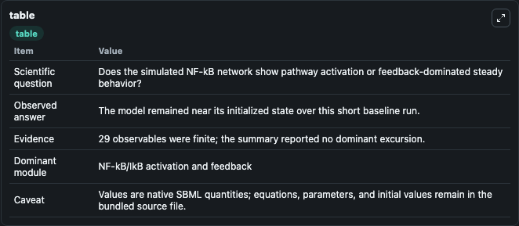
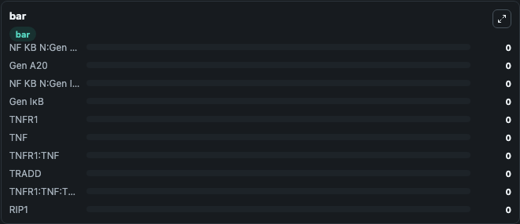

# Amstein2017 - TNFR1-mediated Nf-κB signaling, Petri Net

This Biosimulant lab wraps `Amstein2017 - TNFR1-mediated Nf-κB signaling, Petri Net` as a runnable signaling model with a companion visualization module.
Clean Biosimulant lab for NF-kB pathway signaling. It can be used to explore second-messenger and pathway-signaling dynamics and compare scenario outcomes across configurations.

## What You'll See

The lab asks: How does Amstein2017 - TNFR1-mediated Nf-κB signaling, Petri Net move NF-kB and inhibitor-linked signaling states? It runs for 1.0 time units with a communication step of 0.1. The run uses the model defaults declared by the curated SBML wrapper. The generated visualizations focus on NF B N Gen A20, Gen A20, NF B N Gen I B, Gen I B, TNF receptor 1, and TNF, and related outputs, combining trajectory, endpoint-comparison, and summary-table views from one completed dark-mode run.

In this captured run, **NF ΚB N:Gen A20** moved from 0 to 0 across 1.0 simulation windows.

<!-- BIOSIMULANT_VISUALS_START -->
### Output Visualizations



*Summary table for Amstein2017 - TNFR1-mediated Nf-κB signaling, Petri Net, reporting the scientific question, observed answer, dominant module, and caveat.*


*Trajectories of NF ΚB N:Gen A20, Gen A20, NF ΚB N:Gen IκB, Gen IκB, TNFR1, and TNF across the 1.0 simulation. In this run NF ΚB N:Gen A20, Gen A20, NF ΚB N:Gen IκB, Gen IκB stayed near their initial values — no observable moved appreciably.*



*Largest-excursion ranking of the focused observables — the absolute movement magnitude during the run. Top 3: **NF ΚB N:Gen A20** = 0, **Gen A20** = 0, **NF ΚB N:Gen IκB** = 0, with 7 more observables below.*

<!-- BIOSIMULANT_VISUALS_END -->

## Model Context

- Core model: `models/core`
- Visualization model: `models/visualisation`
- Standard: `other`
- Upstream source: `biomodels_ebi:MODEL2312010001`
- License: `CC0`
- Visual scope: NF-kB activation and feedback signaling
- Caveat: Values are native SBML quantities; equations, parameters, units, and initial values remain in the bundled source file.

## Inputs

| Input | Maps To | Default | Notes |
|---|---|---|---|
| Initial TNF | `signaling_sbml_amstein2017_tnfr1_mediated_nf_b_signaling_petri_model2312010001_model.initial_tnf` |  | Initial level of TNF. Maps to SBML symbol `P5`; exposed as a traceable initial-condition perturbation. |
| Initial TNF receptor 1 | `signaling_sbml_amstein2017_tnfr1_mediated_nf_b_signaling_petri_model2312010001_model.initial_tnf_receptor_1` |  | Initial level of TNF receptor 1. Maps to SBML symbol `P4`; exposed as a traceable initial-condition perturbation. |
| Initial TNF receptor 1 TNF | `signaling_sbml_amstein2017_tnfr1_mediated_nf_b_signaling_petri_model2312010001_model.initial_tnf_receptor_1_tnf` |  | Initial level of TNF receptor 1 TNF. Maps to SBML symbol `P6`; exposed as a traceable initial-condition perturbation. |

## Outputs

| Output | Maps To | Role |
|---|---|---|
| `nf_b_n_gen_a20` | `signaling_sbml_amstein2017_tnfr1_mediated_nf_b_signaling_petri_model2312010001_model.nf_b_n_gen_a20` | NF B N Gen A20. |
| `nf_b_n_gen_i_b` | `signaling_sbml_amstein2017_tnfr1_mediated_nf_b_signaling_petri_model2312010001_model.nf_b_n_gen_i_b` | NF B N Gen I B. |
| `tnf_receptor_1` | `signaling_sbml_amstein2017_tnfr1_mediated_nf_b_signaling_petri_model2312010001_model.tnf_receptor_1` | TNF receptor 1. |
| `state` | `signaling_sbml_amstein2017_tnfr1_mediated_nf_b_signaling_petri_model2312010001_model.state` | Available to the visualization model and downstream workflows. |
| `summary` | `signaling_sbml_amstein2017_tnfr1_mediated_nf_b_signaling_petri_model2312010001_model.summary` | Available to the visualization model and downstream workflows. |
| `species_labels` | `signaling_sbml_amstein2017_tnfr1_mediated_nf_b_signaling_petri_model2312010001_model.species_labels` | Available to the visualization model and downstream workflows. |

## Runtime

- Duration: `1.0`
- Communication step: `0.1`

## Running Locally

```bash
biosimulant labs serve .
```
