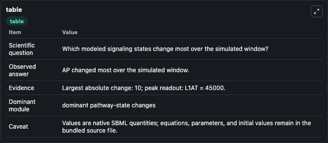
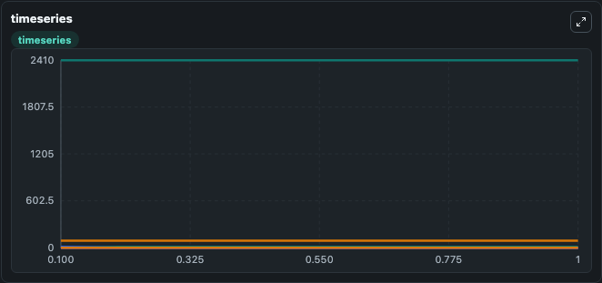
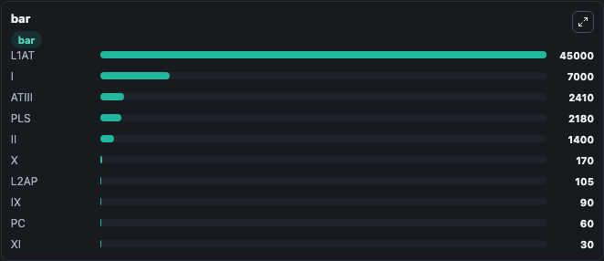

# Anand2003 - Reactions of the Intrinsic Pathway of Blood Coagulation with Platelet Activation

This Biosimulant lab wraps `Anand2003 - Reactions of the Intrinsic Pathway of Blood Coagulation with Platelet Activation` as a runnable signaling model with a companion visualization module.
Clean Biosimulant lab for systems signaling model: Anand2003 - Reactions of the Intrinsic Pathway of Blood Coagulation with Platelet Activation. It can be used to explore second-messenger and pathway-signaling dynamics and compare scenario outcomes across configurations.

## What You'll See

The lab asks: How does Anand2003 - Reactions of the Intrinsic Pathway of Blood Coagulation with Platelet Activation shift hormone-linked signaling readouts? It runs for 1.0 time units with a communication step of 0.1. The run uses the model defaults declared by the curated SBML wrapper. The generated visualizations focus on source-defined IX state, activated clotting factor IX, activated clotting factor XI, ATIII, activated clotting factor IX ATIII, and source-defined IIA state, and related outputs, combining trajectory, endpoint-comparison, and summary-table views from one completed dark-mode run.

In this captured run, **AP** moved from 0.5000 to 10.500 across 1.0 simulation windows.

<!-- BIOSIMULANT_VISUALS_START -->
### Output Visualizations



*Summary table for Anand2003 - Reactions of the Intrinsic Pathway of Blood Coagulation with Platelet Activation, reporting the scientific question, observed answer, dominant module, and caveat.*



*Trajectories of AP, RP, IX, IXa, XIa, and ATIII across the 1.0 simulation. In this run **AP** climbed from 0.5000 to 10.500 and **RP** fell from 10.000 to 2.84e-72 — the largest movements among the focused observables.*



*Largest-excursion ranking of the focused observables — the absolute movement magnitude during the run. Top 3: **L1AT** = 4.5e+04, **I** = 7000.0, **ATIII** = 2410.0, with 7 more observables below.*

<!-- BIOSIMULANT_VISUALS_END -->

## Model Context

- Core model: `models/core`
- Visualization model: `models/visualisation`
- Standard: `other`
- Upstream source: `biomodels_ebi:MODEL1806130003`
- License: `CC0`
- Visual scope: metabolic and hormone signaling response
- Caveat: Values are native SBML quantities; equations, parameters, units, and initial values remain in the bundled source file.

## Inputs

| Input | Maps To | Default | Notes |
|---|---|---|---|
| Initial source-defined IX state | `signaling_sbml_anand2003_reactions_of_the_intrinsic_pathway_of_model1806130003_model.initial_source_defined_ix_state` |  | Initial level of source-defined IX state. Maps to SBML symbol `IX`; exposed as a traceable initial-condition perturbation. |

## Outputs

| Output | Maps To | Role |
|---|---|---|
| `activated_clotting_factor_ix` | `signaling_sbml_anand2003_reactions_of_the_intrinsic_pathway_of_model1806130003_model.activated_clotting_factor_ix` | activated clotting factor IX. |
| `activated_clotting_factor_xi` | `signaling_sbml_anand2003_reactions_of_the_intrinsic_pathway_of_model1806130003_model.activated_clotting_factor_xi` | activated clotting factor XI. |
| `atiii` | `signaling_sbml_anand2003_reactions_of_the_intrinsic_pathway_of_model1806130003_model.atiii` | ATIII. |
| `state` | `signaling_sbml_anand2003_reactions_of_the_intrinsic_pathway_of_model1806130003_model.state` | Available to the visualization model and downstream workflows. |
| `summary` | `signaling_sbml_anand2003_reactions_of_the_intrinsic_pathway_of_model1806130003_model.summary` | Available to the visualization model and downstream workflows. |
| `species_labels` | `signaling_sbml_anand2003_reactions_of_the_intrinsic_pathway_of_model1806130003_model.species_labels` | Available to the visualization model and downstream workflows. |

## Runtime

- Duration: `1.0`
- Communication step: `0.1`

## Running Locally

```bash
biosimulant labs serve .
```
