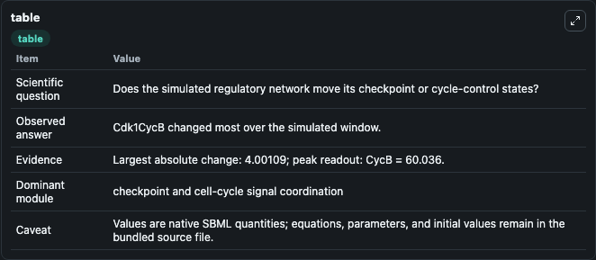
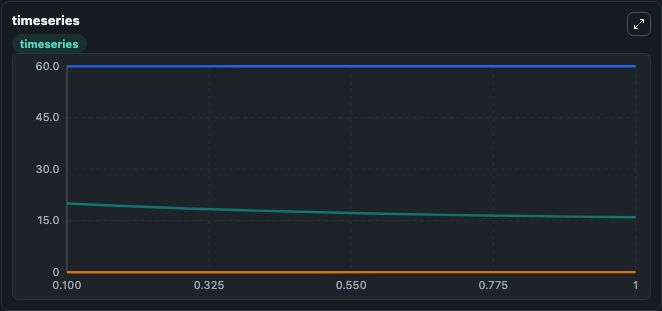
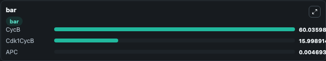

# Araujo2016 - Positive feedback in Cdk1 signalling keeps mitotic duration short and constant

This Biosimulant lab wraps `Araujo2016 - Positive feedback in Cdk1 signalling keeps mitotic duration short and constant` as a runnable signaling model with a companion visualization module.
Clean Biosimulant lab for cell-cycle regulatory signaling. It can be used to explore second-messenger and pathway-signaling dynamics and compare scenario outcomes across configurations.

## What You'll See

The lab asks: How does Araujo2016 - Positive feedback in Cdk1 signalling keeps mitotic duration short and constant move checkpoint or cycle-control signaling states? It runs for 1.0 time units with a communication step of 0.1. The run uses the model defaults declared by the curated SBML wrapper. The generated visualizations focus on Cdk1cyc B, source-defined APC state, and source-defined CYCB state, combining trajectory, endpoint-comparison, and summary-table views from one completed dark-mode run.

In this captured run, **Cdk1CycB** moved from 20.000 to 15.999 across 1.0 simulation windows.

<!-- BIOSIMULANT_VISUALS_START -->
### Output Visualizations



*Summary table for Araujo2016 - Positive feedback in Cdk1 signalling keeps mitotic duration short and constant, reporting the scientific question, observed answer, dominant module, and caveat.*



*Trajectories of Cdk1CycB, CycB, and APC across the 1.0 simulation. In this run **CycB** climbed from 60.000 to 60.036 and **Cdk1CycB** fell from 20.000 to 15.999 — the largest movements among the focused observables.*



*Largest-excursion ranking of the focused observables — the absolute movement magnitude during the run. Top 3: **CycB** = 60.036, **Cdk1CycB** = 15.999, **APC** = 0.00469.*

<!-- BIOSIMULANT_VISUALS_END -->

## Model Context

- Core model: `models/core`
- Visualization model: `models/visualisation`
- Standard: `other`
- Upstream source: `biomodels_ebi:BIOMD0000000657`
- License: `CC0`
- Visual scope: cell-cycle regulatory signaling
- Caveat: Values are native SBML quantities; equations, parameters, units, and initial values remain in the bundled source file.

## Inputs

| Input | Maps To | Default | Notes |
|---|---|---|---|
| Initial Cdk1cyc B | `signaling_sbml_araujo2016_positive_feedback_in_cdk1_signalling_biomd0000000657_model.initial_cdk1cyc_b` |  | Initial level of Cdk1cyc B. Maps to SBML symbol `Cdk1CycB`; exposed as a traceable initial-condition perturbation. |

## Outputs

| Output | Maps To | Role |
|---|---|---|
| `cdk1cyc_b` | `signaling_sbml_araujo2016_positive_feedback_in_cdk1_signalling_biomd0000000657_model.cdk1cyc_b` | Cdk1cyc B. |
| `source_defined_apc_state` | `signaling_sbml_araujo2016_positive_feedback_in_cdk1_signalling_biomd0000000657_model.source_defined_apc_state` | source-defined APC state. |
| `source_defined_cycb_state` | `signaling_sbml_araujo2016_positive_feedback_in_cdk1_signalling_biomd0000000657_model.source_defined_cycb_state` | source-defined CYCB state. |
| `state` | `signaling_sbml_araujo2016_positive_feedback_in_cdk1_signalling_biomd0000000657_model.state` | Available to the visualization model and downstream workflows. |
| `summary` | `signaling_sbml_araujo2016_positive_feedback_in_cdk1_signalling_biomd0000000657_model.summary` | Available to the visualization model and downstream workflows. |
| `species_labels` | `signaling_sbml_araujo2016_positive_feedback_in_cdk1_signalling_biomd0000000657_model.species_labels` | Available to the visualization model and downstream workflows. |

## Runtime

- Duration: `1.0`
- Communication step: `0.1`

## Running Locally

```bash
biosimulant labs serve .
```
