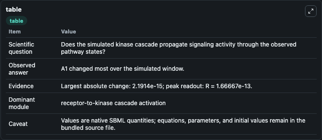
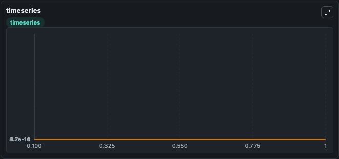
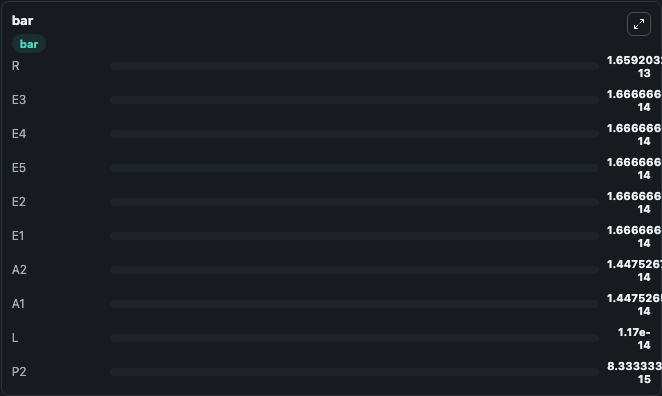

# Asthagiri2001_MAPK_Asthagiri_adapt_fb

This Biosimulant lab wraps `Asthagiri2001_MAPK_Asthagiri_adapt_fb` as a runnable signaling model with a companion visualization module.
Clean Biosimulant lab for MAPK/ERK receptor signaling. It can be used to explore second-messenger and pathway-signaling dynamics and compare scenario outcomes across configurations.

## What You'll See

The lab asks: How does Asthagiri2001 MAPK Asthagiri adapt fb propagate receptor or RAS/ERK pathway activity? It runs for 1.0 time units with a communication step of 0.1. The run uses the model defaults declared by the curated SBML wrapper. The generated visualizations focus on Source Defined R State, Source Defined C State, C active, Source Defined C2 State, Source Defined A1 State, and Source Defined A2 State, and related outputs, combining trajectory, endpoint-comparison, and summary-table views from one completed dark-mode run.

In this captured run, **A1** moved from 1.67e-14 to 1.45e-14 across 1.0 simulation windows.

<!-- BIOSIMULANT_VISUALS_START -->
### Output Visualizations



*Summary table for Asthagiri2001_MAPK_Asthagiri_adapt_fb, reporting the scientific question, observed answer, dominant module, and caveat.*



*Trajectories of A1, A2, A1A2, R, C, and C2 across the 1.0 simulation. In this run **A1A2** climbed from 0 to 2.19e-15 and **A1** fell from 1.67e-14 to 1.45e-14 — the largest movements among the focused observables.*



*Largest-excursion ranking of the focused observables — the absolute movement magnitude during the run. Top 3: **R** = 1.66e-13, **E3** = 1.67e-14, **E4** = 1.67e-14, with 7 more observables below.*

<!-- BIOSIMULANT_VISUALS_END -->

## Model Context

- Core model: `models/core`
- Visualization model: `models/visualisation`
- Standard: `other`
- Upstream source: `biomodels_ebi:MODEL9147975215`
- License: `CC0`
- Visual scope: receptor-to-MAPK cascade signaling
- Caveat: Values are native SBML quantities; equations, parameters, units, and initial values remain in the bundled source file.

## Inputs

| Input | Maps To | Default | Notes |
|---|---|---|---|
| Initial source-defined L state | `signaling_sbml_asthagiri2001_mapk_asthagiri_adapt_fb_model9147975215_model.initial_source_defined_l_state` |  | Initial level of source-defined L state. Maps to SBML symbol `L`; exposed as a traceable initial-condition perturbation. |

## Outputs

| Output | Maps To | Role |
|---|---|---|
| `c_active` | `signaling_sbml_asthagiri2001_mapk_asthagiri_adapt_fb_model9147975215_model.c_active` | C active. |
| `c_active_a1` | `signaling_sbml_asthagiri2001_mapk_asthagiri_adapt_fb_model9147975215_model.c_active_a1` | C active A1. |
| `a1a2` | `signaling_sbml_asthagiri2001_mapk_asthagiri_adapt_fb_model9147975215_model.a1a2` | A1A2. |
| `state` | `signaling_sbml_asthagiri2001_mapk_asthagiri_adapt_fb_model9147975215_model.state` | Available to the visualization model and downstream workflows. |
| `summary` | `signaling_sbml_asthagiri2001_mapk_asthagiri_adapt_fb_model9147975215_model.summary` | Available to the visualization model and downstream workflows. |
| `species_labels` | `signaling_sbml_asthagiri2001_mapk_asthagiri_adapt_fb_model9147975215_model.species_labels` | Available to the visualization model and downstream workflows. |

## Runtime

- Duration: `1.0`
- Communication step: `0.1`

## Running Locally

```bash
biosimulant labs serve .
```
