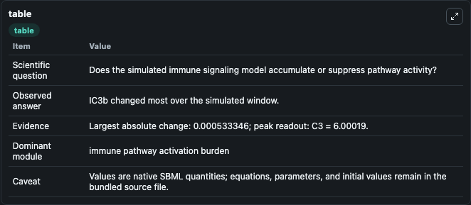
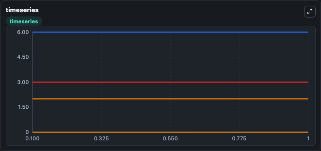
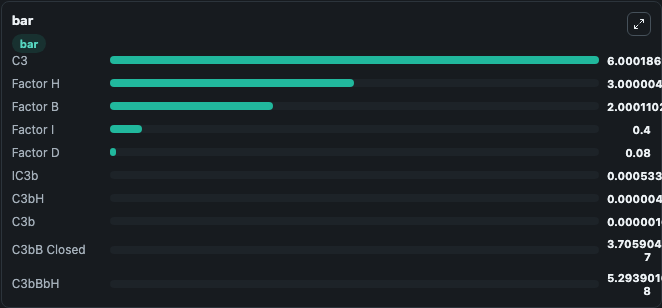

# Bakshi2020 - Minimal model of alternative pathway of complement system

This Biosimulant lab wraps `Bakshi2020 - Minimal model of alternative pathway of complement system` as a runnable signaling model with a companion visualization module.
Clean Biosimulant lab for immune signaling. It can be used to explore second-messenger and pathway-signaling dynamics and compare scenario outcomes across configurations.

## What You'll See

The lab asks: How does Bakshi2020 - Minimal model of alternative pathway of complement system shift hormone-linked signaling readouts? It runs for 1.0 time units with a communication step of 0.1. The run uses the model defaults declared by the curated SBML wrapper. The generated visualizations focus on complement C3, complement C3b, closed complement C3bB complex, open complement C3bB complex, complement C3b complement factor Bb, and complement C3b complement factor Bb H, and related outputs, combining trajectory, endpoint-comparison, and summary-table views from one completed dark-mode run.

In this captured run, **IC3b** moved from 0 to 0.000533 across 1.0 simulation windows.

<!-- BIOSIMULANT_VISUALS_START -->
### Output Visualizations



*Summary table for Bakshi2020 - Minimal model of alternative pathway of complement system, reporting the scientific question, observed answer, dominant module, and caveat.*



*Trajectories of IC3b, C3, Factor B, C3bH, Factor H, and C3b across the 1.0 simulation. In this run **IC3b** climbed from 0 to 0.000533 — the largest movements among the focused observables.*



*Largest-excursion ranking of the focused observables — the absolute movement magnitude during the run. Top 3: **C3** = 6.000, **Factor H** = 3.000, **Factor B** = 2.000, with 7 more observables below.*

<!-- BIOSIMULANT_VISUALS_END -->

## Model Context

- Core model: `models/core`
- Visualization model: `models/visualisation`
- Standard: `other`
- Upstream source: `biomodels_ebi:BIOMD0000001017`
- License: `CC0`
- Visual scope: metabolic and hormone signaling response
- Caveat: Values are native SBML quantities; equations, parameters, units, and initial values remain in the bundled source file.

## Inputs

| Input | Maps To | Default | Notes |
|---|---|---|---|
| Initial complement factor B | `signaling_sbml_bakshi2020_minimal_model_of_alternative_pathway_biomd0000001017_model.initial_complement_factor_b` |  | Initial level of complement factor B. Maps to SBML symbol `Factor_B`; exposed as a traceable initial-condition perturbation. |
| Initial complement factor D | `signaling_sbml_bakshi2020_minimal_model_of_alternative_pathway_biomd0000001017_model.initial_complement_factor_d` |  | Initial level of complement factor D. Maps to SBML symbol `Factor_D`; exposed as a traceable initial-condition perturbation. |
| Initial complement factor H | `signaling_sbml_bakshi2020_minimal_model_of_alternative_pathway_biomd0000001017_model.initial_complement_factor_h` |  | Initial level of complement factor H. Maps to SBML symbol `Factor_H`; exposed as a traceable initial-condition perturbation. |

## Outputs

| Output | Maps To | Role |
|---|---|---|
| `complement_c3b` | `signaling_sbml_bakshi2020_minimal_model_of_alternative_pathway_biomd0000001017_model.complement_c3b` | complement C3b. |
| `closed_complement_c3bb_complex` | `signaling_sbml_bakshi2020_minimal_model_of_alternative_pathway_biomd0000001017_model.closed_complement_c3bb_complex` | closed complement C3bB complex. |
| `open_complement_c3bb_complex` | `signaling_sbml_bakshi2020_minimal_model_of_alternative_pathway_biomd0000001017_model.open_complement_c3bb_complex` | open complement C3bB complex. |
| `state` | `signaling_sbml_bakshi2020_minimal_model_of_alternative_pathway_biomd0000001017_model.state` | Available to the visualization model and downstream workflows. |
| `summary` | `signaling_sbml_bakshi2020_minimal_model_of_alternative_pathway_biomd0000001017_model.summary` | Available to the visualization model and downstream workflows. |
| `species_labels` | `signaling_sbml_bakshi2020_minimal_model_of_alternative_pathway_biomd0000001017_model.species_labels` | Available to the visualization model and downstream workflows. |

## Runtime

- Duration: `1.0`
- Communication step: `0.1`

## Running Locally

```bash
biosimulant labs serve .
```
