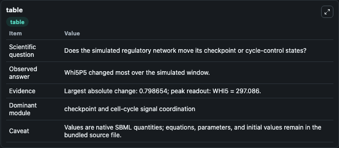
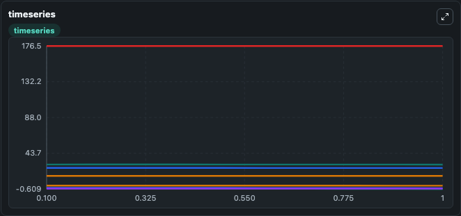
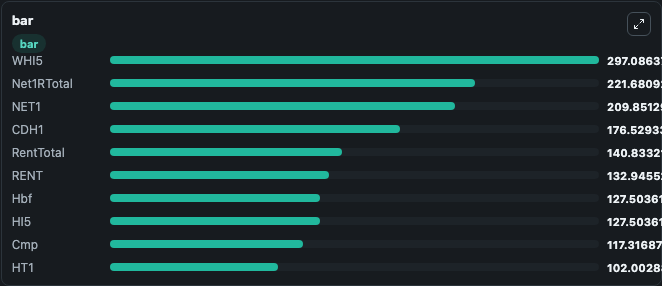

# A model of yeast cell-cycle regulation based on multisite phosphorylation_1_1_1

This Biosimulant lab wraps `A model of yeast cell-cycle regulation based on multisite phosphorylation_1_1_1` as a runnable signaling model with a companion visualization module.
Clean Biosimulant lab for cell-cycle regulatory signaling. It can be used to explore second-messenger and pathway-signaling dynamics and compare scenario outcomes across configurations.

## What You'll See

The lab asks: How does A model of yeast cell-cycle regulation based on multisite phosphorylation 1 1 1 move checkpoint or cycle-control signaling states? It runs for 1.0 time units with a communication step of 0.1. The run uses the model defaults declared by the curated SBML wrapper. The generated visualizations focus on source-defined V state, Cln3 cyclin, mitotic Clb cyclin, S-phase Clb cyclin, Cdc14 phosphatase, and source-defined SBF state, and related outputs, combining trajectory, endpoint-comparison, and summary-table views from one completed dark-mode run.

In this captured run, **Whi5P5** moved from 0.1901 to -0.6086 across 1.0 simulation windows.

<!-- BIOSIMULANT_VISUALS_START -->
### Output Visualizations



*Summary table for A model of yeast cell-cycle regulation based on multisite phosphorylation_1_1_1, reporting the scientific question, observed answer, dominant module, and caveat.*



*Trajectories of Whi5P5, Whi5P4, Whi5P3, Whi5P6, CDH1, and Cdh1PTotal across the 1.0 simulation. In this run **CDH1** climbed from 176.5 to 176.5 and **Whi5P5** fell from 0.1901 to -0.6086 — the largest movements among the focused observables.*



*Largest-excursion ranking of the focused observables — the absolute movement magnitude during the run. Top 3: **WHI5** = 297.1, **Net1RTotal** = 221.7, **NET1** = 209.9, with 7 more observables below.*

<!-- BIOSIMULANT_VISUALS_END -->

## Model Context

- Core model: `models/core`
- Visualization model: `models/visualisation`
- Standard: `other`
- Upstream source: `biomodels_ebi:MODEL1812060001`
- License: `CC0`
- Visual scope: cell-cycle regulatory signaling
- Caveat: Values are native SBML quantities; equations, parameters, units, and initial values remain in the bundled source file.

## Inputs

| Input | Maps To | Default | Notes |
|---|---|---|---|
| Initial Cdc14 phosphatase | `signaling_sbml_a_model_of_yeast_cell_cycle_regulation_based_on_model1812060001_model.initial_cdc14_phosphatase` |  | Initial level of Cdc14 phosphatase. Maps to SBML symbol `Cdc14`; exposed as a traceable initial-condition perturbation. |
| Initial Cdh1 cell-cycle regulator | `signaling_sbml_a_model_of_yeast_cell_cycle_regulation_based_on_model1812060001_model.initial_cdh1_cell_cycle_regulator` |  | Initial level of Cdh1 cell-cycle regulator. Maps to SBML symbol `Cdh1`; exposed as a traceable initial-condition perturbation. |
| Initial Cdh1p1 | `signaling_sbml_a_model_of_yeast_cell_cycle_regulation_based_on_model1812060001_model.initial_cdh1p1` |  | Initial level of Cdh1p1. Maps to SBML symbol `Cdh1P1`; exposed as a traceable initial-condition perturbation. |

## Outputs

| Output | Maps To | Role |
|---|---|---|
| `cln3_cyclin` | `signaling_sbml_a_model_of_yeast_cell_cycle_regulation_based_on_model1812060001_model.cln3_cyclin` | Cln3 cyclin. |
| `mitotic_clb_cyclin` | `signaling_sbml_a_model_of_yeast_cell_cycle_regulation_based_on_model1812060001_model.mitotic_clb_cyclin` | mitotic Clb cyclin. |
| `s_phase_clb_cyclin` | `signaling_sbml_a_model_of_yeast_cell_cycle_regulation_based_on_model1812060001_model.s_phase_clb_cyclin` | S-phase Clb cyclin. |
| `state` | `signaling_sbml_a_model_of_yeast_cell_cycle_regulation_based_on_model1812060001_model.state` | Available to the visualization model and downstream workflows. |
| `summary` | `signaling_sbml_a_model_of_yeast_cell_cycle_regulation_based_on_model1812060001_model.summary` | Available to the visualization model and downstream workflows. |
| `species_labels` | `signaling_sbml_a_model_of_yeast_cell_cycle_regulation_based_on_model1812060001_model.species_labels` | Available to the visualization model and downstream workflows. |

## Runtime

- Duration: `1.0`
- Communication step: `0.1`

## Running Locally

```bash
biosimulant labs serve .
```
