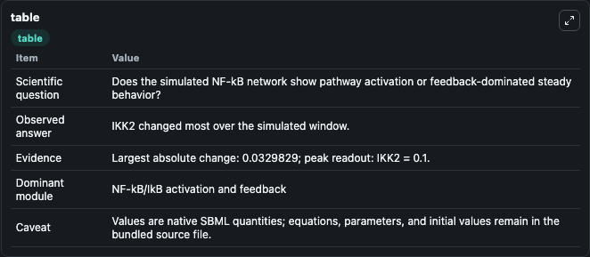
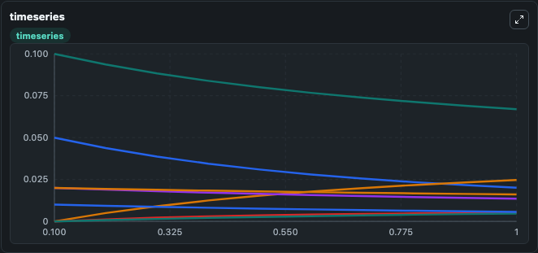
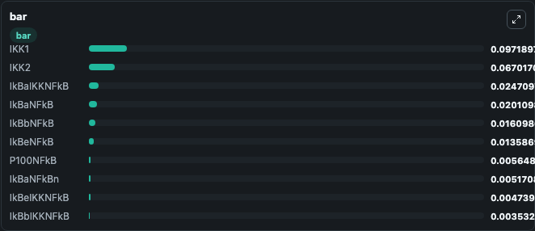

# Basak_Cell_2007

This Biosimulant lab wraps `Basak_Cell_2007` as a runnable signaling model with a companion visualization module.
Clean Biosimulant lab for NF-kB pathway signaling. It can be used to explore second-messenger and pathway-signaling dynamics and compare scenario outcomes across configurations.

## What You'll See

The lab asks: How does Basak Cell 2007 move NF-kB and inhibitor-linked signaling states? It runs for 1.0 time units with a communication step of 0.1. The run uses the model defaults declared by the curated SBML wrapper. The generated visualizations focus on Ik Bat, source-defined IKBA state, Ik Ban, Ik Ba IKK, Ik Ba Nfk B, and Ik Ba Nfk Bn, and related outputs, combining trajectory, endpoint-comparison, and summary-table views from one completed dark-mode run.

In this captured run, **IKK2** moved from 0.1000 to 0.0670 across 1.0 simulation windows.

<!-- BIOSIMULANT_VISUALS_START -->
### Output Visualizations



*Summary table for Basak_Cell_2007, reporting the scientific question, observed answer, dominant module, and caveat.*



*Trajectories of IKK2, IkBaNFkB, IkBaIKKNFkB, IkBeNFkB, IkBaNFkBn, and IkBeIKKNFkB across the 1.0 simulation. In this run **IkBaIKKNFkB** climbed from 0 to 0.0247 and **IKK2** fell from 0.1000 to 0.0670 — the largest movements among the focused observables.*



*Largest-excursion ranking of the focused observables — the absolute movement magnitude during the run. Top 3: **IKK1** = 0.0972, **IKK2** = 0.0670, **IkBaIKKNFkB** = 0.0247, with 7 more observables below.*

<!-- BIOSIMULANT_VISUALS_END -->

## Model Context

- Core model: `models/core`
- Visualization model: `models/visualisation`
- Standard: `other`
- Upstream source: `biomodels_ebi:MODEL8478881246`
- License: `CC0`
- Visual scope: NF-kB activation and feedback signaling
- Caveat: Values are native SBML quantities; equations, parameters, units, and initial values remain in the bundled source file.

## Inputs

| Input | Maps To | Default | Notes |
|---|---|---|---|
| A C 2pnq | `signaling_sbml_basak_cell_2007_model8478881246_model.initial_a_c_2pnq_level` |  | A C 2pnq source parameter. Maps to SBML symbol `mw67DBC35D_6ABA_4E03_A921_AA3E88FCDA17` and preserves the bundled default. |

## Outputs

| Output | Maps To | Role |
|---|---|---|
| `ik_ba_nfk_b` | `signaling_sbml_basak_cell_2007_model8478881246_model.ik_ba_nfk_b` | Ik Ba Nfk B. |
| `ik_ba_nfk_bn` | `signaling_sbml_basak_cell_2007_model8478881246_model.ik_ba_nfk_bn` | Ik Ba Nfk Bn. |
| `ik_ba_ikknfk_b` | `signaling_sbml_basak_cell_2007_model8478881246_model.ik_ba_ikknfk_b` | Ik Ba Ikknfk B. |
| `state` | `signaling_sbml_basak_cell_2007_model8478881246_model.state` | Available to the visualization model and downstream workflows. |
| `summary` | `signaling_sbml_basak_cell_2007_model8478881246_model.summary` | Available to the visualization model and downstream workflows. |
| `species_labels` | `signaling_sbml_basak_cell_2007_model8478881246_model.species_labels` | Available to the visualization model and downstream workflows. |

## Runtime

- Duration: `1.0`
- Communication step: `0.1`

## Running Locally

```bash
biosimulant labs serve .
```
