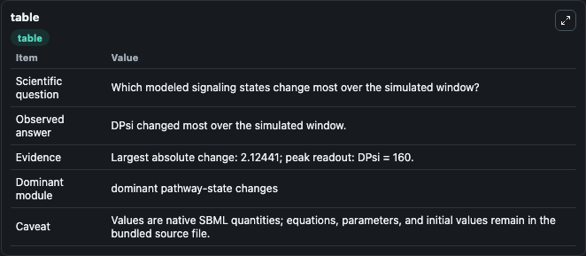
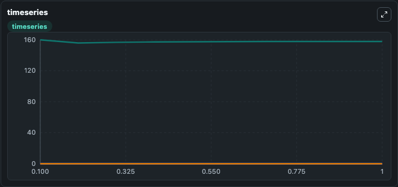
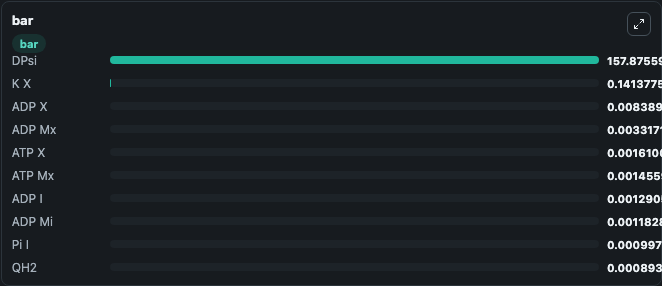

# Beard2005_Mitochondrial_Respiration

This Biosimulant lab wraps `Beard2005_Mitochondrial_Respiration` as a runnable signaling model with a companion visualization module.
Clean Biosimulant lab for metabolic and hormone-linked signaling. It can be used to explore second-messenger and pathway-signaling dynamics and compare scenario outcomes across configurations.

## What You'll See

The lab asks: How does Beard2005 Mitochondrial Respiration shift hormone-linked signaling readouts? It runs for 1.0 time units with a communication step of 0.1. The run uses the model defaults declared by the curated SBML wrapper. The generated visualizations focus on Source Defined H X State, Source Defined K X State, Source Defined MG X State, NADH X, Source Defined QH2 State, and Source Defined CRED State, and related outputs, combining trajectory, endpoint-comparison, and summary-table views from one completed dark-mode run.

In this captured run, **DPsi** moved from 160.0 to 157.9 across 1.0 simulation windows.

<!-- BIOSIMULANT_VISUALS_START -->
### Output Visualizations



*Summary table for Beard2005_Mitochondrial_Respiration, reporting the scientific question, observed answer, dominant module, and caveat.*



*Trajectories of DPsi, Mg X, ADP Mx, ATP X, ADP X, and ATP Mx across the 1.0 simulation. In this run **ADP Mx** climbed from 0 to 0.00332 and **DPsi** fell from 160.0 to 157.9 — the largest movements among the focused observables.*



*Largest-excursion ranking of the focused observables — the absolute movement magnitude during the run. Top 3: **DPsi** = 157.9, **K X** = 0.1414, **ADP X** = 0.00839, with 7 more observables below.*

<!-- BIOSIMULANT_VISUALS_END -->

## Model Context

- Core model: `models/core`
- Visualization model: `models/visualisation`
- Standard: `other`
- Upstream source: `biomodels_ebi:MODEL4151491057`
- License: `CC0`
- Visual scope: metabolic and hormone signaling response
- Caveat: Values are native SBML quantities; equations, parameters, units, and initial values remain in the bundled source file.

## Inputs

| Input | Maps To | Default | Notes |
|---|---|---|---|
| Initial source-defined H_X state | `signaling_sbml_beard2005_mitochondrial_respiration_model4151491057_model.initial_source_defined_h_x_state` |  | Initial level of source-defined H_X state. Maps to SBML symbol `H_x`; exposed as a traceable initial-condition perturbation. |

## Outputs

| Output | Maps To | Role |
|---|---|---|
| `source_defined_h_x_state` | `signaling_sbml_beard2005_mitochondrial_respiration_model4151491057_model.source_defined_h_x_state` | source-defined H_X state. |
| `source_defined_k_x_state` | `signaling_sbml_beard2005_mitochondrial_respiration_model4151491057_model.source_defined_k_x_state` | source-defined K_X state. |
| `source_defined_mg_x_state` | `signaling_sbml_beard2005_mitochondrial_respiration_model4151491057_model.source_defined_mg_x_state` | source-defined MG_X state. |
| `state` | `signaling_sbml_beard2005_mitochondrial_respiration_model4151491057_model.state` | Available to the visualization model and downstream workflows. |
| `summary` | `signaling_sbml_beard2005_mitochondrial_respiration_model4151491057_model.summary` | Available to the visualization model and downstream workflows. |
| `species_labels` | `signaling_sbml_beard2005_mitochondrial_respiration_model4151491057_model.species_labels` | Available to the visualization model and downstream workflows. |

## Runtime

- Duration: `1.0`
- Communication step: `0.1`

## Running Locally

```bash
biosimulant labs serve .
```
