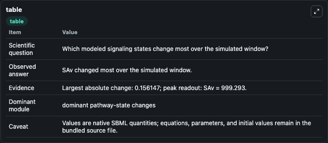
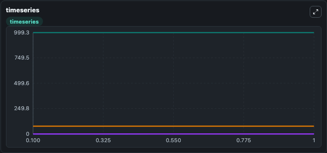
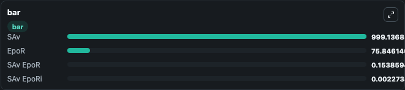

# Becker2010_EpoR_AuxiliaryModel

This Biosimulant lab wraps `Becker2010_EpoR_AuxiliaryModel` as a runnable signaling model with a companion visualization module.
Clean Biosimulant lab for systems signaling model: Becker2010_EpoR_AuxiliaryModel. It can be used to explore second-messenger and pathway-signaling dynamics and compare scenario outcomes across configurations.

## What You'll See

The lab asks: How does Becker2010 EpoR AuxiliaryModel route receptor activity into cAMP/PKA-linked readouts? It runs for 1.0 time units with a communication step of 0.1. The run uses the model defaults declared by the curated SBML wrapper. The generated visualizations focus on EPO receptor, source-defined SAV state, Sav erythropoietin R, and Sav erythropoietin Ri, combining trajectory, endpoint-comparison, and summary-table views from one completed dark-mode run.

In this captured run, **SAv** moved from 999.3 to 999.1 across 1.0 simulation windows.

<!-- BIOSIMULANT_VISUALS_START -->
### Output Visualizations



*Summary table for Becker2010_EpoR_AuxiliaryModel, reporting the scientific question, observed answer, dominant module, and caveat.*



*Trajectories of SAv, SAv EpoR, EpoR, and SAv EpoRi across the 1.0 simulation. In this run **SAv EpoR** climbed from 0 to 0.1539 and **SAv** fell from 999.3 to 999.1 — the largest movements among the focused observables.*



*Largest-excursion ranking of the focused observables — the absolute movement magnitude during the run. Top 3: **SAv** = 999.1, **EpoR** = 75.846, **SAv EpoR** = 0.1539, with 1 more observable below.*

<!-- BIOSIMULANT_VISUALS_END -->

## Model Context

- Core model: `models/core`
- Visualization model: `models/visualisation`
- Standard: `other`
- Upstream source: `biomodels_ebi:BIOMD0000000272`
- License: `CC0`
- Visual scope: GPCR and cAMP/PKA signaling
- Caveat: Values are native SBML quantities; equations, parameters, units, and initial values remain in the bundled source file.

## Inputs

| Input | Maps To | Default | Notes |
|---|---|---|---|
| Initial EPO receptor | `signaling_sbml_becker2010_epor_auxiliarymodel_biomd0000000272_model.initial_epo_receptor` |  | Initial level of EPO receptor. Maps to SBML symbol `EpoR`; exposed as a traceable initial-condition perturbation. |

## Outputs

| Output | Maps To | Role |
|---|---|---|
| `epo_receptor` | `signaling_sbml_becker2010_epor_auxiliarymodel_biomd0000000272_model.epo_receptor` | EPO receptor. |
| `source_defined_sav_state` | `signaling_sbml_becker2010_epor_auxiliarymodel_biomd0000000272_model.source_defined_sav_state` | source-defined SAV state. |
| `sav_erythropoietin_r` | `signaling_sbml_becker2010_epor_auxiliarymodel_biomd0000000272_model.sav_erythropoietin_r` | Sav erythropoietin R. |
| `state` | `signaling_sbml_becker2010_epor_auxiliarymodel_biomd0000000272_model.state` | Available to the visualization model and downstream workflows. |
| `summary` | `signaling_sbml_becker2010_epor_auxiliarymodel_biomd0000000272_model.summary` | Available to the visualization model and downstream workflows. |
| `species_labels` | `signaling_sbml_becker2010_epor_auxiliarymodel_biomd0000000272_model.species_labels` | Available to the visualization model and downstream workflows. |

## Runtime

- Duration: `1.0`
- Communication step: `0.1`

## Running Locally

```bash
biosimulant labs serve .
```
