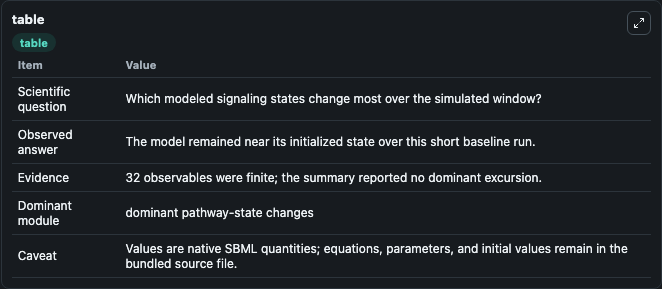
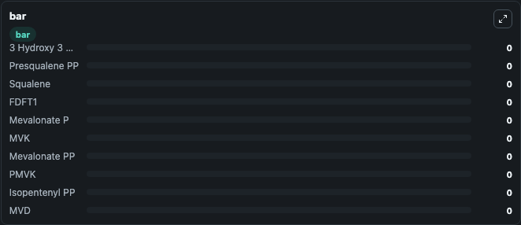

# Benson2017 - Systems Pharmacology Multidrug (cholesterol biosynthesis pathway)

This Biosimulant lab wraps `Benson2017 - Systems Pharmacology Multidrug (cholesterol biosynthesis pathway)` as a runnable signaling model with a companion visualization module.
Clean Biosimulant lab for metabolic and hormone-linked signaling. It can be used to explore second-messenger and pathway-signaling dynamics and compare scenario outcomes across configurations.

## What You'll See

The lab asks: How does Benson2017 - Systems Pharmacology Multidrug (cholesterol biosynthesis pathway) shift hormone-linked signaling readouts? It runs for 1.0 time units with a communication step of 0.1. The run uses the model defaults declared by the curated SBML wrapper. The generated visualizations focus on 3 Hydroxy 3 Methylglutaryl Co A, Presqualene PP, Squalene, source-defined FDFT1 state, Mevalonate P, and source-defined MVK state, and related outputs, combining trajectory, endpoint-comparison, and summary-table views from one completed dark-mode run.

In this captured run, **3 Hydroxy 3 Methylglutaryl CoA** moved from 0 to 0 across 1.0 simulation windows.

<!-- BIOSIMULANT_VISUALS_START -->
### Output Visualizations



*Summary table for Benson2017 - Systems Pharmacology Multidrug (cholesterol biosynthesis pathway), reporting the scientific question, observed answer, dominant module, and caveat.*


*Trajectories of 3 Hydroxy 3 Methylglutaryl CoA, Presqualene PP, Squalene, FDFT1, Mevalonate P, and MVK across the 1.0 simulation. In this run 3 Hydroxy 3 Methylglutaryl CoA, Presqualene PP, Squalene, FDFT1 stayed near their initial values — no observable moved appreciably.*



*Largest-excursion ranking of the focused observables — the absolute movement magnitude during the run. Top 3: **3 Hydroxy 3 Methylglutaryl CoA** = 0, **Presqualene PP** = 0, **Squalene** = 0, with 7 more observables below.*

<!-- BIOSIMULANT_VISUALS_END -->

## Model Context

- Core model: `models/core`
- Visualization model: `models/visualisation`
- Standard: `other`
- Upstream source: `biomodels_ebi:MODEL1506220000`
- License: `CC0`
- Visual scope: metabolic and hormone signaling response
- Caveat: Values are native SBML quantities; equations, parameters, units, and initial values remain in the bundled source file.

## Inputs

| Input | Maps To | Default | Notes |
|---|---|---|---|
| Initial Rosuvastatin | `signaling_sbml_benson2017_systems_pharmacology_multidrug_choles_model1506220000_model.initial_rosuvastatin` |  | Initial level of Rosuvastatin. Maps to SBML symbol `s95`; exposed as a traceable initial-condition perturbation. |

## Outputs

| Output | Maps To | Role |
|---|---|---|
| `rosuvastatin` | `signaling_sbml_benson2017_systems_pharmacology_multidrug_choles_model1506220000_model.rosuvastatin` | Rosuvastatin. |
| `farnesyl_thiodiphosphate` | `signaling_sbml_benson2017_systems_pharmacology_multidrug_choles_model1506220000_model.farnesyl_thiodiphosphate` | Farnesyl Thiodiphosphate. |
| `source_6_fluoromevalonate_5_diphosphate` | `signaling_sbml_benson2017_systems_pharmacology_multidrug_choles_model1506220000_model.source_6_fluoromevalonate_5_diphosphate` | 6 Fluoromevalonate 5 Diphosphate. |
| `state` | `signaling_sbml_benson2017_systems_pharmacology_multidrug_choles_model1506220000_model.state` | Available to the visualization model and downstream workflows. |
| `summary` | `signaling_sbml_benson2017_systems_pharmacology_multidrug_choles_model1506220000_model.summary` | Available to the visualization model and downstream workflows. |
| `species_labels` | `signaling_sbml_benson2017_systems_pharmacology_multidrug_choles_model1506220000_model.species_labels` | Available to the visualization model and downstream workflows. |

## Runtime

- Duration: `1.0`
- Communication step: `0.1`

## Running Locally

```bash
biosimulant labs serve .
```
