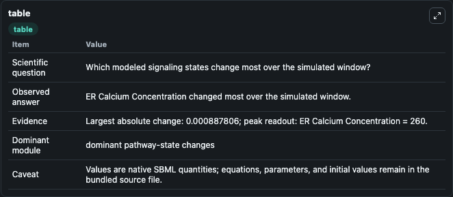
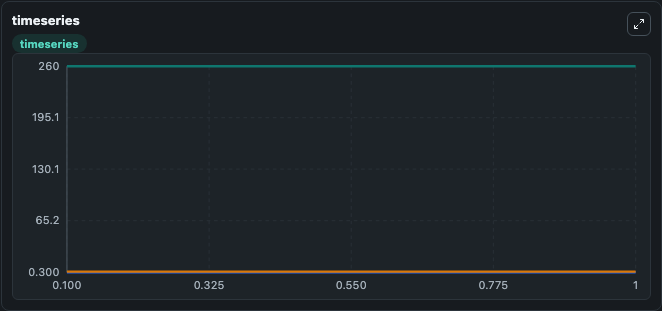
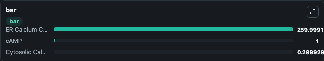

# Bertram2006_Endothelin

This Biosimulant lab wraps `Bertram2006_Endothelin` as a runnable signaling model with a companion visualization module.
Clean Biosimulant lab for systems signaling model: Bertram2006_Endothelin. It can be used to explore second-messenger and pathway-signaling dynamics and compare scenario outcomes across configurations.

## What You'll See

The lab asks: How does Bertram2006 Endothelin route receptor activity into cAMP/PKA-linked readouts? It runs for 1.0 time units with a communication step of 0.1. The run uses the model defaults declared by the curated SBML wrapper. The generated visualizations focus on cytosolic Calcium Concentration, ER Calcium Concentration, and cAMP, combining trajectory, endpoint-comparison, and summary-table views from one completed dark-mode run.

In this captured run, **ER Calcium Concentration** moved from 260.0 to 260.0 across 1.0 simulation windows.

<!-- BIOSIMULANT_VISUALS_START -->
### Output Visualizations



*Summary table for Bertram2006_Endothelin, reporting the scientific question, observed answer, dominant module, and caveat.*



*Trajectories of ER Calcium Concentration, Cytosolic Calcium Concentration, and cAMP across the 1.0 simulation. In this run **ER Calcium Concentration** fell from 260.0 to 260.0 — the largest movements among the focused observables.*



*Largest-excursion ranking of the focused observables — the absolute movement magnitude during the run. Top 3: **ER Calcium Concentration** = 260.0, **cAMP** = 1.000, **Cytosolic Calcium Concentration** = 0.2999.*

<!-- BIOSIMULANT_VISUALS_END -->

## Model Context

- Core model: `models/core`
- Visualization model: `models/visualisation`
- Standard: `other`
- Upstream source: `biomodels_ebi:BIOMD0000000128`
- License: `CC0`
- Visual scope: GPCR and cAMP/PKA signaling
- Caveat: Values are native SBML quantities; equations, parameters, units, and initial values remain in the bundled source file.

## Inputs

| Input | Maps To | Default | Notes |
|---|---|---|---|
| C Amplow | `signaling_sbml_bertram2006_endothelin_biomd0000000128_model.initial_c_amplow_level` |  | C Amplow source parameter. Maps to SBML symbol `cAMPlow` and preserves the bundled default. |
| Initial cytosolic Calcium Concentration | `signaling_sbml_bertram2006_endothelin_biomd0000000128_model.initial_cytosolic_calcium_concentration` |  | Initial level of cytosolic Calcium Concentration. Maps to SBML symbol `c`; exposed as a traceable initial-condition perturbation. |
| Initial ER Calcium Concentration | `signaling_sbml_bertram2006_endothelin_biomd0000000128_model.initial_er_calcium_concentration` |  | Initial level of ER Calcium Concentration. Maps to SBML symbol `cer`; exposed as a traceable initial-condition perturbation. |

## Outputs

| Output | Maps To | Role |
|---|---|---|
| `cytosolic_calcium_concentration` | `signaling_sbml_bertram2006_endothelin_biomd0000000128_model.cytosolic_calcium_concentration` | cytosolic Calcium Concentration. |
| `er_calcium_concentration` | `signaling_sbml_bertram2006_endothelin_biomd0000000128_model.er_calcium_concentration` | ER Calcium Concentration. |
| `camp` | `signaling_sbml_bertram2006_endothelin_biomd0000000128_model.camp` | cAMP. |
| `state` | `signaling_sbml_bertram2006_endothelin_biomd0000000128_model.state` | Available to the visualization model and downstream workflows. |
| `summary` | `signaling_sbml_bertram2006_endothelin_biomd0000000128_model.summary` | Available to the visualization model and downstream workflows. |
| `species_labels` | `signaling_sbml_bertram2006_endothelin_biomd0000000128_model.species_labels` | Available to the visualization model and downstream workflows. |

## Runtime

- Duration: `1.0`
- Communication step: `0.1`

## Running Locally

```bash
biosimulant labs serve .
```
