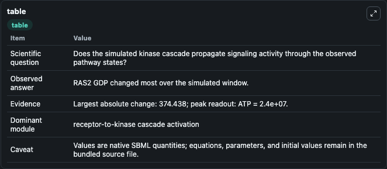
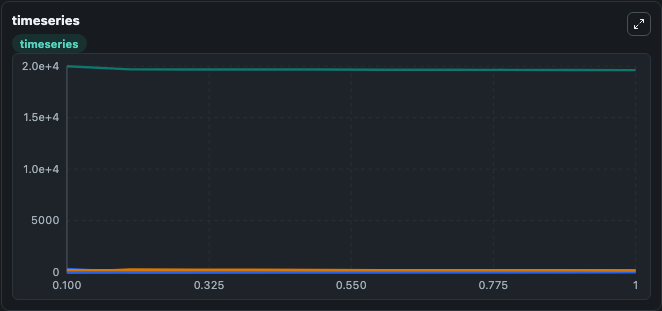
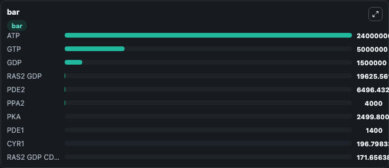

# Besozzi2012 - Oscillatory regimes in the Ras/cAMP/PKA pathway in S.cerevisiae

This Biosimulant lab wraps `Besozzi2012 - Oscillatory regimes in the Ras/cAMP/PKA pathway in S.cerevisiae` as a runnable signaling model with a companion visualization module.
Clean Biosimulant lab for MAPK/ERK receptor signaling. It can be used to explore second-messenger and pathway-signaling dynamics and compare scenario outcomes across configurations.

## What You'll See

The lab asks: How does Besozzi2012 - Oscillatory regimes in the Ras/cAMP/PKA pathway in S.cerevisiae propagate receptor or RAS/ERK pathway activity? It runs for 1.0 time units with a communication step of 0.1. The run uses the model defaults declared by the curated SBML wrapper. The generated visualizations focus on RAS2 GDP, CDC25, RAS2 GDP CDC25, RAS2 CDC25, Source Defined GDP State, and Source Defined GTP State, and related outputs, combining trajectory, endpoint-comparison, and summary-table views from one completed dark-mode run.

In this captured run, **RAS2 GDP** moved from 2e+04 to 1.96e+04 across 1.0 simulation windows.

<!-- BIOSIMULANT_VISUALS_START -->
### Output Visualizations



*Summary table for Besozzi2012 - Oscillatory regimes in the Ras/cAMP/PKA pathway in S.cerevisiae, reporting the scientific question, observed answer, dominant module, and caveat.*



*Trajectories of RAS2 GDP, CDC25, RAS2 GDP CDC25, RAS2 GTP CDC25, RAS2 GTP, and cAMP across the 1.0 simulation. In this run **RAS2 GDP CDC25** climbed from 0 to 171.7 and **RAS2 GDP** fell from 2e+04 to 1.96e+04 — the largest movements among the focused observables.*



*Largest-excursion ranking of the focused observables — the absolute movement magnitude during the run. Top 3: **ATP** = 2.4e+07, **GTP** = 5e+06, **GDP** = 1.5e+06, with 7 more observables below.*

<!-- BIOSIMULANT_VISUALS_END -->

## Model Context

- Core model: `models/core`
- Visualization model: `models/visualisation`
- Standard: `other`
- Upstream source: `biomodels_ebi:BIOMD0000000478`
- License: `CC0`
- Visual scope: receptor-to-MAPK cascade signaling
- Caveat: Values are native SBML quantities; equations, parameters, units, and initial values remain in the bundled source file.

## Inputs

| Input | Maps To | Default | Notes |
|---|---|---|---|
| Initial ATP | `signaling_sbml_besozzi2012_oscillatory_regimes_in_the_ras_camp_biomd0000000478_model.initial_atp` |  | Initial level of ATP. Maps to SBML symbol `ATP`; exposed as a traceable initial-condition perturbation. |
| Initial GDP | `signaling_sbml_besozzi2012_oscillatory_regimes_in_the_ras_camp_biomd0000000478_model.initial_gdp` |  | Initial level of GDP. Maps to SBML symbol `GDP`; exposed as a traceable initial-condition perturbation. |
| Initial GTP | `signaling_sbml_besozzi2012_oscillatory_regimes_in_the_ras_camp_biomd0000000478_model.initial_gtp` |  | Initial level of GTP. Maps to SBML symbol `GTP`; exposed as a traceable initial-condition perturbation. |

## Outputs

| Output | Maps To | Role |
|---|---|---|
| `ras2_gdp` | `signaling_sbml_besozzi2012_oscillatory_regimes_in_the_ras_camp_biomd0000000478_model.ras2_gdp` | RAS2 GDP. |
| `ras2_gdp_cdc25` | `signaling_sbml_besozzi2012_oscillatory_regimes_in_the_ras_camp_biomd0000000478_model.ras2_gdp_cdc25` | RAS2 GDP CDC25. |
| `ras2_cdc25` | `signaling_sbml_besozzi2012_oscillatory_regimes_in_the_ras_camp_biomd0000000478_model.ras2_cdc25` | RAS2 CDC25. |
| `state` | `signaling_sbml_besozzi2012_oscillatory_regimes_in_the_ras_camp_biomd0000000478_model.state` | Available to the visualization model and downstream workflows. |
| `summary` | `signaling_sbml_besozzi2012_oscillatory_regimes_in_the_ras_camp_biomd0000000478_model.summary` | Available to the visualization model and downstream workflows. |
| `species_labels` | `signaling_sbml_besozzi2012_oscillatory_regimes_in_the_ras_camp_biomd0000000478_model.species_labels` | Available to the visualization model and downstream workflows. |

## Runtime

- Duration: `1.0`
- Communication step: `0.1`

## Running Locally

```bash
biosimulant labs serve .
```
