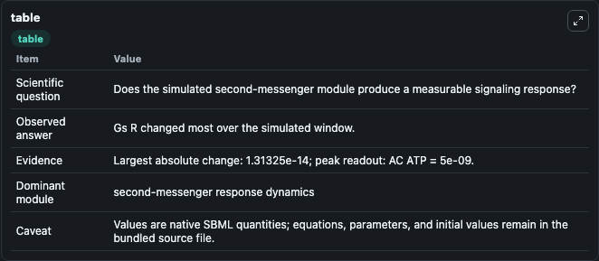
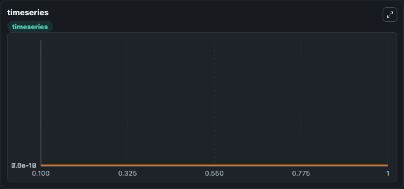
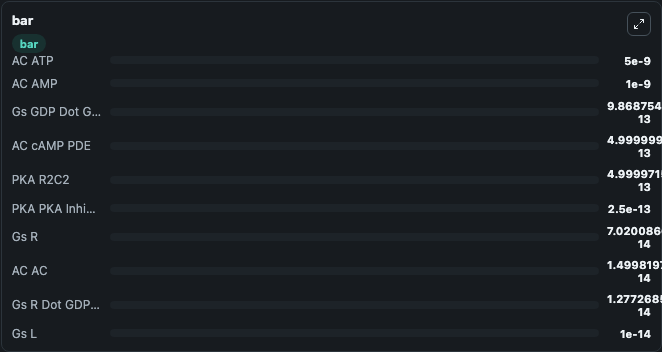

# Bhalla2002_cAMP_pathway

This Biosimulant lab wraps `Bhalla2002_cAMP_pathway` as a runnable signaling model with a companion visualization module.
Clean Biosimulant lab for systems signaling model: Bhalla2002_cAMP_pathway. It can be used to explore second-messenger and pathway-signaling dynamics and compare scenario outcomes across configurations.

## What You'll See

The lab asks: How does Bhalla2002 cAMP pathway route receptor activity into cAMP/PKA-linked readouts? It runs for 1.0 time units with a communication step of 0.1. The run uses the model defaults declared by the curated SBML wrapper. The generated visualizations focus on PKA R2C2, PKA PKA Inhibitor, PKA Inhibited PKA, PKA C AMP Dot R2C2, PKA CAMP2 Dot R2C2, and PKA CAMP3 Dot R2C2, and related outputs, combining trajectory, endpoint-comparison, and summary-table views from one completed dark-mode run.

In this captured run, **Gs R** moved from 8.33e-14 to 7.02e-14 across 1.0 simulation windows.

<!-- BIOSIMULANT_VISUALS_START -->
### Output Visualizations



*Summary table for Bhalla2002_cAMP_pathway, reporting the scientific question, observed answer, dominant module, and caveat.*



*Trajectories of Gs R, Gs GDP Dot Gabc, Gs R Dot GDP Dot Gabc, Gs L Dot R Dot GDP Dot Gabc, Gs L Dot R, and cAMP across the 1.0 simulation. In this run **Gs R Dot GDP Dot Gabc** climbed from 0 to 1.28e-14 and **Gs R** fell from 8.33e-14 to 7.02e-14 — the largest movements among the focused observables.*



*Largest-excursion ranking of the focused observables — the absolute movement magnitude during the run. Top 3: **AC ATP** = 5e-09, **AC AMP** = 1e-09, **Gs GDP Dot Gabc** = 9.87e-13, with 7 more observables below.*

<!-- BIOSIMULANT_VISUALS_END -->

## Model Context

- Core model: `models/core`
- Visualization model: `models/visualisation`
- Standard: `other`
- Upstream source: `biomodels_ebi:MODEL9077438479`
- License: `CC0`
- Visual scope: GPCR and cAMP/PKA signaling
- Caveat: Values are native SBML quantities; equations, parameters, units, and initial values remain in the bundled source file.

## Inputs

| Input | Maps To | Default | Notes |
|---|---|---|---|
| Initial AC AMP | `signaling_sbml_bhalla2002_camp_pathway_model9077438479_model.initial_ac_amp` |  | Initial level of AC AMP. Maps to SBML symbol `AC_slash_AMP`; exposed as a traceable initial-condition perturbation. |
| Initial AC ATP | `signaling_sbml_bhalla2002_camp_pathway_model9077438479_model.initial_ac_atp` |  | Initial level of AC ATP. Maps to SBML symbol `AC_slash_ATP`; exposed as a traceable initial-condition perturbation. |
| Initial Gs ligand | `signaling_sbml_bhalla2002_camp_pathway_model9077438479_model.initial_gs_ligand` |  | Initial level of Gs ligand. Maps to SBML symbol `Gs_slash_L`; exposed as a traceable initial-condition perturbation. |

## Outputs

| Output | Maps To | Role |
|---|---|---|
| `pka_c_amp_dot_r2c2` | `signaling_sbml_bhalla2002_camp_pathway_model9077438479_model.pka_c_amp_dot_r2c2` | PKA C AMP Dot R2C2. |
| `pka_camp2_dot_r2c2` | `signaling_sbml_bhalla2002_camp_pathway_model9077438479_model.pka_camp2_dot_r2c2` | PKA CAMP2 Dot R2C2. |
| `pka_camp3_dot_r2c2` | `signaling_sbml_bhalla2002_camp_pathway_model9077438479_model.pka_camp3_dot_r2c2` | PKA CAMP3 Dot R2C2. |
| `state` | `signaling_sbml_bhalla2002_camp_pathway_model9077438479_model.state` | Available to the visualization model and downstream workflows. |
| `summary` | `signaling_sbml_bhalla2002_camp_pathway_model9077438479_model.summary` | Available to the visualization model and downstream workflows. |
| `species_labels` | `signaling_sbml_bhalla2002_camp_pathway_model9077438479_model.species_labels` | Available to the visualization model and downstream workflows. |

## Runtime

- Duration: `1.0`
- Communication step: `0.1`

## Running Locally

```bash
biosimulant labs serve .
```
