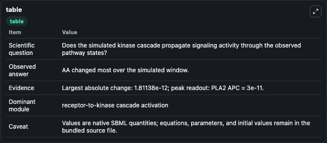
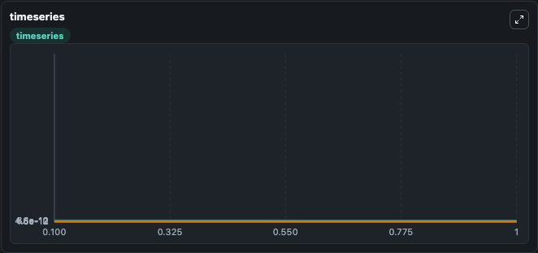
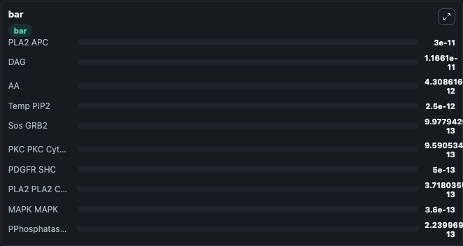

# Bhalla2002_mkp1_feedback_effects

This Biosimulant lab wraps `Bhalla2002_mkp1_feedback_effects` as a runnable signaling model with a companion visualization module.
Clean Biosimulant lab for MAPK/ERK receptor signaling. It can be used to explore second-messenger and pathway-signaling dynamics and compare scenario outcomes across configurations.

## What You'll See

The lab asks: How does Bhalla2002 mkp1 feedback effects propagate receptor or RAS/ERK pathway activity? It runs for 1.0 time units with a communication step of 0.1. The run uses the model defaults declared by the curated SBML wrapper. The generated visualizations focus on Shc adapter protein Adapter Protein Adapter Protein Adapter Protein Adapter Protein Adapter Protein active Dot SOS guanine-nucleotide exchange factor Guanine Nucleotide Exchange Factor Guanine Nucleotide Exchange Factor Guanine Nucleotide Exchange Factor Guanine Nucleotide Exchange Factor Dot Grb2 adapter protein Adapter Protein Adapter Protein Adapter Protein Adapter Protein Adapter Protein, Shc adapter protein Adapter Protein Adapter Protein Adapter Protein Adapter Protein Adapter Protein active Dot SOS guanine-nucleotide exchange factor Guanine Nucleotide Exchange Factor Guanine Nucleotide Exchange Factor Guanine Nucleotide Exchange Factor Guanine Nucleotide Exchange Factor Dot Grb2 adapter protein Adapter Protein Adapter Protein Adapter Protein Adapter Protein Adapter Protein SOS guanine-nucleotide exchange factor Guanine Nucleotide Exchange Factor Guanine Nucleotide Exchange Factor Guanine Nucleotide Exchange Factor Guanine Nucleotide Exchange Factor Dot RAS GEF SOS guanine-nucleotide exchange factor Guanine Nucleotide Exchange Factor Guanine Nucleotide Exchange Factor Guanine Nucleotide Exchange Factor Guanine Nucleotide Exchange Factor Dot RAS GEF Cplx, SOS guanine-nucleotide exchange factor Guanine Nucleotide Exchange Factor Guanine Nucleotide Exchange Factor Guanine Nucleotide Exchange Factor Guanine Nucleotide Exchange Factor SOS guanine-nucleotide exchange factor Guanine Nucleotide Exchange Factor Guanine Nucleotide Exchange Factor Guanine Nucleotide Exchange Factor Guanine Nucleotide Exchange Factor active Dot Grb2 adapter protein Adapter Protein Adapter Protein Adapter Protein Adapter Protein Adapter Protein, SOS guanine-nucleotide exchange factor Guanine Nucleotide Exchange Factor Guanine Nucleotide Exchange Factor Guanine Nucleotide Exchange Factor Guanine Nucleotide Exchange Factor Grb2 adapter protein Adapter Protein Adapter Protein Adapter Protein Adapter Protein Adapter Protein, SOS guanine-nucleotide exchange factor Guanine Nucleotide Exchange Factor Guanine Nucleotide Exchange Factor Guanine Nucleotide Exchange Factor Guanine Nucleotide Exchange Factor SOS guanine-nucleotide exchange factor Guanine Nucleotide Exchange Factor Guanine Nucleotide Exchange Factor Guanine Nucleotide Exchange Factor Guanine Nucleotide Exchange Factor Dot Grb2 adapter protein Adapter Protein Adapter Protein Adapter Protein Adapter Protein Adapter Protein, and SOS guanine-nucleotide exchange factor Guanine Nucleotide Exchange Factor Guanine Nucleotide Exchange Factor Guanine Nucleotide Exchange Factor Guanine Nucleotide Exchange Factor SOS guanine-nucleotide exchange factor Guanine Nucleotide Exchange Factor Guanine Nucleotide Exchange Factor Guanine Nucleotide Exchange Factor Guanine Nucleotide Exchange Factor active, and related outputs, combining trajectory, endpoint-comparison, and summary-table views from one completed dark-mode run.

In this captured run, **AA** moved from 6.12e-12 to 4.31e-12 across 1.0 simulation windows.

<!-- BIOSIMULANT_VISUALS_START -->
### Output Visualizations



*Summary table for Bhalla2002_mkp1_feedback_effects, reporting the scientific question, observed answer, dominant module, and caveat.*



*Trajectories of AA, PKC PKC Cytosolic, PLA2 PLA2 Cytosolic, PKC PKC Ca, PLA2 PLA2 Ca Active Kenz Kenz Cplx, and PLA2 PLA2 Ca Active across the 1.0 simulation. In this run **PKC PKC Ca** climbed from 3.72e-29 to 2.75e-14 and **AA** fell from 6.12e-12 to 4.31e-12 — the largest movements among the focused observables.*



*Largest-excursion ranking of the focused observables — the absolute movement magnitude during the run. Top 3: **PLA2 APC** = 3e-11, **DAG** = 1.17e-11, **AA** = 4.31e-12, with 7 more observables below.*

<!-- BIOSIMULANT_VISUALS_END -->

## Model Context

- Core model: `models/core`
- Visualization model: `models/visualisation`
- Standard: `other`
- Upstream source: `biomodels_ebi:MODEL9070467164`
- License: `CC0`
- Visual scope: receptor-to-MAPK cascade signaling
- Caveat: Values are native SBML quantities; equations, parameters, units, and initial values remain in the bundled source file.

## Inputs

| Input | Maps To | Default | Notes |
|---|---|---|---|
| Initial DAG | `signaling_sbml_bhalla2002_mkp1_feedback_effects_model9070467164_model.initial_dag` |  | Initial level of DAG. Maps to SBML symbol `DAG`; exposed as a traceable initial-condition perturbation. |
| Initial MAPK Nucleotides | `signaling_sbml_bhalla2002_mkp1_feedback_effects_model9070467164_model.initial_mapk_nucleotides` |  | Initial level of MAPK Nucleotides. Maps to SBML symbol `MAPK_slash_Nucleotides`; exposed as a traceable initial-condition perturbation. |
| Initial MAPK Ubiquitination | `signaling_sbml_bhalla2002_mkp1_feedback_effects_model9070467164_model.initial_mapk_ubiquitination` |  | Initial level of MAPK Ubiquitination. Maps to SBML symbol `MAPK_slash_Ubiquitination`; exposed as a traceable initial-condition perturbation. |

## Outputs

| Output | Maps To | Role |
|---|---|---|
| `shc_adapter_protein_adapter_protein_adapter_protein_adapter_protein_adapter_protein_adapter_protein_adapter_protein_active_dot_sos_guanine_nucleotide_exchange_factor_guanine_nucleotide_exchange_factor_guanine_nucleotide_exchange_factor_guanine_nucleotide_exchange_factor_guanine_nucleotide_exchange_factor_guanine_nucleotide_exchange_factor_dot_grb2_adapter_protein_adapter_protein_adapter_protein_adapter_protein_adapter_protein_adapter_protein_adapter_protein_sos_guanine_nucleotide_exchange_factor_guanine_nucleotide_exchange_factor_guanine_nucleotide_exchange_factor_guanine_nucleotide_exchange_factor_guanine_nucleotide_exchange_factor_guanine_nucleotide_exchange_factor_dot_ras_gef_sos_guanine_nucleotide_exchange_factor_guanine_nucleotide_exchange_factor_guanine_nucleotide_exchange_factor_guanine_nucleotide_exchange_factor_guanine_nucleotide_exchange_factor_guanine_nucleotide_exchange_factor_dot_ras_gef_cplx` | `signaling_sbml_bhalla2002_mkp1_feedback_effects_model9070467164_model.shc_adapter_protein_adapter_protein_adapter_protein_adapter_protein_adapter_protein_adapter_protein_adapter_protein_active_dot_sos_guanine_nucleotide_exchange_factor_guanine_nucleotide_exchange_factor_guanine_nucleotide_exchange_factor_guanine_nucleotide_exchange_factor_guanine_nucleotide_exchange_factor_guanine_nucleotide_exchange_factor_dot_grb2_adapter_protein_adapter_protein_adapter_protein_adapter_protein_adapter_protein_adapter_protein_adapter_protein_sos_guanine_nucleotide_exchange_factor_guanine_nucleotide_exchange_factor_guanine_nucleotide_exchange_factor_guanine_nucleotide_exchange_factor_guanine_nucleotide_exchange_factor_guanine_nucleotide_exchange_factor_dot_ras_gef_sos_guanine_nucleotide_exchange_factor_guanine_nucleotide_exchange_factor_guanine_nucleotide_exchange_factor_guanine_nucleotide_exchange_factor_guanine_nucleotide_exchange_factor_guanine_nucleotide_exchange_factor_dot_ras_gef_cplx` | Shc adapter protein Adapter Protein Adapter Protein Adapter Protein Adapter Protein Adapter Protein Adapter Protein active Dot SOS guanine-nucleotide exchange factor Guanine Nucleotide Exchange Factor Guanine Nucleotide Exchange Factor Guanine Nucleotide Exchange Factor Guanine Nucleotide Exchange Factor Guanine Nucleotide Exchange Factor Dot Grb2 adapter protein Adapter Protein Adapter Protein Adapter Protein Adapter Protein Adapter Protein Adapter Protein SOS guanine-nucleotide exchange factor Guanine Nucleotide Exchange Factor Guanine Nucleotide Exchange Factor Guanine Nucleotide Exchange Factor Guanine Nucleotide Exchange Factor Guanine Nucleotide Exchange Factor Dot RAS GEF SOS guanine-nucleotide exchange factor Guanine Nucleotide Exchange Factor Guanine Nucleotide Exchange Factor Guanine Nucleotide Exchange Factor Guanine Nucleotide Exchange Factor Guanine Nucleotide Exchange Factor Dot RAS GEF Cplx. |
| `calcium_bound_pkc` | `signaling_sbml_bhalla2002_mkp1_feedback_effects_model9070467164_model.calcium_bound_pkc` | Calcium bound PKC. |
| `arachidonic_acid_active_calcium_bound_pkc` | `signaling_sbml_bhalla2002_mkp1_feedback_effects_model9070467164_model.arachidonic_acid_active_calcium_bound_pkc` | Arachidonic Acid active Calcium bound PKC. |
| `state` | `signaling_sbml_bhalla2002_mkp1_feedback_effects_model9070467164_model.state` | Available to the visualization model and downstream workflows. |
| `summary` | `signaling_sbml_bhalla2002_mkp1_feedback_effects_model9070467164_model.summary` | Available to the visualization model and downstream workflows. |
| `species_labels` | `signaling_sbml_bhalla2002_mkp1_feedback_effects_model9070467164_model.species_labels` | Available to the visualization model and downstream workflows. |

## Runtime

- Duration: `1.0`
- Communication step: `0.1`

## Running Locally

```bash
biosimulant labs serve .
```
