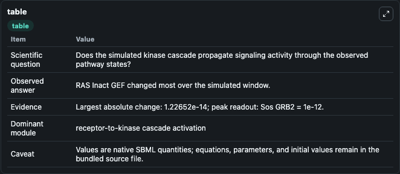
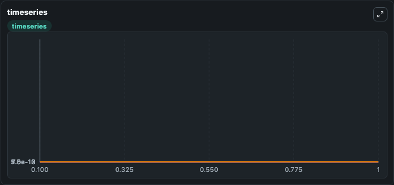
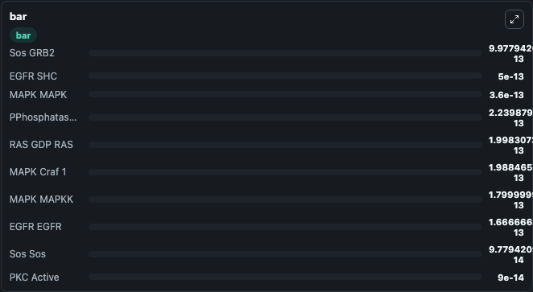

# Bhalla2004_EGFR_MAPK

This Biosimulant lab wraps `Bhalla2004_EGFR_MAPK` as a runnable signaling model with a companion visualization module.
Clean Biosimulant lab for MAPK/ERK receptor signaling. It can be used to explore second-messenger and pathway-signaling dynamics and compare scenario outcomes across configurations.

## What You'll See

The lab asks: How does Bhalla2004 EGFR MAPK propagate receptor or RAS/ERK pathway activity? It runs for 1.0 time units with a communication step of 0.1. The run uses the model defaults declared by the curated SBML wrapper. The generated visualizations focus on PKC active PKC Act RAF PKC Act RAF Cplx, PKC active PKC Inact GAP PKC Inact GAP Cplx, PKC active PKC Act GEF PKC Act GEF Cplx, MAPK active, MAPK active MAPK active Feedback MAPK active Feedback Cplx, and MAPK active Phosph SOS guanine-nucleotide exchange factor Guanine Nucleotide Exchange Factor Guanine Nucleotide Exchange Factor Guanine Nucleotide Exchange Factor Guanine Nucleotide Exchange Factor Phosph SOS guanine-nucleotide exchange factor Guanine Nucleotide Exchange Factor Guanine Nucleotide Exchange Factor Guanine Nucleotide Exchange Factor Guanine Nucleotide Exchange Factor Cplx, and related outputs, combining trajectory, endpoint-comparison, and summary-table views from one completed dark-mode run.

In this captured run, **RAS Inact GEF** moved from 1e-13 to 8.77e-14 across 1.0 simulation windows.

<!-- BIOSIMULANT_VISUALS_START -->
### Output Visualizations



*Summary table for Bhalla2004_EGFR_MAPK, reporting the scientific question, observed answer, dominant module, and caveat.*



*Trajectories of RAS Inact GEF, RAS GEF Active, RAS GEF Gprot Bg, PKC Active PKC Act GEF PKC Act GEF Cplx, Sos Sos Dot GRB2, and Sos Sos across the 1.0 simulation. In this run **RAS GEF Active** climbed from 0 to 5.57e-15 and **RAS Inact GEF** fell from 1e-13 to 8.77e-14 — the largest movements among the focused observables.*



*Largest-excursion ranking of the focused observables — the absolute movement magnitude during the run. Top 3: **Sos GRB2** = 9.98e-13, **EGFR SHC** = 5e-13, **MAPK MAPK** = 3.6e-13, with 7 more observables below.*

<!-- BIOSIMULANT_VISUALS_END -->

## Model Context

- Core model: `models/core`
- Visualization model: `models/visualisation`
- Standard: `other`
- Upstream source: `biomodels_ebi:MODEL9085850385`
- License: `CC0`
- Visual scope: receptor-to-MAPK cascade signaling
- Caveat: Values are native SBML quantities; equations, parameters, units, and initial values remain in the bundled source file.

## Inputs

| Input | Maps To | Default | Notes |
|---|---|---|---|
| Initial beta response parameter Gamma | `signaling_sbml_bhalla2004_egfr_mapk_model9085850385_model.initial_beta_response_parameter_gamma` |  | Initial level of beta response parameter Gamma. Maps to SBML symbol `BetaGamma`; exposed as a traceable initial-condition perturbation. |
| Initial calcium M Ca4 | `signaling_sbml_bhalla2004_egfr_mapk_model9085850385_model.initial_calcium_m_ca4` |  | Initial level of calcium M Ca4. Maps to SBML symbol `CaM_minus_Ca4`; exposed as a traceable initial-condition perturbation. |
| Initial EGFR EGF | `signaling_sbml_bhalla2004_egfr_mapk_model9085850385_model.initial_egfr_egf` |  | Initial level of EGFR EGF. Maps to SBML symbol `EGFR_slash_EGF`; exposed as a traceable initial-condition perturbation. |

## Outputs

| Output | Maps To | Role |
|---|---|---|
| `pkc_active_pkc_act_raf_pkc_act_raf_cplx` | `signaling_sbml_bhalla2004_egfr_mapk_model9085850385_model.pkc_active_pkc_act_raf_pkc_act_raf_cplx` | PKC active PKC Act RAF PKC Act RAF Cplx. |
| `pkc_active_pkc_inact_gap_pkc_inact_gap_cplx` | `signaling_sbml_bhalla2004_egfr_mapk_model9085850385_model.pkc_active_pkc_inact_gap_pkc_inact_gap_cplx` | PKC active PKC Inact GAP PKC Inact GAP Cplx. |
| `pkc_active_pkc_act_gef_pkc_act_gef_cplx` | `signaling_sbml_bhalla2004_egfr_mapk_model9085850385_model.pkc_active_pkc_act_gef_pkc_act_gef_cplx` | PKC active PKC Act GEF PKC Act GEF Cplx. |
| `state` | `signaling_sbml_bhalla2004_egfr_mapk_model9085850385_model.state` | Available to the visualization model and downstream workflows. |
| `summary` | `signaling_sbml_bhalla2004_egfr_mapk_model9085850385_model.summary` | Available to the visualization model and downstream workflows. |
| `species_labels` | `signaling_sbml_bhalla2004_egfr_mapk_model9085850385_model.species_labels` | Available to the visualization model and downstream workflows. |

## Runtime

- Duration: `1.0`
- Communication step: `0.1`

## Running Locally

```bash
biosimulant labs serve .
```
