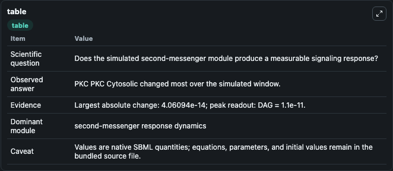
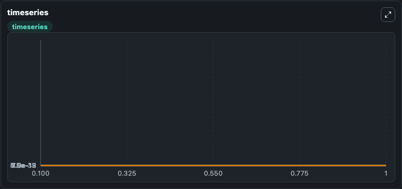
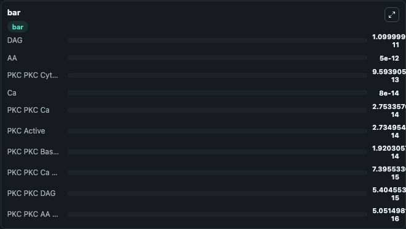

# Bhalla2004_PKC_2003

This Biosimulant lab wraps `Bhalla2004_PKC_2003` as a runnable signaling model with a companion visualization module.
Clean Biosimulant lab for systems signaling model: Bhalla2004_PKC_2003. It can be used to explore second-messenger and pathway-signaling dynamics and compare scenario outcomes across configurations.

## What You'll See

The lab asks: How does Bhalla2004 PKC 2003 route receptor activity into cAMP/PKA-linked readouts? It runs for 1.0 time units with a communication step of 0.1. The run uses the model defaults declared by the curated SBML wrapper. The generated visualizations focus on Calcium bound PKC, DAG And Arachidonic Acid active PKC, Arachidonic Acid active Calcium bound PKC, Membrane active Calcium bound PKC, Membrane active DAG bound PKC, and Basal active PKC, and related outputs, combining trajectory, endpoint-comparison, and summary-table views from one completed dark-mode run.

In this captured run, **PKC PKC Cytosolic** moved from 1e-12 to 9.59e-13 across 1.0 simulation windows.

<!-- BIOSIMULANT_VISUALS_START -->
### Output Visualizations



*Summary table for Bhalla2004_PKC_2003, reporting the scientific question, observed answer, dominant module, and caveat.*



*Trajectories of PKC PKC Cytosolic, PKC PKC Ca, PKC PKC Ca Memb Active, PKC Active, PKC PKC DAG, and PKC PKC Basal Active across the 1.0 simulation. In this run **PKC PKC Ca** climbed from 3.72e-29 to 2.75e-14 and **PKC PKC Cytosolic** fell from 1e-12 to 9.59e-13 — the largest movements among the focused observables.*



*Largest-excursion ranking of the focused observables — the absolute movement magnitude during the run. Top 3: **DAG** = 1.1e-11, **AA** = 5e-12, **PKC PKC Cytosolic** = 9.59e-13, with 7 more observables below.*

<!-- BIOSIMULANT_VISUALS_END -->

## Model Context

- Core model: `models/core`
- Visualization model: `models/visualisation`
- Standard: `other`
- Upstream source: `biomodels_ebi:MODEL9080388197`
- License: `CC0`
- Visual scope: GPCR and cAMP/PKA signaling
- Caveat: Values are native SBML quantities; equations, parameters, units, and initial values remain in the bundled source file.

## Inputs

| Input | Maps To | Default | Notes |
|---|---|---|---|
| Initial DAG | `signaling_sbml_bhalla2004_pkc_2003_model9080388197_model.initial_dag` |  | Initial level of DAG. Maps to SBML symbol `DAG`; exposed as a traceable initial-condition perturbation. |
| Initial source-defined AA state | `signaling_sbml_bhalla2004_pkc_2003_model9080388197_model.initial_source_defined_aa_state` |  | Initial level of source-defined AA state. Maps to SBML symbol `AA`; exposed as a traceable initial-condition perturbation. |
| Initial calcium | `signaling_sbml_bhalla2004_pkc_2003_model9080388197_model.initial_calcium` |  | Initial level of calcium. Maps to SBML symbol `Ca`; exposed as a traceable initial-condition perturbation. |

## Outputs

| Output | Maps To | Role |
|---|---|---|
| `calcium_bound_pkc` | `signaling_sbml_bhalla2004_pkc_2003_model9080388197_model.calcium_bound_pkc` | Calcium bound PKC. |
| `arachidonic_acid_active_calcium_bound_pkc` | `signaling_sbml_bhalla2004_pkc_2003_model9080388197_model.arachidonic_acid_active_calcium_bound_pkc` | Arachidonic Acid active Calcium bound PKC. |
| `membrane_active_calcium_bound_pkc` | `signaling_sbml_bhalla2004_pkc_2003_model9080388197_model.membrane_active_calcium_bound_pkc` | Membrane active Calcium bound PKC. |
| `state` | `signaling_sbml_bhalla2004_pkc_2003_model9080388197_model.state` | Available to the visualization model and downstream workflows. |
| `summary` | `signaling_sbml_bhalla2004_pkc_2003_model9080388197_model.summary` | Available to the visualization model and downstream workflows. |
| `species_labels` | `signaling_sbml_bhalla2004_pkc_2003_model9080388197_model.species_labels` | Available to the visualization model and downstream workflows. |

## Runtime

- Duration: `1.0`
- Communication step: `0.1`

## Running Locally

```bash
biosimulant labs serve .
```
