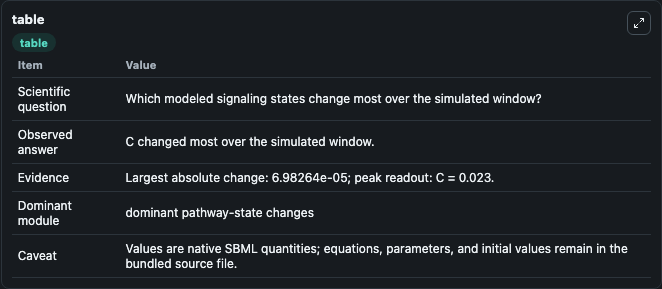
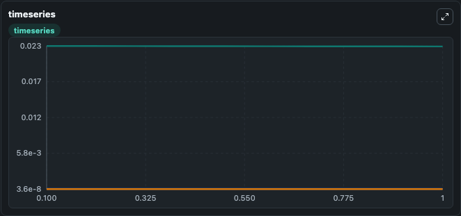
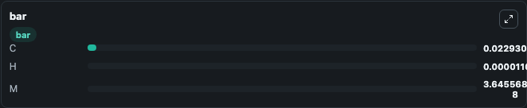

# Bhattacharya2014 - A mathematical model of the sterol regulatory element binding protein 2 cholesterol biosynthesis pathway

This Biosimulant lab wraps `Bhattacharya2014 - A mathematical model of the sterol regulatory element binding protein 2 cholesterol biosynthesis pathway` as a runnable signaling model with a companion visualization module.
Clean Biosimulant lab for metabolic and hormone-linked signaling. It can be used to explore second-messenger and pathway-signaling dynamics and compare scenario outcomes across configurations.

## What You'll See

The lab asks: How does Bhattacharya2014 - A mathematical model of the sterol regulatory element binding protein 2 cholesterol biosynthesis pathway route receptor activity into cAMP/PKA-linked readouts? It runs for 1.0 time units with a communication step of 0.1. The run uses the model defaults declared by the curated SBML wrapper. The generated visualizations focus on source-defined M state, source-defined H state, and source-defined C state, combining trajectory, endpoint-comparison, and summary-table views from one completed dark-mode run.

In this captured run, **C** moved from 0.0230 to 0.0229 across 1.0 simulation windows.

<!-- BIOSIMULANT_VISUALS_START -->
### Output Visualizations



*Summary table for Bhattacharya2014 - A mathematical model of the sterol regulatory element binding protein 2 cholesterol biosynthesis pathway, reporting the scientific question, observed answer, dominant module, and caveat.*



*Trajectories of C, H, and M across the 1.0 simulation. In this run **H** climbed from 1.1e-05 to 1.1e-05 and **C** fell from 0.0230 to 0.0229 — the largest movements among the focused observables.*



*Largest-excursion ranking of the focused observables — the absolute movement magnitude during the run. Top 3: **C** = 0.0229, **H** = 1.1e-05, **M** = 3.65e-08.*

<!-- BIOSIMULANT_VISUALS_END -->

## Model Context

- Core model: `models/core`
- Visualization model: `models/visualisation`
- Standard: `other`
- Upstream source: `biomodels_ebi:BIOMD0000000890`
- License: `CC0`
- Visual scope: GPCR and cAMP/PKA signaling
- Caveat: Values are native SBML quantities; equations, parameters, units, and initial values remain in the bundled source file.

## Inputs

| Input | Maps To | Default | Notes |
|---|---|---|---|
| Initial source-defined M state | `signaling_sbml_bhattacharya2014_a_mathematical_model_of_the_ste_biomd0000000890_model.initial_source_defined_m_state` |  | Initial level of source-defined M state. Maps to SBML symbol `m`; exposed as a traceable initial-condition perturbation. |

## Outputs

| Output | Maps To | Role |
|---|---|---|
| `source_defined_m_state` | `signaling_sbml_bhattacharya2014_a_mathematical_model_of_the_ste_biomd0000000890_model.source_defined_m_state` | source-defined M state. |
| `source_defined_h_state` | `signaling_sbml_bhattacharya2014_a_mathematical_model_of_the_ste_biomd0000000890_model.source_defined_h_state` | source-defined H state. |
| `source_defined_c_state` | `signaling_sbml_bhattacharya2014_a_mathematical_model_of_the_ste_biomd0000000890_model.source_defined_c_state` | source-defined C state. |
| `state` | `signaling_sbml_bhattacharya2014_a_mathematical_model_of_the_ste_biomd0000000890_model.state` | Available to the visualization model and downstream workflows. |
| `summary` | `signaling_sbml_bhattacharya2014_a_mathematical_model_of_the_ste_biomd0000000890_model.summary` | Available to the visualization model and downstream workflows. |
| `species_labels` | `signaling_sbml_bhattacharya2014_a_mathematical_model_of_the_ste_biomd0000000890_model.species_labels` | Available to the visualization model and downstream workflows. |

## Runtime

- Duration: `1.0`
- Communication step: `0.1`

## Running Locally

```bash
biosimulant labs serve .
```
