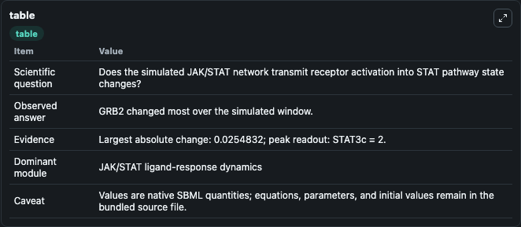
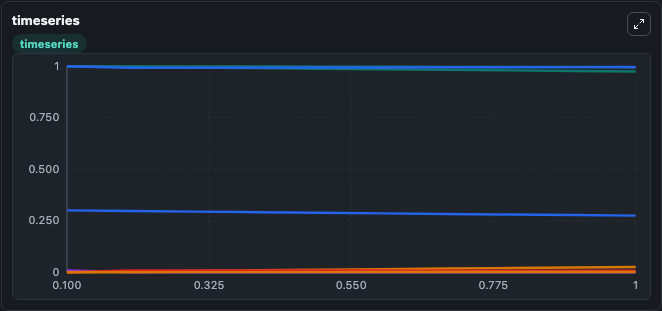
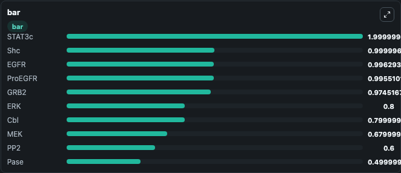

# Bidkhori2012 - EGFR signalling in NSCLC

This Biosimulant lab wraps `Bidkhori2012 - EGFR signalling in NSCLC` as a runnable signaling model with a companion visualization module.
Clean Biosimulant lab for JAK/STAT cytokine signaling. It can be used to explore second-messenger and pathway-signaling dynamics and compare scenario outcomes across configurations.

## What You'll See

The lab asks: How does Bidkhori2012 - EGFR signalling in NSCLC transmit cytokine receptor activity into STAT pathway states? It runs for 1.0 time units with a communication step of 0.1. The run uses the model defaults declared by the curated SBML wrapper. The generated visualizations focus on EGF, EGFR, EGF EGFR, EGF EGFR2, P EGF EGFR2, and Cbl ubiquitin ligase, and related outputs, combining trajectory, endpoint-comparison, and summary-table views from one completed dark-mode run.

In this captured run, **GRB2** moved from 1.000 to 0.9745 across 1.0 simulation windows.

<!-- BIOSIMULANT_VISUALS_START -->
### Output Visualizations



*Summary table for Bidkhori2012 - EGFR signalling in NSCLC, reporting the scientific question, observed answer, dominant module, and caveat.*



*Trajectories of GRB2, SOS, GRB2 SOS, EGF, EGF EGFR, and ProEGFR across the 1.0 simulation. In this run **GRB2 SOS** climbed from 0 to 0.0255 and **GRB2** fell from 1.000 to 0.9745 — the largest movements among the focused observables.*



*Largest-excursion ranking of the focused observables — the absolute movement magnitude during the run. Top 3: **STAT3c** = 2.000, **Shc** = 1.0000, **EGFR** = 0.9963, with 7 more observables below.*

<!-- BIOSIMULANT_VISUALS_END -->

## Model Context

- Core model: `models/core`
- Visualization model: `models/visualisation`
- Standard: `other`
- Upstream source: `biomodels_ebi:BIOMD0000000453`
- License: `CC0`
- Visual scope: JAK/STAT receptor-to-transcription signaling
- Caveat: Values are native SBML quantities; equations, parameters, units, and initial values remain in the bundled source file.

## Inputs

| Input | Maps To | Default | Notes |
|---|---|---|---|
| Abstract source state K115 | `signaling_sbml_bidkhori2012_egfr_signalling_in_nsclc_biomd0000000453_model.initial_abstract_source_state_k115_level` |  | Abstract source state K115 source parameter. Maps to SBML symbol `mw1df2caba_8e41_4fe5_a1b5_7777eb98ed1c` and preserves the bundled default. |
| Abstract source state K121 | `signaling_sbml_bidkhori2012_egfr_signalling_in_nsclc_biomd0000000453_model.initial_abstract_source_state_k121_level` |  | Abstract source state K121 source parameter. Maps to SBML symbol `mw7aba6db3_c7ec_4192_bb5e_0ac4b466c1a5` and preserves the bundled default. |
| Abstract source state K46 | `signaling_sbml_bidkhori2012_egfr_signalling_in_nsclc_biomd0000000453_model.initial_abstract_source_state_k46_level` |  | Abstract source state K46 source parameter. Maps to SBML symbol `mwe1743f7b_ca2c_47d4_91d7_aed2748d98c5` and preserves the bundled default. |

## Outputs

| Output | Maps To | Role |
|---|---|---|
| `egf_egfr` | `signaling_sbml_bidkhori2012_egfr_signalling_in_nsclc_biomd0000000453_model.egf_egfr` | EGF EGFR. |
| `shc_adapter_protein` | `signaling_sbml_bidkhori2012_egfr_signalling_in_nsclc_biomd0000000453_model.shc_adapter_protein` | Shc adapter protein. |
| `sos_guanine_nucleotide_exchange_factor` | `signaling_sbml_bidkhori2012_egfr_signalling_in_nsclc_biomd0000000453_model.sos_guanine_nucleotide_exchange_factor` | SOS guanine-nucleotide exchange factor. |
| `state` | `signaling_sbml_bidkhori2012_egfr_signalling_in_nsclc_biomd0000000453_model.state` | Available to the visualization model and downstream workflows. |
| `summary` | `signaling_sbml_bidkhori2012_egfr_signalling_in_nsclc_biomd0000000453_model.summary` | Available to the visualization model and downstream workflows. |
| `species_labels` | `signaling_sbml_bidkhori2012_egfr_signalling_in_nsclc_biomd0000000453_model.species_labels` | Available to the visualization model and downstream workflows. |

## Runtime

- Duration: `1.0`
- Communication step: `0.1`

## Running Locally

```bash
biosimulant labs serve .
```
