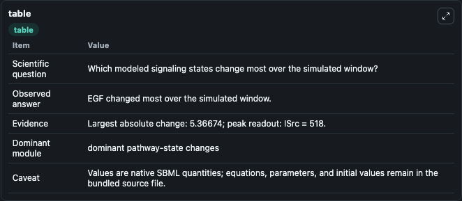
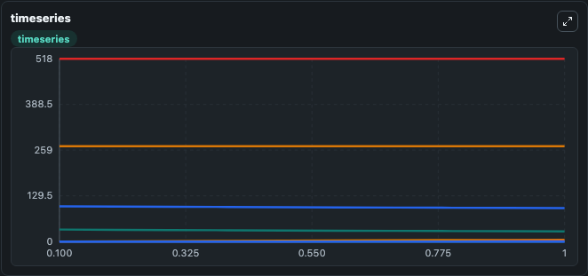
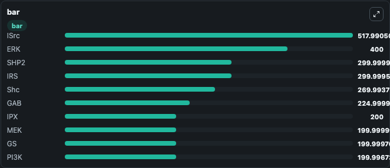

# Borisov2009_EGF_Insulin_Crosstalk

This Biosimulant lab wraps `Borisov2009_EGF_Insulin_Crosstalk` as a runnable signaling model with a companion visualization module.
Clean Biosimulant lab for metabolic and hormone-linked signaling. It can be used to explore second-messenger and pathway-signaling dynamics and compare scenario outcomes across configurations.

## What You'll See

The lab asks: How does Borisov2009 EGF Insulin Crosstalk propagate receptor or RAS/ERK pathway activity? It runs for 1.0 time units with a communication step of 0.1. The run uses the model defaults declared by the curated SBML wrapper. The generated visualizations focus on EGF, Source Defined I State, Source Defined RE State, Source Defined RD State, Source Defined RP State, and Source Defined GS State, and related outputs, combining trajectory, endpoint-comparison, and summary-table views from one completed dark-mode run.

In this captured run, **EGF** moved from 34.000 to 28.633 across 1.0 simulation windows.

<!-- BIOSIMULANT_VISUALS_START -->
### Output Visualizations



*Summary table for Borisov2009_EGF_Insulin_Crosstalk, reporting the scientific question, observed answer, dominant module, and caveat.*



*Trajectories of EGF, R, RE, Rd, ISrc, and ASrc across the 1.0 simulation. In this run **RE** climbed from 0 to 4.880 and **EGF** fell from 34.000 to 28.633 — the largest movements among the focused observables.*



*Largest-excursion ranking of the focused observables — the absolute movement magnitude during the run. Top 3: **ISrc** = 518.0, **ERK** = 400.0, **SHP2** = 300.0, with 7 more observables below.*

<!-- BIOSIMULANT_VISUALS_END -->

## Model Context

- Core model: `models/core`
- Visualization model: `models/visualisation`
- Standard: `other`
- Upstream source: `biomodels_ebi:BIOMD0000000223`
- License: `CC0`
- Visual scope: receptor-to-MAPK cascade signaling
- Caveat: Values are native SBML quantities; equations, parameters, units, and initial values remain in the bundled source file.

## Inputs

| Input | Maps To | Default | Notes |
|---|---|---|---|
| Initial EGF | `signaling_sbml_borisov2009_egf_insulin_crosstalk_biomd0000000223_model.initial_egf` |  | Initial level of EGF. Maps to SBML symbol `EGF`; exposed as a traceable initial-condition perturbation. |

## Outputs

| Output | Maps To | Role |
|---|---|---|
| `ras_gap` | `signaling_sbml_borisov2009_egf_insulin_crosstalk_biomd0000000223_model.ras_gap` | RAS GAP. |
| `rp_ras_gap` | `signaling_sbml_borisov2009_egf_insulin_crosstalk_biomd0000000223_model.rp_ras_gap` | Rp RAS GAP. |
| `phosphorylated_insulin_receptor_ras_gap` | `signaling_sbml_borisov2009_egf_insulin_crosstalk_biomd0000000223_model.phosphorylated_insulin_receptor_ras_gap` | Phosphorylated Insulin Receptor RAS GAP. |
| `state` | `signaling_sbml_borisov2009_egf_insulin_crosstalk_biomd0000000223_model.state` | Available to the visualization model and downstream workflows. |
| `summary` | `signaling_sbml_borisov2009_egf_insulin_crosstalk_biomd0000000223_model.summary` | Available to the visualization model and downstream workflows. |
| `species_labels` | `signaling_sbml_borisov2009_egf_insulin_crosstalk_biomd0000000223_model.species_labels` | Available to the visualization model and downstream workflows. |

## Runtime

- Duration: `1.0`
- Communication step: `0.1`

## Running Locally

```bash
biosimulant labs serve .
```
