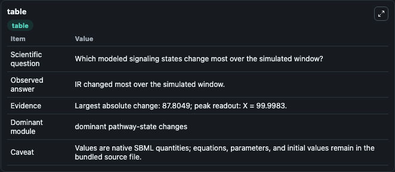
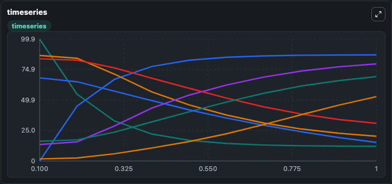
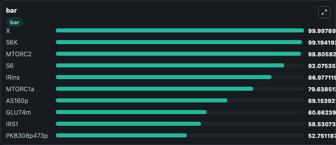

# Brännmark2013 - Insulin signalling in human adipocytes (normal condition)

This Biosimulant lab wraps `Brännmark2013 - Insulin signalling in human adipocytes (normal condition)` as a runnable signaling model with a companion visualization module.
Clean Biosimulant lab for metabolic and hormone-linked signaling. It can be used to explore second-messenger and pathway-signaling dynamics and compare scenario outcomes across configurations.

## What You'll See

The lab asks: How does Brännmark2013 - Insulin signalling in human adipocytes (normal condition) shift hormone-linked signaling readouts? It runs for 1.0 time units with a communication step of 0.1. The run uses the model defaults declared by the curated SBML wrapper. The generated visualizations focus on insulin receptor, phosphorylated insulin receptor, insulin-bound insulin receptor, internalized phosphorylated insulin receptor, internalized insulin receptor, and source-defined IRS1 state, and related outputs, combining trajectory, endpoint-comparison, and summary-table views from one completed dark-mode run.

In this captured run, **IR** moved from 99.874 to 12.069 across 1.0 simulation windows.

<!-- BIOSIMULANT_VISUALS_START -->
### Output Visualizations



*Summary table for Brännmark2013 - Insulin signalling in human adipocytes (normal condition), reporting the scientific question, observed answer, dominant module, and caveat.*



*Trajectories of IR, IRins, MTORC1, MTORC1a, AS160, and AS160p across the 1.0 simulation. In this run **IRins** climbed from 0 to 86.977 and **IR** fell from 99.874 to 12.069 — the largest movements among the focused observables.*



*Largest-excursion ranking of the focused observables — the absolute movement magnitude during the run. Top 3: **X** = 99.998, **S6K** = 99.194, **MTORC2** = 98.806, with 7 more observables below.*

<!-- BIOSIMULANT_VISUALS_END -->

## Model Context

- Core model: `models/core`
- Visualization model: `models/visualisation`
- Standard: `other`
- Upstream source: `biomodels_ebi:BIOMD0000000448`
- License: `CC0`
- Visual scope: metabolic and hormone signaling response
- Caveat: Values are native SBML quantities; equations, parameters, units, and initial values remain in the bundled source file.

## Inputs

| Input | Maps To | Default | Notes |
|---|---|---|---|
| Insulin | `signaling_sbml_br_nnmark2013_insulin_signalling_in_human_adipoc_biomd0000000448_model.initial_insulin_level` |  | Insulin source parameter. Maps to SBML symbol `insulin` and preserves the bundled default. |
| Scale GLUCOSE | `signaling_sbml_br_nnmark2013_insulin_signalling_in_human_adipoc_biomd0000000448_model.initial_scale_glucose_level` |  | Scale GLUCOSE source parameter. Maps to SBML symbol `scaleGLUCOSE` and preserves the bundled default. |

## Outputs

| Output | Maps To | Role |
|---|---|---|
| `phosphorylated_insulin_receptor` | `signaling_sbml_br_nnmark2013_insulin_signalling_in_human_adipoc_biomd0000000448_model.phosphorylated_insulin_receptor` | phosphorylated insulin receptor. |
| `insulin_bound_insulin_receptor` | `signaling_sbml_br_nnmark2013_insulin_signalling_in_human_adipoc_biomd0000000448_model.insulin_bound_insulin_receptor` | insulin-bound insulin receptor. |
| `internalized_phosphorylated_insulin_receptor` | `signaling_sbml_br_nnmark2013_insulin_signalling_in_human_adipoc_biomd0000000448_model.internalized_phosphorylated_insulin_receptor` | internalized phosphorylated insulin receptor. |
| `state` | `signaling_sbml_br_nnmark2013_insulin_signalling_in_human_adipoc_biomd0000000448_model.state` | Available to the visualization model and downstream workflows. |
| `summary` | `signaling_sbml_br_nnmark2013_insulin_signalling_in_human_adipoc_biomd0000000448_model.summary` | Available to the visualization model and downstream workflows. |
| `species_labels` | `signaling_sbml_br_nnmark2013_insulin_signalling_in_human_adipoc_biomd0000000448_model.species_labels` | Available to the visualization model and downstream workflows. |

## Runtime

- Duration: `1.0`
- Communication step: `0.1`

## Running Locally

```bash
biosimulant labs serve .
```
