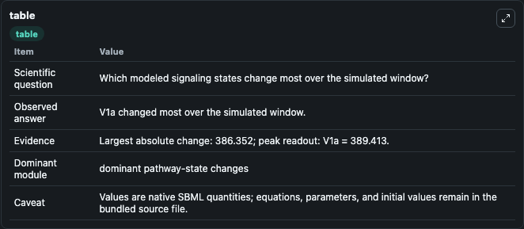
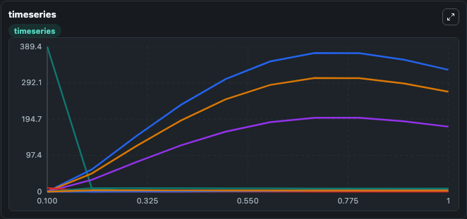
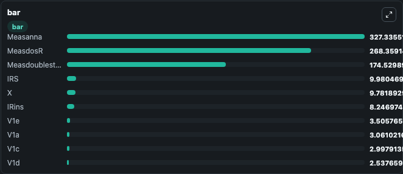

# Brannmark2010_InsulinSignalling_Mifamodel

This Biosimulant lab wraps `Brannmark2010_InsulinSignalling_Mifamodel` as a runnable signaling model with a companion visualization module.
Clean Biosimulant lab for metabolic and hormone-linked signaling. It can be used to explore second-messenger and pathway-signaling dynamics and compare scenario outcomes across configurations.

## What You'll See

The lab asks: How does Brannmark2010 InsulinSignalling Mifamodel route receptor activity into cAMP/PKA-linked readouts? It runs for 1.0 time units with a communication step of 0.1. The run uses the model defaults declared by the curated SBML wrapper. The generated visualizations focus on insulin receptor, insulin-bound insulin receptor, phosphorylated insulin receptor, internalized phosphorylated insulin receptor, internalized insulin receptor, and IRS, and related outputs, combining trajectory, endpoint-comparison, and summary-table views from one completed dark-mode run.

In this captured run, **V1a** moved from 389.4 to 3.061 across 1.0 simulation windows.

<!-- BIOSIMULANT_VISUALS_START -->
### Output Visualizations



*Summary table for Brannmark2010_InsulinSignalling_Mifamodel, reporting the scientific question, observed answer, dominant module, and caveat.*



*Trajectories of V1a, Measanna, MeasdosR, Measdoublestep, IR, and IRins across the 1.0 simulation. In this run **Measanna** climbed from 0 to 327.3 and **V1a** fell from 389.4 to 3.061 — the largest movements among the focused observables.*



*Largest-excursion ranking of the focused observables — the absolute movement magnitude during the run. Top 3: **Measanna** = 327.3, **MeasdosR** = 268.4, **Measdoublestep** = 174.5, with 7 more observables below.*

<!-- BIOSIMULANT_VISUALS_END -->

## Model Context

- Core model: `models/core`
- Visualization model: `models/visualisation`
- Standard: `other`
- Upstream source: `biomodels_ebi:BIOMD0000000343`
- License: `CC0`
- Visual scope: GPCR and cAMP/PKA signaling
- Caveat: Values are native SBML quantities; equations, parameters, units, and initial values remain in the bundled source file.

## Inputs

| Input | Maps To | Default | Notes |
|---|---|---|---|
| Initial internalized insulin receptor amount | `signaling_sbml_brannmark2010_insulinsignalling_mifamodel_biomd0000000343_model.initial_internalized_insulin_receptor_amount` |  | Initial level of internalized insulin receptor amount. Maps to SBML symbol `intamount`; exposed as a traceable initial-condition perturbation. |
| Initial internalized insulin receptor | `signaling_sbml_brannmark2010_insulinsignalling_mifamodel_biomd0000000343_model.initial_internalized_insulin_receptor` |  | Initial level of internalized insulin receptor. Maps to SBML symbol `IRi`; exposed as a traceable initial-condition perturbation. |
| Initial insulin-bound insulin receptor | `signaling_sbml_brannmark2010_insulinsignalling_mifamodel_biomd0000000343_model.initial_insulin_bound_insulin_receptor` |  | Initial level of insulin-bound insulin receptor. Maps to SBML symbol `IRins`; exposed as a traceable initial-condition perturbation. |

## Outputs

| Output | Maps To | Role |
|---|---|---|
| `insulin_bound_insulin_receptor` | `signaling_sbml_brannmark2010_insulinsignalling_mifamodel_biomd0000000343_model.insulin_bound_insulin_receptor` | insulin-bound insulin receptor. |
| `phosphorylated_insulin_receptor` | `signaling_sbml_brannmark2010_insulinsignalling_mifamodel_biomd0000000343_model.phosphorylated_insulin_receptor` | phosphorylated insulin receptor. |
| `internalized_phosphorylated_insulin_receptor` | `signaling_sbml_brannmark2010_insulinsignalling_mifamodel_biomd0000000343_model.internalized_phosphorylated_insulin_receptor` | internalized phosphorylated insulin receptor. |
| `state` | `signaling_sbml_brannmark2010_insulinsignalling_mifamodel_biomd0000000343_model.state` | Available to the visualization model and downstream workflows. |
| `summary` | `signaling_sbml_brannmark2010_insulinsignalling_mifamodel_biomd0000000343_model.summary` | Available to the visualization model and downstream workflows. |
| `species_labels` | `signaling_sbml_brannmark2010_insulinsignalling_mifamodel_biomd0000000343_model.species_labels` | Available to the visualization model and downstream workflows. |

## Runtime

- Duration: `1.0`
- Communication step: `0.1`

## Running Locally

```bash
biosimulant labs serve .
```
