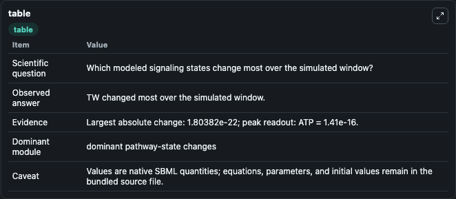
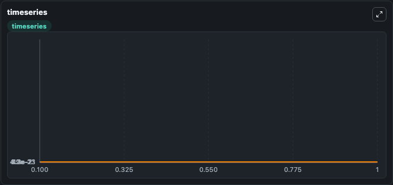
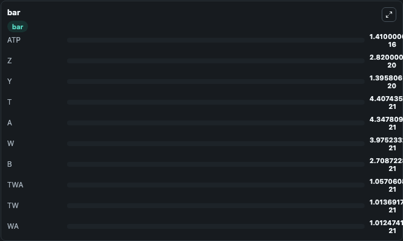

# Bray1993_chemotaxis

This Biosimulant lab wraps `Bray1993_chemotaxis` as a runnable signaling model with a companion visualization module.
Clean Biosimulant lab for systems signaling model: Bray1993_chemotaxis. It can be used to explore second-messenger and pathway-signaling dynamics and compare scenario outcomes across configurations.

## What You'll See

The lab asks: How does Bray1993 chemotaxis route receptor activity into cAMP/PKA-linked readouts? It runs for 1.0 time units with a communication step of 0.1. The run uses the model defaults declared by the curated SBML wrapper. The generated visualizations focus on aspartate ligand, source-defined NI state, source-defined T state, total aspartate-bound receptor, total inactive receptor state Ni, and source-defined W state, and related outputs, combining trajectory, endpoint-comparison, and summary-table views from one completed dark-mode run.

In this captured run, **TW** moved from 8.33e-22 to 1.01e-21 across 1.0 simulation windows.

<!-- BIOSIMULANT_VISUALS_START -->
### Output Visualizations



*Summary table for Bray1993_chemotaxis, reporting the scientific question, observed answer, dominant module, and caveat.*



*Trajectories of TW, TWA, A, W, WA, and TA across the 1.0 simulation. In this run **TW** climbed from 8.33e-22 to 1.01e-21 and **TWA** fell from 1.19e-21 to 1.06e-21 — the largest movements among the focused observables.*



*Largest-excursion ranking of the focused observables — the absolute movement magnitude during the run. Top 3: **ATP** = 1.41e-16, **Z** = 2.82e-20, **Y** = 1.4e-20, with 7 more observables below.*

<!-- BIOSIMULANT_VISUALS_END -->

## Model Context

- Core model: `models/core`
- Visualization model: `models/visualisation`
- Standard: `other`
- Upstream source: `biomodels_ebi:BIOMD0000000404`
- License: `CC0`
- Visual scope: GPCR and cAMP/PKA signaling
- Caveat: Values are native SBML quantities; equations, parameters, units, and initial values remain in the bundled source file.

## Inputs

| Input | Maps To | Default | Notes |
|---|---|---|---|
| Initial aspartate ligand | `signaling_sbml_bray1993_chemotaxis_biomd0000000404_model.initial_aspartate_ligand` |  | Initial level of aspartate ligand. Maps to SBML symbol `asp`; exposed as a traceable initial-condition perturbation. |
| Initial ATP | `signaling_sbml_bray1993_chemotaxis_biomd0000000404_model.initial_atp` |  | Initial level of ATP. Maps to SBML symbol `species_1`; exposed as a traceable initial-condition perturbation. |
| Initial source-defined NI state | `signaling_sbml_bray1993_chemotaxis_biomd0000000404_model.initial_source_defined_ni_state` |  | Initial level of source-defined NI state. Maps to SBML symbol `ni`; exposed as a traceable initial-condition perturbation. |

## Outputs

| Output | Maps To | Role |
|---|---|---|
| `aspartate_ligand` | `signaling_sbml_bray1993_chemotaxis_biomd0000000404_model.aspartate_ligand` | aspartate ligand. |
| `total_aspartate_bound_receptor` | `signaling_sbml_bray1993_chemotaxis_biomd0000000404_model.total_aspartate_bound_receptor` | total aspartate-bound receptor. |
| `total_inactive_receptor_state_ni` | `signaling_sbml_bray1993_chemotaxis_biomd0000000404_model.total_inactive_receptor_state_ni` | total inactive receptor state Ni. |
| `state` | `signaling_sbml_bray1993_chemotaxis_biomd0000000404_model.state` | Available to the visualization model and downstream workflows. |
| `summary` | `signaling_sbml_bray1993_chemotaxis_biomd0000000404_model.summary` | Available to the visualization model and downstream workflows. |
| `species_labels` | `signaling_sbml_bray1993_chemotaxis_biomd0000000404_model.species_labels` | Available to the visualization model and downstream workflows. |

## Runtime

- Duration: `1.0`
- Communication step: `0.1`

## Running Locally

```bash
biosimulant labs serve .
```
