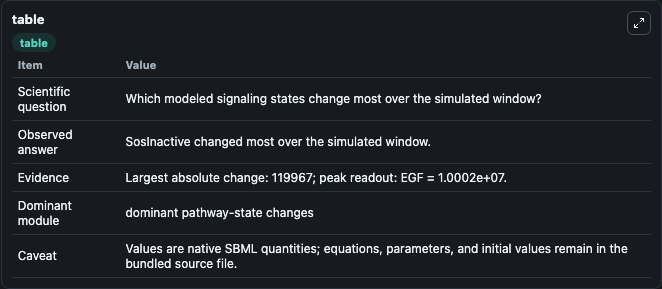
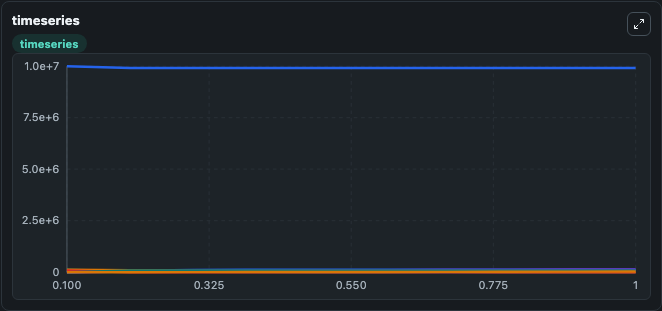
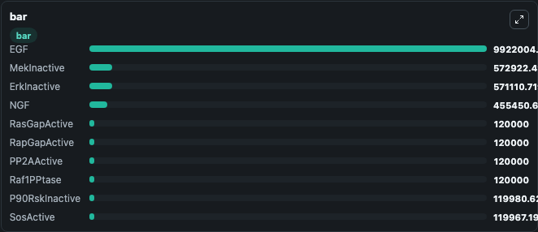

# Brown2004 - NGF and EGF signaling

This Biosimulant lab wraps `Brown2004 - NGF and EGF signaling` as a runnable signaling model with a companion visualization module.
Clean Biosimulant lab for systems signaling model: Brown2004 - NGF and EGF signaling. It can be used to explore second-messenger and pathway-signaling dynamics and compare scenario outcomes across configurations.

## What You'll See

The lab asks: How does Brown2004 - NGF and EGF signaling propagate receptor or RAS/ERK pathway activity? It runs for 1.0 time units with a communication step of 0.1. The run uses the model defaults declared by the curated SBML wrapper. The generated visualizations focus on EGF, Source Defined Nerve Growth Factor State, free Egfreceptor, bound Egfreceptor, free Ngfreceptor, and bound Ngfreceptor, and related outputs, combining trajectory, endpoint-comparison, and summary-table views from one completed dark-mode run.

In this captured run, **SosInactive** moved from 1.2e+05 to 32.807 across 1.0 simulation windows.

<!-- BIOSIMULANT_VISUALS_START -->
### Output Visualizations



*Summary table for Brown2004 - NGF and EGF signaling, reporting the scientific question, observed answer, dominant module, and caveat.*



*Trajectories of SosInactive, SosActive, PI3KInactive, PI3KActive, FreeEGFReceptor, and BoundEGFReceptor across the 1.0 simulation. In this run **SosActive** climbed from 0 to 1.2e+05 and **SosInactive** fell from 1.2e+05 to 32.807 — the largest movements among the focused observables.*



*Largest-excursion ranking of the focused observables — the absolute movement magnitude during the run. Top 3: **EGF** = 9.92e+06, **MekInactive** = 5.73e+05, **ErkInactive** = 5.71e+05, with 7 more observables below.*

<!-- BIOSIMULANT_VISUALS_END -->

## Model Context

- Core model: `models/core`
- Visualization model: `models/visualisation`
- Standard: `other`
- Upstream source: `biomodels_ebi:BIOMD0000000033`
- License: `CC0`
- Visual scope: receptor-to-MAPK cascade signaling
- Caveat: Values are native SBML quantities; equations, parameters, units, and initial values remain in the bundled source file.

## Inputs

| Input | Maps To | Default | Notes |
|---|---|---|---|
| source-defined KEGF state | `signaling_sbml_brown2004_ngf_and_egf_signaling_biomd0000000033_model.initial_source_defined_kegf_state_level` |  | source-defined KEGF state source parameter. Maps to SBML symbol `kEGF` and preserves the bundled default. |
| Km EGF | `signaling_sbml_brown2004_ngf_and_egf_signaling_biomd0000000033_model.initial_km_egf_level` |  | Km EGF source parameter. Maps to SBML symbol `KmEGF` and preserves the bundled default. |
| Krb EGF | `signaling_sbml_brown2004_ngf_and_egf_signaling_biomd0000000033_model.initial_krb_egf_level` |  | Krb EGF source parameter. Maps to SBML symbol `krbEGF` and preserves the bundled default. |

## Outputs

| Output | Maps To | Role |
|---|---|---|
| `free_egfreceptor` | `signaling_sbml_brown2004_ngf_and_egf_signaling_biomd0000000033_model.free_egfreceptor` | free Egfreceptor. |
| `bound_egfreceptor` | `signaling_sbml_brown2004_ngf_and_egf_signaling_biomd0000000033_model.bound_egfreceptor` | bound Egfreceptor. |
| `free_ngfreceptor` | `signaling_sbml_brown2004_ngf_and_egf_signaling_biomd0000000033_model.free_ngfreceptor` | free Ngfreceptor. |
| `state` | `signaling_sbml_brown2004_ngf_and_egf_signaling_biomd0000000033_model.state` | Available to the visualization model and downstream workflows. |
| `summary` | `signaling_sbml_brown2004_ngf_and_egf_signaling_biomd0000000033_model.summary` | Available to the visualization model and downstream workflows. |
| `species_labels` | `signaling_sbml_brown2004_ngf_and_egf_signaling_biomd0000000033_model.species_labels` | Available to the visualization model and downstream workflows. |

## Runtime

- Duration: `1.0`
- Communication step: `0.1`

## Running Locally

```bash
biosimulant labs serve .
```
