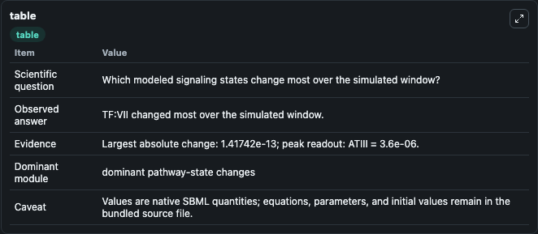
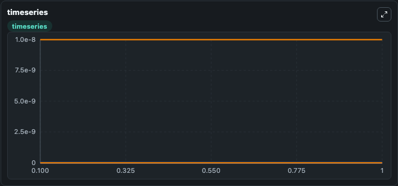
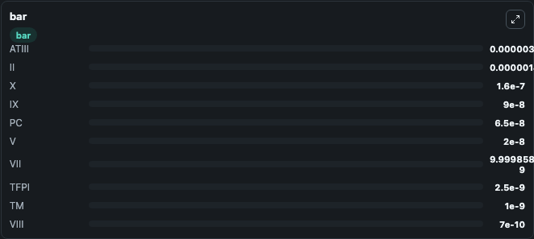

# Brummel-Ziedins2012 - Contribution of the PC pathway to thrombin generation

This Biosimulant lab wraps `Brummel-Ziedins2012 - Contribution of the PC pathway to thrombin generation` as a runnable signaling model with a companion visualization module.
Clean Biosimulant lab for systems signaling model: Brummel-Ziedins2012 - Contribution of the PC pathway to thrombin generation. It can be used to explore second-messenger and pathway-signaling dynamics and compare scenario outcomes across configurations.

## What You'll See

The lab asks: How does Brummel-Ziedins2012 - Contribution of the PC pathway to thrombin generation shift hormone-linked signaling readouts? It runs for 1.0 time units with a communication step of 0.1. The run uses the model defaults declared by the curated SBML wrapper. The generated visualizations focus on source-defined TF state, TF VII, source-defined VII state, TF Viia, source-defined VIIA state, and source-defined XA state, and related outputs, combining trajectory, endpoint-comparison, and summary-table views from one completed dark-mode run.

In this captured run, **TF:VII** moved from 0 to 1.42e-13 across 1.0 simulation windows.

<!-- BIOSIMULANT_VISUALS_START -->
### Output Visualizations



*Summary table for Brummel-Ziedins2012 - Contribution of the PC pathway to thrombin generation, reporting the scientific question, observed answer, dominant module, and caveat.*



*Trajectories of TF:VII, TF, VII, TF:VIIa, VIIa, and Xa across the 1.0 simulation. In this run **TF:VII** climbed from 0 to 1.42e-13 and **TF** fell from 5e-12 to 4.86e-12 — the largest movements among the focused observables.*



*Largest-excursion ranking of the focused observables — the absolute movement magnitude during the run. Top 3: **ATIII** = 3.6e-06, **II** = 1.4e-06, **X** = 1.6e-07, with 7 more observables below.*

<!-- BIOSIMULANT_VISUALS_END -->

## Model Context

- Core model: `models/core`
- Visualization model: `models/visualisation`
- Standard: `other`
- Upstream source: `biomodels_ebi:MODEL1807180002`
- License: `CC0`
- Visual scope: metabolic and hormone signaling response
- Caveat: Values are native SBML quantities; equations, parameters, units, and initial values remain in the bundled source file.

## Inputs

| Input | Maps To | Default | Notes |
|---|---|---|---|
| Initial source-defined TF state | `signaling_sbml_brummel_ziedins2012_contribution_of_the_pc_pathw_model1807180002_model.initial_source_defined_tf_state` |  | Initial level of source-defined TF state. Maps to SBML symbol `TF`; exposed as a traceable initial-condition perturbation. |

## Outputs

| Output | Maps To | Role |
|---|---|---|
| `viii_ica1` | `signaling_sbml_brummel_ziedins2012_contribution_of_the_pc_pathw_model1807180002_model.viii_ica1` | VIII Ica1. |
| `source_defined_lca1_state` | `signaling_sbml_brummel_ziedins2012_contribution_of_the_pc_pathw_model1807180002_model.source_defined_lca1_state` | source-defined LCA1 state. |
| `apc_lca1` | `signaling_sbml_brummel_ziedins2012_contribution_of_the_pc_pathw_model1807180002_model.apc_lca1` | APC LCA1. |
| `state` | `signaling_sbml_brummel_ziedins2012_contribution_of_the_pc_pathw_model1807180002_model.state` | Available to the visualization model and downstream workflows. |
| `summary` | `signaling_sbml_brummel_ziedins2012_contribution_of_the_pc_pathw_model1807180002_model.summary` | Available to the visualization model and downstream workflows. |
| `species_labels` | `signaling_sbml_brummel_ziedins2012_contribution_of_the_pc_pathw_model1807180002_model.species_labels` | Available to the visualization model and downstream workflows. |

## Runtime

- Duration: `1.0`
- Communication step: `0.1`

## Running Locally

```bash
biosimulant labs serve .
```
