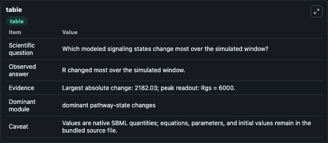
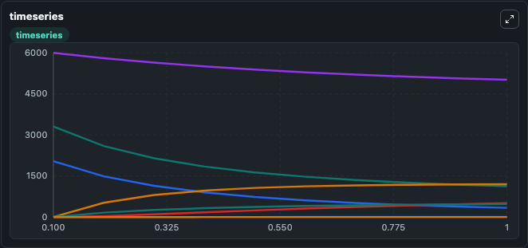
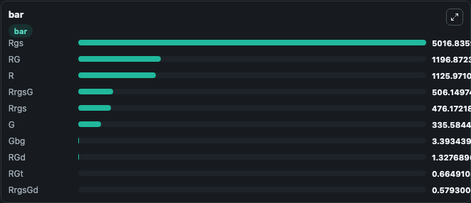

# Bush2016 - Extended Carrousel model of GPCR-RGS

This Biosimulant lab wraps `Bush2016 - Extended Carrousel model of GPCR-RGS` as a runnable signaling model with a companion visualization module.
Clean Biosimulant lab for systems signaling model: Bush2016 - Extended Carrousel model of GPCR-RGS. It can be used to explore second-messenger and pathway-signaling dynamics and compare scenario outcomes across configurations.

## What You'll See

The lab asks: How does Bush2016 - Extended Carrousel model of GPCR-RGS route receptor activity into cAMP/PKA-linked readouts? It runs for 1.0 time units with a communication step of 0.1. The run uses the model defaults declared by the curated SBML wrapper. The generated visualizations focus on source-defined R state, source-defined LR state, source-defined G state, source-defined GT state, source-defined GD state, and source-defined RG state, and related outputs, combining trajectory, endpoint-comparison, and summary-table views from one completed dark-mode run.

In this captured run, **R** moved from 3308.0 to 1126.0 across 1.0 simulation windows.

<!-- BIOSIMULANT_VISUALS_START -->
### Output Visualizations



*Summary table for Bush2016 - Extended Carrousel model of GPCR-RGS, reporting the scientific question, observed answer, dominant module, and caveat.*



*Trajectories of R, G, RG, Rgs, RrgsG, and Rrgs across the 1.0 simulation. In this run **RG** climbed from 0 to 1196.9 and **R** fell from 3308.0 to 1126.0 — the largest movements among the focused observables.*



*Largest-excursion ranking of the focused observables — the absolute movement magnitude during the run. Top 3: **Rgs** = 5016.8, **RG** = 1196.9, **R** = 1126.0, with 7 more observables below.*

<!-- BIOSIMULANT_VISUALS_END -->

## Model Context

- Core model: `models/core`
- Visualization model: `models/visualisation`
- Standard: `other`
- Upstream source: `biomodels_ebi:BIOMD0000000638`
- License: `CC0`
- Visual scope: GPCR and cAMP/PKA signaling
- Caveat: Values are native SBML quantities; equations, parameters, units, and initial values remain in the bundled source file.

## Inputs

| Input | Maps To | Default | Notes |
|---|---|---|---|
| Initial source-defined R state | `signaling_sbml_bush2016_extended_carrousel_model_of_gpcr_rgs_biomd0000000638_model.initial_source_defined_r_state` |  | Initial level of source-defined R state. Maps to SBML symbol `R`; exposed as a traceable initial-condition perturbation. |

## Outputs

| Output | Maps To | Role |
|---|---|---|
| `g_beta_gamma_complex` | `signaling_sbml_bush2016_extended_carrousel_model_of_gpcr_rgs_biomd0000000638_model.g_beta_gamma_complex` | G beta-gamma complex. |
| `source_defined_lrg_state` | `signaling_sbml_bush2016_extended_carrousel_model_of_gpcr_rgs_biomd0000000638_model.source_defined_lrg_state` | source-defined LRG state. |
| `ligand_receptor_gtp_complex` | `signaling_sbml_bush2016_extended_carrousel_model_of_gpcr_rgs_biomd0000000638_model.ligand_receptor_gtp_complex` | ligand-receptor GTP complex. |
| `state` | `signaling_sbml_bush2016_extended_carrousel_model_of_gpcr_rgs_biomd0000000638_model.state` | Available to the visualization model and downstream workflows. |
| `summary` | `signaling_sbml_bush2016_extended_carrousel_model_of_gpcr_rgs_biomd0000000638_model.summary` | Available to the visualization model and downstream workflows. |
| `species_labels` | `signaling_sbml_bush2016_extended_carrousel_model_of_gpcr_rgs_biomd0000000638_model.species_labels` | Available to the visualization model and downstream workflows. |

## Runtime

- Duration: `1.0`
- Communication step: `0.1`

## Running Locally

```bash
biosimulant labs serve .
```
