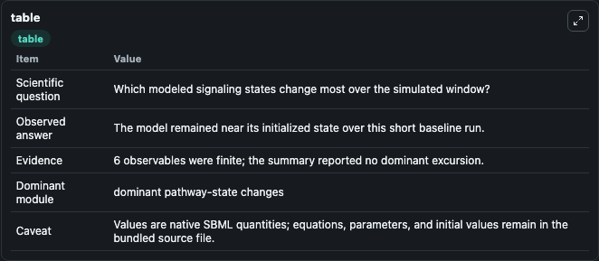
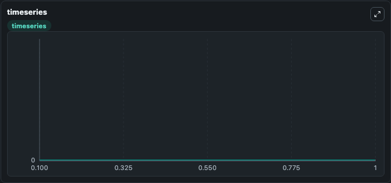
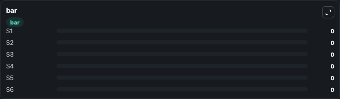

# Cao2013 - Application of ABSIS in the the enzymatic futile cycle

This Biosimulant lab wraps `Cao2013 - Application of ABSIS in the the enzymatic futile cycle` as a runnable signaling model with a companion visualization module.
Clean Biosimulant lab for systems signaling model: Cao2013 - Application of ABSIS in the the enzymatic futile cycle. It can be used to explore second-messenger and pathway-signaling dynamics and compare scenario outcomes across configurations.

## What You'll See

The lab asks: How does Cao2013 - Application of ABSIS in the the enzymatic futile cycle express its source-modeled signaling motif over the baseline run? It runs for 1.0 time units with a communication step of 0.1. The run uses the model defaults declared by the curated SBML wrapper. The generated visualizations focus on source-defined S1 state, source-defined S2 state, source-defined S3 state, source-defined S4 state, source-defined S5 state, and source-defined S6 state, combining trajectory, endpoint-comparison, and summary-table views from one completed dark-mode run.

In this captured run, **S1** moved from 0 to 0 across 1.0 simulation windows.

<!-- BIOSIMULANT_VISUALS_START -->
### Output Visualizations



*Summary table for Cao2013 - Application of ABSIS in the the enzymatic futile cycle, reporting the scientific question, observed answer, dominant module, and caveat.*



*Trajectories of S1, S2, S3, S4, S5, and S6 across the 1.0 simulation. In this run S1, S2, S3, S4 stayed near their initial values — no observable moved appreciably.*



*Largest-excursion ranking of the focused observables — the absolute movement magnitude during the run. Top 3: **S1** = 0, **S2** = 0, **S3** = 0, with 3 more observables below.*

<!-- BIOSIMULANT_VISUALS_END -->

## Model Context

- Core model: `models/core`
- Visualization model: `models/visualisation`
- Standard: `other`
- Upstream source: `biomodels_ebi:BIOMD0000000487`
- License: `CC0`
- Visual scope: phosphorylation and regulatory motif dynamics
- Caveat: Values are native SBML quantities; equations, parameters, units, and initial values remain in the bundled source file.

## Inputs

| Input | Maps To | Default | Notes |
|---|---|---|---|
| Initial source-defined S1 state | `signaling_sbml_cao2013_application_of_absis_in_the_the_enzymati_biomd0000000487_model.initial_source_defined_s1_state` |  | Initial level of source-defined S1 state. Maps to SBML symbol `S1`; exposed as a traceable initial-condition perturbation. |

## Outputs

| Output | Maps To | Role |
|---|---|---|
| `source_defined_s1_state` | `signaling_sbml_cao2013_application_of_absis_in_the_the_enzymati_biomd0000000487_model.source_defined_s1_state` | source-defined S1 state. |
| `source_defined_s2_state` | `signaling_sbml_cao2013_application_of_absis_in_the_the_enzymati_biomd0000000487_model.source_defined_s2_state` | source-defined S2 state. |
| `source_defined_s3_state` | `signaling_sbml_cao2013_application_of_absis_in_the_the_enzymati_biomd0000000487_model.source_defined_s3_state` | source-defined S3 state. |
| `state` | `signaling_sbml_cao2013_application_of_absis_in_the_the_enzymati_biomd0000000487_model.state` | Available to the visualization model and downstream workflows. |
| `summary` | `signaling_sbml_cao2013_application_of_absis_in_the_the_enzymati_biomd0000000487_model.summary` | Available to the visualization model and downstream workflows. |
| `species_labels` | `signaling_sbml_cao2013_application_of_absis_in_the_the_enzymati_biomd0000000487_model.species_labels` | Available to the visualization model and downstream workflows. |

## Runtime

- Duration: `1.0`
- Communication step: `0.1`

## Running Locally

```bash
biosimulant labs serve .
```
