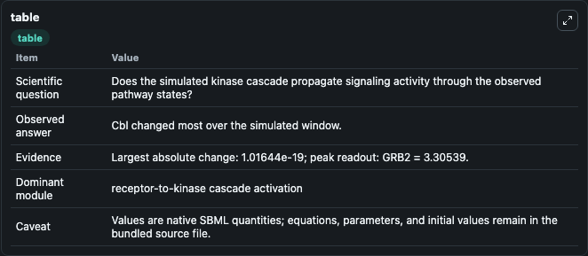
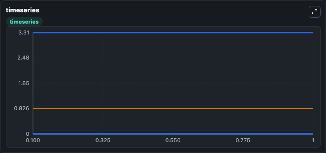
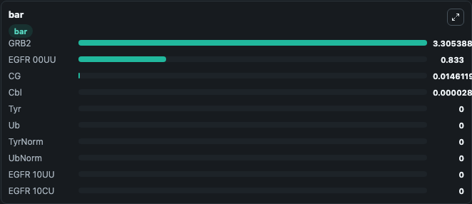

# Capuani2015 - Binding of Cbl and Gbr2 to EGFR (Multisite Phosphorylation Model - MPM)

This Biosimulant lab wraps `Capuani2015 - Binding of Cbl and Gbr2 to EGFR (Multisite Phosphorylation Model - MPM)` as a runnable signaling model with a companion visualization module.
Clean Biosimulant lab for MAPK/ERK receptor signaling. It can be used to explore second-messenger and pathway-signaling dynamics and compare scenario outcomes across configurations.

## What You'll See

The lab asks: How does Capuani2015 - Binding of Cbl and Gbr2 to EGFR (Multisite Phosphorylation Model - MPM) propagate receptor or RAS/ERK pathway activity? It runs for 1.0 time units with a communication step of 0.1. The run uses the model defaults declared by the curated SBML wrapper. The generated visualizations focus on Cbl ubiquitin ligase, Grb2 adapter protein, source-defined CG state, tyrosine site, source-defined UB state, and tyrosine site Norm, and related outputs, combining trajectory, endpoint-comparison, and summary-table views from one completed dark-mode run.

In this captured run, **Cbl** moved from 2.81e-05 to 2.81e-05 across 1.0 simulation windows.

<!-- BIOSIMULANT_VISUALS_START -->
### Output Visualizations



*Summary table for Capuani2015 - Binding of Cbl and Gbr2 to EGFR (Multisite Phosphorylation Model - MPM), reporting the scientific question, observed answer, dominant module, and caveat.*



*Trajectories of Cbl, GRB2, CG, Tyr, Ub, and TyrNorm across the 1.0 simulation. In this run **Cbl** climbed from 2.81e-05 to 2.81e-05 — the largest movements among the focused observables.*



*Largest-excursion ranking of the focused observables — the absolute movement magnitude during the run. Top 3: **GRB2** = 3.305, **EGFR 00UU** = 0.8330, **CG** = 0.0146, with 7 more observables below.*

<!-- BIOSIMULANT_VISUALS_END -->

## Model Context

- Core model: `models/core`
- Visualization model: `models/visualisation`
- Standard: `other`
- Upstream source: `biomodels_ebi:BIOMD0000000594`
- License: `CC0`
- Visual scope: receptor-to-MAPK cascade signaling
- Caveat: Values are native SBML quantities; equations, parameters, units, and initial values remain in the bundled source file.

## Inputs

| Input | Maps To | Default | Notes |
|---|---|---|---|
| Cbl ubiquitin ligase Factor | `signaling_sbml_capuani2015_binding_of_cbl_and_gbr2_to_egfr_mult_biomd0000000594_model.initial_cbl_ubiquitin_ligase_factor_level` |  | Cbl ubiquitin ligase Factor source parameter. Maps to SBML symbol `CblFactor` and preserves the bundled default. |
| Initial EGFR 00UU | `signaling_sbml_capuani2015_binding_of_cbl_and_gbr2_to_egfr_mult_biomd0000000594_model.initial_egfr_00uu` |  | Initial level of EGFR 00UU. Maps to SBML symbol `EGFR_00UU`; exposed as a traceable initial-condition perturbation. |
| Initial EGFR 01UG | `signaling_sbml_capuani2015_binding_of_cbl_and_gbr2_to_egfr_mult_biomd0000000594_model.initial_egfr_01ug` |  | Initial level of EGFR 01UG. Maps to SBML symbol `EGFR_01UG`; exposed as a traceable initial-condition perturbation. |

## Outputs

| Output | Maps To | Role |
|---|---|---|
| `cbl_ubiquitin_ligase` | `signaling_sbml_capuani2015_binding_of_cbl_and_gbr2_to_egfr_mult_biomd0000000594_model.cbl_ubiquitin_ligase` | Cbl ubiquitin ligase. |
| `grb2_adapter_protein` | `signaling_sbml_capuani2015_binding_of_cbl_and_gbr2_to_egfr_mult_biomd0000000594_model.grb2_adapter_protein` | Grb2 adapter protein. |
| `tyrosine_site` | `signaling_sbml_capuani2015_binding_of_cbl_and_gbr2_to_egfr_mult_biomd0000000594_model.tyrosine_site` | tyrosine site. |
| `state` | `signaling_sbml_capuani2015_binding_of_cbl_and_gbr2_to_egfr_mult_biomd0000000594_model.state` | Available to the visualization model and downstream workflows. |
| `summary` | `signaling_sbml_capuani2015_binding_of_cbl_and_gbr2_to_egfr_mult_biomd0000000594_model.summary` | Available to the visualization model and downstream workflows. |
| `species_labels` | `signaling_sbml_capuani2015_binding_of_cbl_and_gbr2_to_egfr_mult_biomd0000000594_model.species_labels` | Available to the visualization model and downstream workflows. |

## Runtime

- Duration: `1.0`
- Communication step: `0.1`

## Running Locally

```bash
biosimulant labs serve .
```
