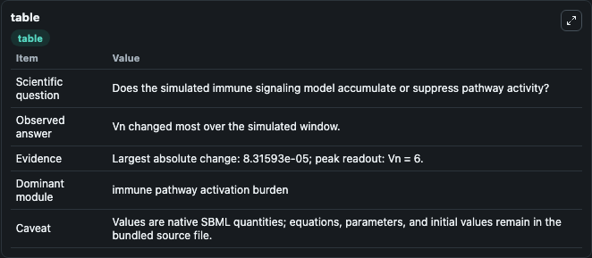
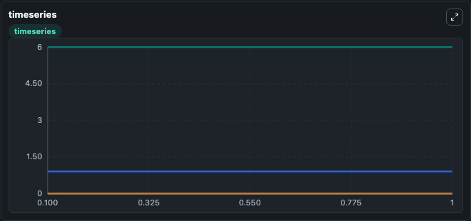
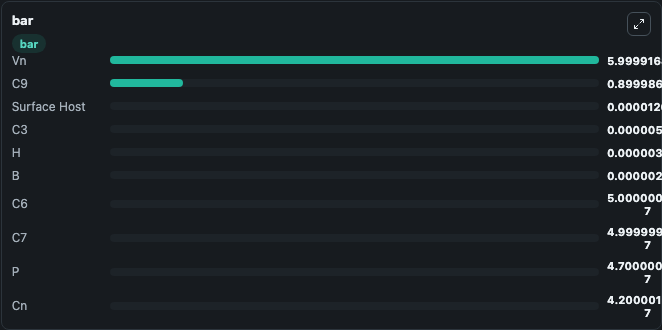

# Caruso2020 - Activation of the alternative complement pathway and effects on hemolysis

This Biosimulant lab wraps `Caruso2020 - Activation of the alternative complement pathway and effects on hemolysis` as a runnable signaling model with a companion visualization module.
Clean Biosimulant lab for immune signaling. It can be used to explore second-messenger and pathway-signaling dynamics and compare scenario outcomes across configurations.

## What You'll See

The lab asks: How does Caruso2020 - Activation of the alternative complement pathway and effects on hemolysis shift hormone-linked signaling readouts? It runs for 1.0 time units with a communication step of 0.1. The run uses the model defaults declared by the curated SBML wrapper. The generated visualizations focus on complement C3, complement C3 H2O Fluid, source-defined B state, complement C3 H2O B Fluid, complement C3 H2O H Fluid, and source-defined H state, and related outputs, combining trajectory, endpoint-comparison, and summary-table views from one completed dark-mode run.

In this captured run, **Vn** moved from 6.000 to 6.000 across 1.0 simulation windows.

<!-- BIOSIMULANT_VISUALS_START -->
### Output Visualizations



*Summary table for Caruso2020 - Activation of the alternative complement pathway and effects on hemolysis, reporting the scientific question, observed answer, dominant module, and caveat.*



*Trajectories of Vn, C9, B, C3, C3(H2O)H Fluid, and H across the 1.0 simulation. In this run **B** climbed from 2.2e-06 to 2.2e-06 and **Vn** fell from 6.000 to 6.000 — the largest movements among the focused observables.*



*Largest-excursion ranking of the focused observables — the absolute movement magnitude during the run. Top 3: **Vn** = 6.000, **C9** = 0.9000, **Surface Host** = 1.21e-05, with 7 more observables below.*

<!-- BIOSIMULANT_VISUALS_END -->

## Model Context

- Core model: `models/core`
- Visualization model: `models/visualisation`
- Standard: `other`
- Upstream source: `biomodels_ebi:MODEL2109110001`
- License: `CC0`
- Visual scope: metabolic and hormone signaling response
- Caveat: Values are native SBML quantities; equations, parameters, units, and initial values remain in the bundled source file.

## Inputs

| Input | Maps To | Default | Notes |
|---|---|---|---|
| Initial complement C3 | `signaling_sbml_caruso2020_activation_of_the_alternative_complem_model2109110001_model.initial_complement_c3` |  | Initial level of complement C3. Maps to SBML symbol `C3`; exposed as a traceable initial-condition perturbation. |

## Outputs

| Output | Maps To | Role |
|---|---|---|
| `nf_complement_c3b` | `signaling_sbml_caruso2020_activation_of_the_alternative_complem_model2109110001_model.nf_complement_c3b` | Nf complement C3b. |
| `complement_c3_h2o_fluid` | `signaling_sbml_caruso2020_activation_of_the_alternative_complem_model2109110001_model.complement_c3_h2o_fluid` | complement C3 H2O Fluid. |
| `complement_c3_h2o_b_fluid` | `signaling_sbml_caruso2020_activation_of_the_alternative_complem_model2109110001_model.complement_c3_h2o_b_fluid` | complement C3 H2O B Fluid. |
| `state` | `signaling_sbml_caruso2020_activation_of_the_alternative_complem_model2109110001_model.state` | Available to the visualization model and downstream workflows. |
| `summary` | `signaling_sbml_caruso2020_activation_of_the_alternative_complem_model2109110001_model.summary` | Available to the visualization model and downstream workflows. |
| `species_labels` | `signaling_sbml_caruso2020_activation_of_the_alternative_complem_model2109110001_model.species_labels` | Available to the visualization model and downstream workflows. |

## Runtime

- Duration: `1.0`
- Communication step: `0.1`

## Running Locally

```bash
biosimulant labs serve .
```
