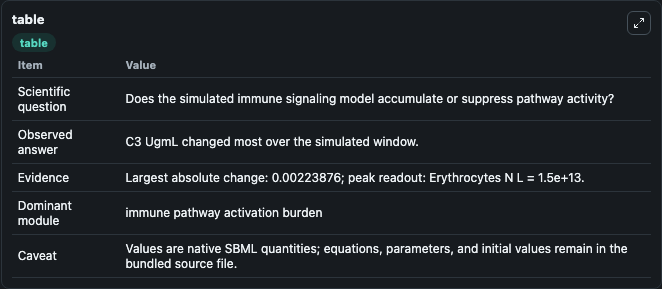
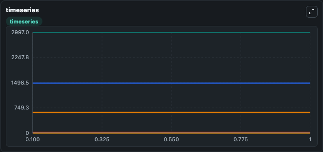
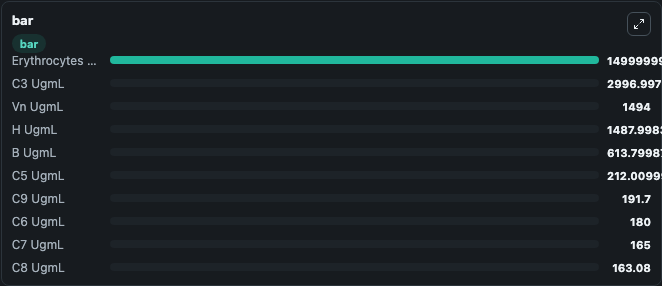

# Caruso2020 - Alternative Complement Pathway model

This Biosimulant lab wraps `Caruso2020 - Alternative Complement Pathway model` as a runnable signaling model with a companion visualization module.
Clean Biosimulant lab for immune signaling. It can be used to explore second-messenger and pathway-signaling dynamics and compare scenario outcomes across configurations.

## What You'll See

The lab asks: How does Caruso2020 - Alternative Complement Pathway model shift hormone-linked signaling readouts? It runs for 1.0 time units with a communication step of 0.1. The run uses the model defaults declared by the curated SBML wrapper. The generated visualizations focus on complement C3, source-defined C5 state, source-defined C6 state, source-defined C7 state, source-defined C8 state, and source-defined C9 state, and related outputs, combining trajectory, endpoint-comparison, and summary-table views from one completed dark-mode run.

In this captured run, **C3 UgmL** moved from 2997.0 to 2997.0 across 1.0 simulation windows.

<!-- BIOSIMULANT_VISUALS_START -->
### Output Visualizations



*Summary table for Caruso2020 - Alternative Complement Pathway model, reporting the scientific question, observed answer, dominant module, and caveat.*



*Trajectories of C3 UgmL, H UgmL, B UgmL, CR1 UgmL, C3, and C3(H2O)H Fluid across the 1.0 simulation. In this run **C3(H2O)H Fluid** climbed from 0 to 1.06e-05 and **C3 UgmL** fell from 2997.0 to 2997.0 — the largest movements among the focused observables.*



*Largest-excursion ranking of the focused observables — the absolute movement magnitude during the run. Top 3: **Erythrocytes N L** = 1.5e+13, **C3 UgmL** = 2997.0, **Vn UgmL** = 1494.0, with 7 more observables below.*

<!-- BIOSIMULANT_VISUALS_END -->

## Model Context

- Core model: `models/core`
- Visualization model: `models/visualisation`
- Standard: `other`
- Upstream source: `biomodels_ebi:MODEL2206230002`
- License: `CC0`
- Visual scope: metabolic and hormone signaling response
- Caveat: Values are native SBML quantities; equations, parameters, units, and initial values remain in the bundled source file.

## Inputs

| Input | Maps To | Default | Notes |
|---|---|---|---|
| K El C5a | `signaling_sbml_caruso2020_alternative_complement_pathway_model_model2206230002_model.initial_k_el_c5a_level` |  | K El C5a source parameter. Maps to SBML symbol `mw0eca22f3_9f69_4c28_8450_109dea301a7e` and preserves the bundled default. |
| K El Drug | `signaling_sbml_caruso2020_alternative_complement_pathway_model_model2206230002_model.initial_k_el_drug_level` |  | K El Drug source parameter. Maps to SBML symbol `mw2904b9f4_09fe_48f9_a742_05908528bc90` and preserves the bundled default. |
| K El I complement C3b | `signaling_sbml_caruso2020_alternative_complement_pathway_model_model2206230002_model.initial_k_el_i_complement_c3b_level` |  | K El I complement C3b source parameter. Maps to SBML symbol `mwf3fb9035_f67a_4a45_a797_5c11abaa0feb` and preserves the bundled default. |

## Outputs

| Output | Maps To | Role |
|---|---|---|
| `cn_ugm_l` | `signaling_sbml_caruso2020_alternative_complement_pathway_model_model2206230002_model.cn_ugm_l` | Cn Ugm L. |
| `erythrocytes_u_m` | `signaling_sbml_caruso2020_alternative_complement_pathway_model_model2206230002_model.erythrocytes_u_m` | Erythrocytes U M. |
| `erythrocytes_n_l` | `signaling_sbml_caruso2020_alternative_complement_pathway_model_model2206230002_model.erythrocytes_n_l` | Erythrocytes N L. |
| `state` | `signaling_sbml_caruso2020_alternative_complement_pathway_model_model2206230002_model.state` | Available to the visualization model and downstream workflows. |
| `summary` | `signaling_sbml_caruso2020_alternative_complement_pathway_model_model2206230002_model.summary` | Available to the visualization model and downstream workflows. |
| `species_labels` | `signaling_sbml_caruso2020_alternative_complement_pathway_model_model2206230002_model.species_labels` | Available to the visualization model and downstream workflows. |

## Runtime

- Duration: `1.0`
- Communication step: `0.1`

## Running Locally

```bash
biosimulant labs serve .
```
