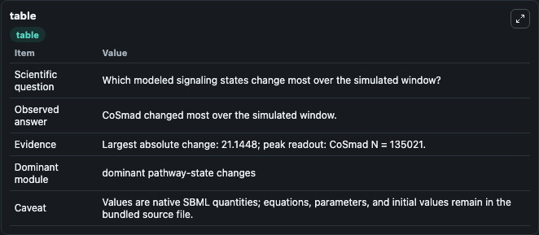
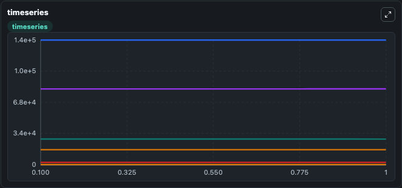
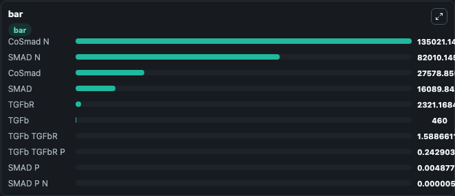

# Cellière2011 - Plasticity of TGF-β Signalling

This Biosimulant lab wraps `Cellière2011 - Plasticity of TGF-β Signalling` as a runnable signaling model with a companion visualization module.
Clean Biosimulant lab for systems signaling model: Cellière2011 - Plasticity of TGF-β Signalling. It can be used to explore second-messenger and pathway-signaling dynamics and compare scenario outcomes across configurations.

## What You'll See

The lab asks: How does Cellière2011 - Plasticity of TGF-β Signalling shift developmental or growth-control pathway states? It runs for 1.0 time units with a communication step of 0.1. The run uses the model defaults declared by the curated SBML wrapper. The generated visualizations focus on TGF-beta R, TGF-beta TGF-beta R, TGF-beta TGF-beta R P, I SMAD TGF-beta TGF-beta R P, SMAD, and SMAD P, and related outputs, combining trajectory, endpoint-comparison, and summary-table views from one completed dark-mode run.

In this captured run, **CoSmad** moved from 2.76e+04 to 2.76e+04 across 1.0 simulation windows.

<!-- BIOSIMULANT_VISUALS_START -->
### Output Visualizations



*Summary table for Cellière2011 - Plasticity of TGF-β Signalling, reporting the scientific question, observed answer, dominant module, and caveat.*



*Trajectories of CoSmad, CoSmad N, SMAD, SMAD N, TGFbR, and TGFb TGFbR across the 1.0 simulation. In this run **CoSmad N** climbed from 1.35e+05 to 1.35e+05 and **CoSmad** fell from 2.76e+04 to 2.76e+04 — the largest movements among the focused observables.*



*Largest-excursion ranking of the focused observables — the absolute movement magnitude during the run. Top 3: **CoSmad N** = 1.35e+05, **SMAD N** = 8.2e+04, **CoSmad** = 2.76e+04, with 7 more observables below.*

<!-- BIOSIMULANT_VISUALS_END -->

## Model Context

- Core model: `models/core`
- Visualization model: `models/visualisation`
- Standard: `other`
- Upstream source: `biomodels_ebi:BIOMD0000000600`
- License: `CC0`
- Visual scope: growth-control pathway signaling
- Caveat: Values are native SBML quantities; equations, parameters, units, and initial values remain in the bundled source file.

## Inputs

| Input | Maps To | Default | Notes |
|---|---|---|---|
| Initial TGF-beta | `signaling_sbml_celli_re2011_plasticity_of_tgf_signalling_biomd0000000600_model.initial_tgf_beta` |  | Initial level of TGF-beta. Maps to SBML symbol `TGFb`; exposed as a traceable initial-condition perturbation. |
| Initial I SMAD TGF-beta TGF-beta R P | `signaling_sbml_celli_re2011_plasticity_of_tgf_signalling_biomd0000000600_model.initial_i_smad_tgf_beta_tgf_beta_r_p` |  | Initial level of I SMAD TGF-beta TGF-beta R P. Maps to SBML symbol `I_Smad_TGFb_TGFbR_P`; exposed as a traceable initial-condition perturbation. |
| Initial TGF-beta TGF-beta R | `signaling_sbml_celli_re2011_plasticity_of_tgf_signalling_biomd0000000600_model.initial_tgf_beta_tgf_beta_r` |  | Initial level of TGF-beta TGF-beta R. Maps to SBML symbol `TGFb_TGFbR`; exposed as a traceable initial-condition perturbation. |

## Outputs

| Output | Maps To | Role |
|---|---|---|
| `i_smad_tgf_beta_tgf_beta_r_p` | `signaling_sbml_celli_re2011_plasticity_of_tgf_signalling_biomd0000000600_model.i_smad_tgf_beta_tgf_beta_r_p` | I SMAD TGF-beta TGF-beta R P. |
| `smad` | `signaling_sbml_celli_re2011_plasticity_of_tgf_signalling_biomd0000000600_model.smad` | SMAD. |
| `smad_p` | `signaling_sbml_celli_re2011_plasticity_of_tgf_signalling_biomd0000000600_model.smad_p` | SMAD P. |
| `state` | `signaling_sbml_celli_re2011_plasticity_of_tgf_signalling_biomd0000000600_model.state` | Available to the visualization model and downstream workflows. |
| `summary` | `signaling_sbml_celli_re2011_plasticity_of_tgf_signalling_biomd0000000600_model.summary` | Available to the visualization model and downstream workflows. |
| `species_labels` | `signaling_sbml_celli_re2011_plasticity_of_tgf_signalling_biomd0000000600_model.species_labels` | Available to the visualization model and downstream workflows. |

## Runtime

- Duration: `1.0`
- Communication step: `0.1`

## Running Locally

```bash
biosimulant labs serve .
```
