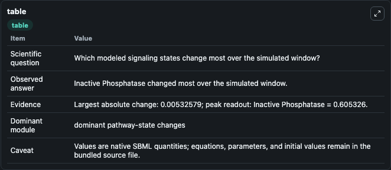
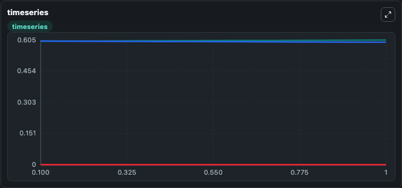
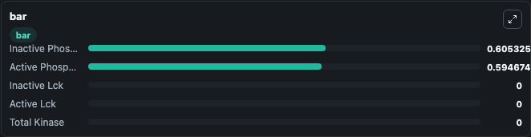

# Chan2004_TCell_receptor_activation

This Biosimulant lab wraps `Chan2004_TCell_receptor_activation` as a runnable signaling model with a companion visualization module.
Clean Biosimulant lab for systems signaling model: Chan2004_TCell_receptor_activation. It can be used to explore second-messenger and pathway-signaling dynamics and compare scenario outcomes across configurations.

## What You'll See

The lab asks: How does Chan2004 TCell receptor activation route receptor activity into cAMP/PKA-linked readouts? It runs for 1.0 time units with a communication step of 0.1. The run uses the model defaults declared by the curated SBML wrapper. The generated visualizations focus on Inactive Lck, active Lck, Inactive Phosphatase, active Phosphatase, and Total Kinase, combining trajectory, endpoint-comparison, and summary-table views from one completed dark-mode run.

In this captured run, **Inactive Phosphatase** moved from 0.6000 to 0.6053 across 1.0 simulation windows.

<!-- BIOSIMULANT_VISUALS_START -->
### Output Visualizations



*Summary table for Chan2004_TCell_receptor_activation, reporting the scientific question, observed answer, dominant module, and caveat.*



*Trajectories of Inactive Phosphatase, Active Phosphatase, Inactive Lck, Active Lck, and Total Kinase across the 1.0 simulation. In this run **Inactive Phosphatase** climbed from 0.6000 to 0.6053 and **Active Phosphatase** fell from 0.6000 to 0.5947 — the largest movements among the focused observables.*



*Largest-excursion ranking of the focused observables — the absolute movement magnitude during the run. Top 3: **Inactive Phosphatase** = 0.6053, **Active Phosphatase** = 0.5947, **Inactive Lck** = 0, with 2 more observables below.*

<!-- BIOSIMULANT_VISUALS_END -->

## Model Context

- Core model: `models/core`
- Visualization model: `models/visualisation`
- Standard: `other`
- Upstream source: `biomodels_ebi:BIOMD0000000120`
- License: `CC0`
- Visual scope: GPCR and cAMP/PKA signaling
- Caveat: Values are native SBML quantities; equations, parameters, units, and initial values remain in the bundled source file.

## Inputs

| Input | Maps To | Default | Notes |
|---|---|---|---|
| Initial Inactive Lck | `signaling_sbml_chan2004_tcell_receptor_activation_biomd0000000120_model.initial_inactive_lck` |  | Initial level of Inactive Lck. Maps to SBML symbol `lck_inactive`; exposed as a traceable initial-condition perturbation. |

## Outputs

| Output | Maps To | Role |
|---|---|---|
| `inactive_lck` | `signaling_sbml_chan2004_tcell_receptor_activation_biomd0000000120_model.inactive_lck` | Inactive Lck. |
| `active_lck` | `signaling_sbml_chan2004_tcell_receptor_activation_biomd0000000120_model.active_lck` | active Lck. |
| `inactive_phosphatase` | `signaling_sbml_chan2004_tcell_receptor_activation_biomd0000000120_model.inactive_phosphatase` | Inactive Phosphatase. |
| `state` | `signaling_sbml_chan2004_tcell_receptor_activation_biomd0000000120_model.state` | Available to the visualization model and downstream workflows. |
| `summary` | `signaling_sbml_chan2004_tcell_receptor_activation_biomd0000000120_model.summary` | Available to the visualization model and downstream workflows. |
| `species_labels` | `signaling_sbml_chan2004_tcell_receptor_activation_biomd0000000120_model.species_labels` | Available to the visualization model and downstream workflows. |

## Runtime

- Duration: `1.0`
- Communication step: `0.1`

## Running Locally

```bash
biosimulant labs serve .
```
