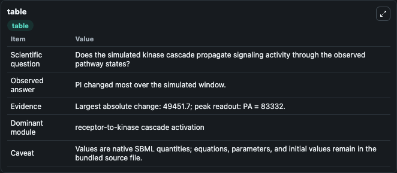
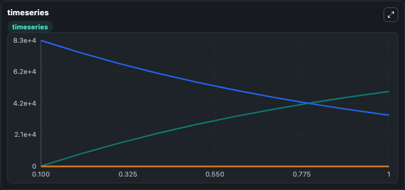
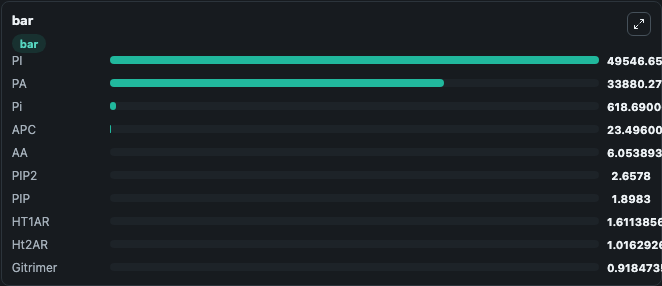

# Chang2008 - ERK activation, hallucinogenic drugs mediated signalling through serotonin receptors

This Biosimulant lab wraps `Chang2008 - ERK activation, hallucinogenic drugs mediated signalling through serotonin receptors` as a runnable signaling model with a companion visualization module.
Clean Biosimulant lab for MAPK/ERK receptor signaling. It can be used to explore second-messenger and pathway-signaling dynamics and compare scenario outcomes across configurations.

## What You'll See

The lab asks: How does Chang2008 - ERK activation, hallucinogenic drugs mediated signalling through serotonin receptors propagate receptor or RAS/ERK pathway activity? It runs for 1.0 time units with a communication step of 0.1. The run uses the model defaults declared by the curated SBML wrapper. The generated visualizations focus on source-defined TCB state, Cpx ERK PP MKP PP, Cpx ERKP MKP PP, active ERK-MKP phosphatase complex, Rafstarstar, and Cpx MEKPP PP2A, and related outputs, combining trajectory, endpoint-comparison, and summary-table views from one completed dark-mode run.

In this captured run, **PI** moved from 94.922 to 4.95e+04 across 1.0 simulation windows.

<!-- BIOSIMULANT_VISUALS_START -->
### Output Visualizations



*Summary table for Chang2008 - ERK activation, hallucinogenic drugs mediated signalling through serotonin receptors, reporting the scientific question, observed answer, dominant module, and caveat.*



*Trajectories of PI, PA, GRB2, Sos, GRB2 Sos, and Gitrimer across the 1.0 simulation. In this run **PI** climbed from 94.922 to 4.95e+04 and **PA** fell from 8.33e+04 to 3.39e+04 — the largest movements among the focused observables.*



*Largest-excursion ranking of the focused observables — the absolute movement magnitude during the run. Top 3: **PI** = 4.95e+04, **PA** = 3.39e+04, **Pi** = 618.7, with 7 more observables below.*

<!-- BIOSIMULANT_VISUALS_END -->

## Model Context

- Core model: `models/core`
- Visualization model: `models/visualisation`
- Standard: `other`
- Upstream source: `biomodels_ebi:MODEL0975191032`
- License: `CC0`
- Visual scope: receptor-to-MAPK cascade signaling
- Caveat: Values are native SBML quantities; equations, parameters, units, and initial values remain in the bundled source file.

## Inputs

| Input | Maps To | Default | Notes |
|---|---|---|---|
| Initial source-defined PIP2 state | `signaling_sbml_chang2008_erk_activation_hallucinogenic_drugs_me_model0975191032_model.initial_source_defined_pip2_state` |  | Initial level of source-defined PIP2 state. Maps to SBML symbol `PIP2`; exposed as a traceable initial-condition perturbation. |

## Outputs

| Output | Maps To | Role |
|---|---|---|
| `cpx_erk_pp_mkp_pp` | `signaling_sbml_chang2008_erk_activation_hallucinogenic_drugs_me_model0975191032_model.cpx_erk_pp_mkp_pp` | Cpx ERK PP MKP PP. |
| `cpx_erkp_mkp_pp` | `signaling_sbml_chang2008_erk_activation_hallucinogenic_drugs_me_model0975191032_model.cpx_erkp_mkp_pp` | Cpx ERKP MKP PP. |
| `active_erk_mkp_phosphatase_complex` | `signaling_sbml_chang2008_erk_activation_hallucinogenic_drugs_me_model0975191032_model.active_erk_mkp_phosphatase_complex` | active ERK-MKP phosphatase complex. |
| `state` | `signaling_sbml_chang2008_erk_activation_hallucinogenic_drugs_me_model0975191032_model.state` | Available to the visualization model and downstream workflows. |
| `summary` | `signaling_sbml_chang2008_erk_activation_hallucinogenic_drugs_me_model0975191032_model.summary` | Available to the visualization model and downstream workflows. |
| `species_labels` | `signaling_sbml_chang2008_erk_activation_hallucinogenic_drugs_me_model0975191032_model.species_labels` | Available to the visualization model and downstream workflows. |

## Runtime

- Duration: `1.0`
- Communication step: `0.1`

## Running Locally

```bash
biosimulant labs serve .
```
