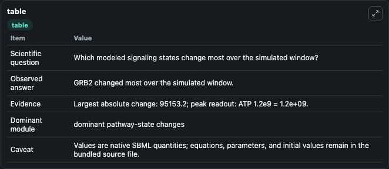
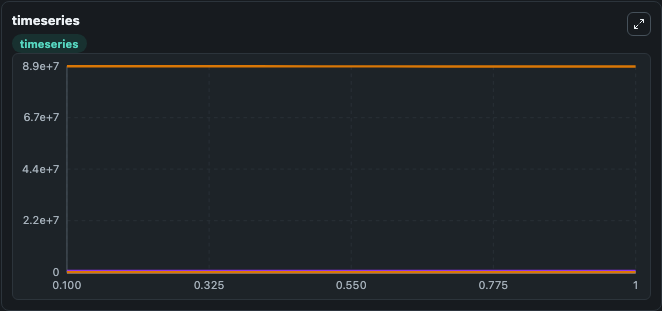
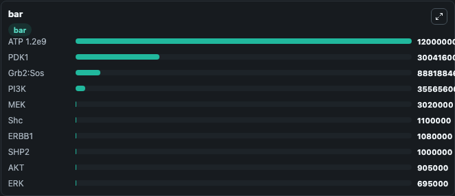

# Chen2009 - ErbB Signaling

This Biosimulant lab wraps `Chen2009 - ErbB Signaling` as a runnable signaling model with a companion visualization module.
Clean Biosimulant lab for systems signaling model: Chen2009 - ErbB Signaling. It can be used to explore second-messenger and pathway-signaling dynamics and compare scenario outcomes across configurations.

## What You'll See

The lab asks: How does Chen2009 - ErbB Signaling propagate receptor or RAS/ERK pathway activity? It runs for 1.0 time units with a communication step of 0.1. The run uses the model defaults declared by the curated SBML wrapper. The generated visualizations focus on EGF, Erb B1 ATP, EGF Erb B1 ATP, Erb B2 Erb B3, Erb B3 Erb B2 P, and Erb B2 Erb B4, and related outputs, combining trajectory, endpoint-comparison, and summary-table views from one completed dark-mode run.

In this captured run, **GRB2** moved from 1264.9 to 9.64e+04 across 1.0 simulation windows.

<!-- BIOSIMULANT_VISUALS_START -->
### Output Visualizations



*Summary table for Chen2009 - ErbB Signaling, reporting the scientific question, observed answer, dominant module, and caveat.*



*Trajectories of GRB2, Sos, Grb2:Sos, ERBB2, ERBB3, and (ErbB2:ErbB3) across the 1.0 simulation. In this run **GRB2** climbed from 1264.9 to 9.64e+04 and **Grb2:Sos** fell from 8.89e+07 to 8.88e+07 — the largest movements among the focused observables.*



*Largest-excursion ranking of the focused observables — the absolute movement magnitude during the run. Top 3: **ATP 1.2e9** = 1.2e+09, **PDK1** = 3e+08, **Grb2:Sos** = 8.88e+07, with 7 more observables below.*

<!-- BIOSIMULANT_VISUALS_END -->

## Model Context

- Core model: `models/core`
- Visualization model: `models/visualisation`
- Standard: `other`
- Upstream source: `biomodels_ebi:BIOMD0000000255`
- License: `CC0`
- Visual scope: receptor-to-MAPK cascade signaling
- Caveat: Values are native SBML quantities; equations, parameters, units, and initial values remain in the bundled source file.

## Inputs

| Input | Maps To | Default | Notes |
|---|---|---|---|
| Initial EGF | `signaling_sbml_chen2009_erbb_signaling_biomd0000000255_model.initial_egf` |  | Initial level of EGF. Maps to SBML symbol `c1`; exposed as a traceable initial-condition perturbation. |
| Initial heregulin | `signaling_sbml_chen2009_erbb_signaling_biomd0000000255_model.initial_heregulin` |  | Initial level of heregulin. Maps to SBML symbol `c515`; exposed as a traceable initial-condition perturbation. |
| Initial heregulin | `signaling_sbml_chen2009_erbb_signaling_biomd0000000255_model.initial_heregulin_2` |  | Initial level of heregulin. Maps to SBML symbol `c514`; exposed as a traceable initial-condition perturbation. |

## Outputs

| Output | Maps To | Role |
|---|---|---|
| `source_2_egf_erb_b1_atp_full_active` | `signaling_sbml_chen2009_erbb_signaling_biomd0000000255_model.source_2_egf_erb_b1_atp_full_active` | 2 EGF Erb B1 ATP Full active. |
| `source_2_egf_erb_b1_p_gap_grb2_adapter_protein_sos_guanine_nucleotide_exchange_factor_ras_gdp` | `signaling_sbml_chen2009_erbb_signaling_biomd0000000255_model.source_2_egf_erb_b1_p_gap_grb2_adapter_protein_sos_guanine_nucleotide_exchange_factor_ras_gdp` | 2 EGF Erb B1 P GAP Grb2 adapter protein SOS guanine-nucleotide exchange factor RAS GDP. |
| `source_2_egf_erb_b1_p_gap_grb2_adapter_protein_sos_guanine_nucleotide_exchange_factor_ras_gdp_c_pp` | `signaling_sbml_chen2009_erbb_signaling_biomd0000000255_model.source_2_egf_erb_b1_p_gap_grb2_adapter_protein_sos_guanine_nucleotide_exchange_factor_ras_gdp_c_pp` | 2 EGF Erb B1 P GAP Grb2 adapter protein SOS guanine-nucleotide exchange factor RAS GDP C PP. |
| `state` | `signaling_sbml_chen2009_erbb_signaling_biomd0000000255_model.state` | Available to the visualization model and downstream workflows. |
| `summary` | `signaling_sbml_chen2009_erbb_signaling_biomd0000000255_model.summary` | Available to the visualization model and downstream workflows. |
| `species_labels` | `signaling_sbml_chen2009_erbb_signaling_biomd0000000255_model.species_labels` | Available to the visualization model and downstream workflows. |

## Runtime

- Duration: `1.0`
- Communication step: `0.1`

## Running Locally

```bash
biosimulant labs serve .
```
