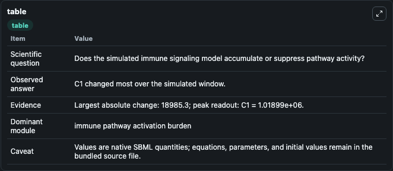
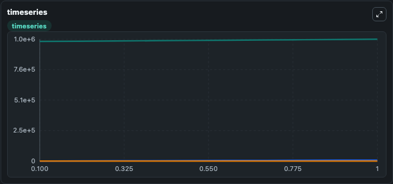
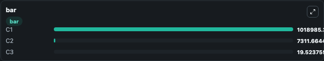

# Chulian2021 - feedback signalling in B lymphopoeisis

This Biosimulant lab wraps `Chulian2021 - feedback signalling in B lymphopoeisis` as a runnable signaling model with a companion visualization module.
Clean Biosimulant lab for immune signaling. It can be used to explore second-messenger and pathway-signaling dynamics and compare scenario outcomes across configurations.

## What You'll See

The lab asks: How does Chulian2021 - feedback signalling in B lymphopoeisis redistribute immune or cytokine-linked pathway states? It runs for 1.0 time units with a communication step of 0.1. The run uses the model defaults declared by the curated SBML wrapper. The generated visualizations focus on source-defined C1 state, source-defined C2 state, and complement C3, combining trajectory, endpoint-comparison, and summary-table views from one completed dark-mode run.

In this captured run, **C1** moved from 1e+06 to 1.02e+06 across 1.0 simulation windows.

<!-- BIOSIMULANT_VISUALS_START -->
### Output Visualizations



*Summary table for Chulian2021 - feedback signalling in B lymphopoeisis, reporting the scientific question, observed answer, dominant module, and caveat.*



*Trajectories of C1, C2, and C3 across the 1.0 simulation. In this run **C1** climbed from 1e+06 to 1.02e+06 — the largest movements among the focused observables.*



*Largest-excursion ranking of the focused observables — the absolute movement magnitude during the run. Top 3: **C1** = 1.02e+06, **C2** = 7311.7, **C3** = 19.524.*

<!-- BIOSIMULANT_VISUALS_END -->

## Model Context

- Core model: `models/core`
- Visualization model: `models/visualisation`
- Standard: `other`
- Upstream source: `biomodels_ebi:BIOMD0000001056`
- License: `CC0`
- Visual scope: immune and cytokine signaling response
- Caveat: Values are native SBML quantities; equations, parameters, units, and initial values remain in the bundled source file.

## Inputs

| Input | Maps To | Default | Notes |
|---|---|---|---|
| Initial source-defined C1 state | `signaling_sbml_chulian2021_feedback_signalling_in_b_lymphopoeis_biomd0000001056_model.initial_source_defined_c1_state` |  | Initial level of source-defined C1 state. Maps to SBML symbol `C1`; exposed as a traceable initial-condition perturbation. |

## Outputs

| Output | Maps To | Role |
|---|---|---|
| `source_defined_c1_state` | `signaling_sbml_chulian2021_feedback_signalling_in_b_lymphopoeis_biomd0000001056_model.source_defined_c1_state` | source-defined C1 state. |
| `source_defined_c2_state` | `signaling_sbml_chulian2021_feedback_signalling_in_b_lymphopoeis_biomd0000001056_model.source_defined_c2_state` | source-defined C2 state. |
| `complement_c3` | `signaling_sbml_chulian2021_feedback_signalling_in_b_lymphopoeis_biomd0000001056_model.complement_c3` | complement C3. |
| `state` | `signaling_sbml_chulian2021_feedback_signalling_in_b_lymphopoeis_biomd0000001056_model.state` | Available to the visualization model and downstream workflows. |
| `summary` | `signaling_sbml_chulian2021_feedback_signalling_in_b_lymphopoeis_biomd0000001056_model.summary` | Available to the visualization model and downstream workflows. |
| `species_labels` | `signaling_sbml_chulian2021_feedback_signalling_in_b_lymphopoeis_biomd0000001056_model.species_labels` | Available to the visualization model and downstream workflows. |

## Runtime

- Duration: `1.0`
- Communication step: `0.1`

## Running Locally

```bash
biosimulant labs serve .
```
