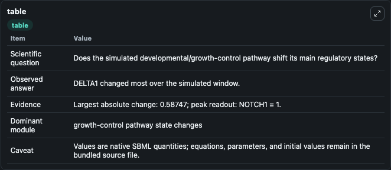
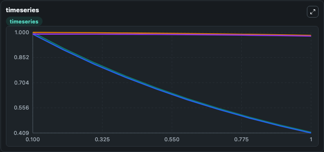
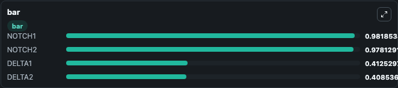

# Collier1996 - Delta Notch intercellular signalling and lateral inhibition

This Biosimulant lab wraps `Collier1996 - Delta Notch intercellular signalling and lateral inhibition` as a runnable signaling model with a companion visualization module.
Clean Biosimulant lab for developmental and growth-control signaling. It can be used to explore second-messenger and pathway-signaling dynamics and compare scenario outcomes across configurations.

## What You'll See

The lab asks: How does Collier1996 - Delta Notch intercellular signalling and lateral inhibition shift developmental or growth-control pathway states? It runs for 1.0 time units with a communication step of 0.1. The run uses the model defaults declared by the curated SBML wrapper. The generated visualizations focus on Delta1, Delta2, Notch1, and Notch2, combining trajectory, endpoint-comparison, and summary-table views from one completed dark-mode run.

In this captured run, **DELTA1** moved from 1.0000 to 0.4125 across 1.0 simulation windows.

<!-- BIOSIMULANT_VISUALS_START -->
### Output Visualizations



*Summary table for Collier1996 - Delta Notch intercellular signalling and lateral inhibition, reporting the scientific question, observed answer, dominant module, and caveat.*



*Trajectories of DELTA1, DELTA2, NOTCH1, and NOTCH2 across the 1.0 simulation. In this run **DELTA1** fell from 1.0000 to 0.4125 — the largest movements among the focused observables.*



*Largest-excursion ranking of the focused observables — the absolute movement magnitude during the run. Top 3: **NOTCH1** = 0.9819, **NOTCH2** = 0.9781, **DELTA1** = 0.4125, with 1 more observable below.*

<!-- BIOSIMULANT_VISUALS_END -->

## Model Context

- Core model: `models/core`
- Visualization model: `models/visualisation`
- Standard: `other`
- Upstream source: `biomodels_ebi:BIOMD0000001047`
- License: `CC0`
- Visual scope: growth-control pathway signaling
- Caveat: Values are native SBML quantities; equations, parameters, units, and initial values remain in the bundled source file.

## Inputs

| Input | Maps To | Default | Notes |
|---|---|---|---|
| Initial Notch1 | `signaling_sbml_collier1996_delta_notch_intercellular_signalling_biomd0000001047_model.initial_notch1` |  | Initial level of Notch1. Maps to SBML symbol `notch1`; exposed as a traceable initial-condition perturbation. |
| Initial Notch2 | `signaling_sbml_collier1996_delta_notch_intercellular_signalling_biomd0000001047_model.initial_notch2` |  | Initial level of Notch2. Maps to SBML symbol `notch2`; exposed as a traceable initial-condition perturbation. |

## Outputs

| Output | Maps To | Role |
|---|---|---|
| `delta1` | `signaling_sbml_collier1996_delta_notch_intercellular_signalling_biomd0000001047_model.delta1` | Delta1. |
| `delta2` | `signaling_sbml_collier1996_delta_notch_intercellular_signalling_biomd0000001047_model.delta2` | Delta2. |
| `notch1` | `signaling_sbml_collier1996_delta_notch_intercellular_signalling_biomd0000001047_model.notch1` | Notch1. |
| `state` | `signaling_sbml_collier1996_delta_notch_intercellular_signalling_biomd0000001047_model.state` | Available to the visualization model and downstream workflows. |
| `summary` | `signaling_sbml_collier1996_delta_notch_intercellular_signalling_biomd0000001047_model.summary` | Available to the visualization model and downstream workflows. |
| `species_labels` | `signaling_sbml_collier1996_delta_notch_intercellular_signalling_biomd0000001047_model.species_labels` | Available to the visualization model and downstream workflows. |

## Runtime

- Duration: `1.0`
- Communication step: `0.1`

## Running Locally

```bash
biosimulant labs serve .
```
