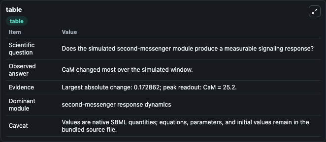
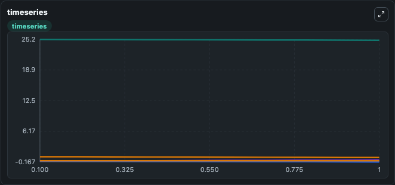
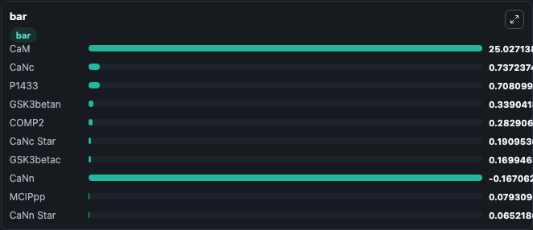

# Cui2008_CardiacMyocytes

This Biosimulant lab wraps `Cui2008_CardiacMyocytes` as a runnable signaling model with a companion visualization module.
Clean Biosimulant lab for calcium and second-messenger signaling. It can be used to explore second-messenger and pathway-signaling dynamics and compare scenario outcomes across configurations.

## What You'll See

The lab asks: How do calcium-linked states respond in Cui2008 CardiacMyocytes? It runs for 1.0 time units with a communication step of 0.1. The run uses the model defaults declared by the curated SBML wrapper. The generated visualizations focus on Source Defined BMK1 State, Source Defined MRNA State, Nfatc, Nfatn, Nfatpc, and Nfatpn, and related outputs, combining trajectory, endpoint-comparison, and summary-table views from one completed dark-mode run.

In this captured run, **CaM** moved from 25.200 to 25.027 across 1.0 simulation windows.

<!-- BIOSIMULANT_VISUALS_START -->
### Output Visualizations



*Summary table for Cui2008_CardiacMyocytes, reporting the scientific question, observed answer, dominant module, and caveat.*



*Trajectories of CaM, CaNn, CaNc, CaNc Star, CaNn Star, and MCIPpp CaNc Star across the 1.0 simulation. In this run **CaNc Star** climbed from 0.0275 to 0.1910 and **CaM** fell from 25.200 to 25.027 — the largest movements among the focused observables.*



*Largest-excursion ranking of the focused observables — the absolute movement magnitude during the run. Top 3: **CaM** = 25.027, **CaNc** = 0.7372, **P1433** = 0.7081, with 7 more observables below.*

<!-- BIOSIMULANT_VISUALS_END -->

## Model Context

- Core model: `models/core`
- Visualization model: `models/visualisation`
- Standard: `other`
- Upstream source: `biomodels_ebi:MODEL1172425728`
- License: `CC0`
- Visual scope: calcium second-messenger signaling
- Caveat: Values are native SBML quantities; equations, parameters, units, and initial values remain in the bundled source file.

## Inputs

| Input | Maps To | Default | Notes |
|---|---|---|---|
| Initial source-defined BMK1 state | `signaling_sbml_cui2008_cardiacmyocytes_model1172425728_model.initial_source_defined_bmk1_state` |  | Initial level of source-defined BMK1 state. Maps to SBML symbol `BMK1`; exposed as a traceable initial-condition perturbation. |

## Outputs

| Output | Maps To | Role |
|---|---|---|
| `nfatc` | `signaling_sbml_cui2008_cardiacmyocytes_model1172425728_model.nfatc` | Nfatc. |
| `nfatn` | `signaling_sbml_cui2008_cardiacmyocytes_model1172425728_model.nfatn` | Nfatn. |
| `nfatpc` | `signaling_sbml_cui2008_cardiacmyocytes_model1172425728_model.nfatpc` | Nfatpc. |
| `state` | `signaling_sbml_cui2008_cardiacmyocytes_model1172425728_model.state` | Available to the visualization model and downstream workflows. |
| `summary` | `signaling_sbml_cui2008_cardiacmyocytes_model1172425728_model.summary` | Available to the visualization model and downstream workflows. |
| `species_labels` | `signaling_sbml_cui2008_cardiacmyocytes_model1172425728_model.species_labels` | Available to the visualization model and downstream workflows. |

## Runtime

- Duration: `1.0`
- Communication step: `0.1`

## Running Locally

```bash
biosimulant labs serve .
```
