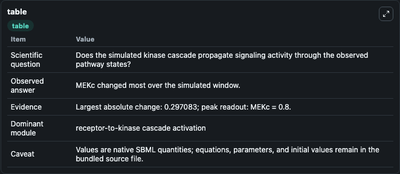
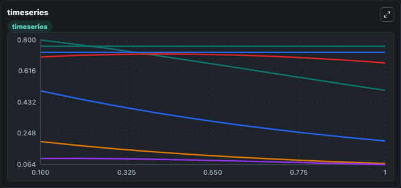
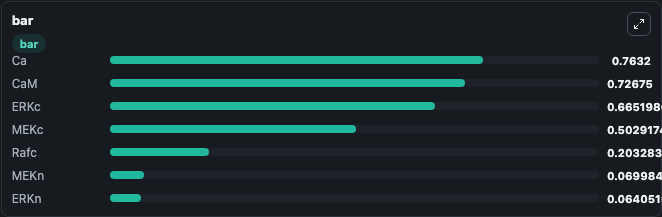

# Cursons2015 - Regulation of ERK-MAPK signaling in human epidermis

This Biosimulant lab wraps `Cursons2015 - Regulation of ERK-MAPK signaling in human epidermis` as a runnable signaling model with a companion visualization module.
Clean Biosimulant lab for MAPK/ERK receptor signaling. It can be used to explore second-messenger and pathway-signaling dynamics and compare scenario outcomes across configurations.

## What You'll See

The lab asks: How does Cursons2015 - Regulation of ERK-MAPK signaling in human epidermis propagate receptor or RAS/ERK pathway activity? It runs for 1.0 time units with a communication step of 0.1. The run uses the model defaults declared by the curated SBML wrapper. The generated visualizations focus on source-defined RAFC state, source-defined MEKC state, cytosolic phosphorylated ERK, source-defined MEKN state, nuclear phosphorylated ERK, and calcium, and related outputs, combining trajectory, endpoint-comparison, and summary-table views from one completed dark-mode run.

In this captured run, **MEKc** moved from 0.8000 to 0.5029 across 1.0 simulation windows.

<!-- BIOSIMULANT_VISUALS_START -->
### Output Visualizations



*Summary table for Cursons2015 - Regulation of ERK-MAPK signaling in human epidermis, reporting the scientific question, observed answer, dominant module, and caveat.*



*Trajectories of MEKc, Rafc, MEKn, ERKn, ERKc, and Ca across the 1.0 simulation. In this run **MEKc** fell from 0.8000 to 0.5029 — the largest movements among the focused observables.*



*Largest-excursion ranking of the focused observables — the absolute movement magnitude during the run. Top 3: **Ca** = 0.7632, **CaM** = 0.7268, **ERKc** = 0.6652, with 4 more observables below.*

<!-- BIOSIMULANT_VISUALS_END -->

## Model Context

- Core model: `models/core`
- Visualization model: `models/visualisation`
- Standard: `other`
- Upstream source: `biomodels_ebi:BIOMD0000000659`
- License: `CC0`
- Visual scope: receptor-to-MAPK cascade signaling
- Caveat: Values are native SBML quantities; equations, parameters, units, and initial values remain in the bundled source file.

## Inputs

| Input | Maps To | Default | Notes |
|---|---|---|---|
| calcium AMP | `signaling_sbml_cursons2015_regulation_of_erk_mapk_signaling_in_biomd0000000659_model.initial_calcium_amp_level` |  | calcium AMP source parameter. Maps to SBML symbol `numCaInputAmp` and preserves the bundled default. |
| calcium Baseline | `signaling_sbml_cursons2015_regulation_of_erk_mapk_signaling_in_biomd0000000659_model.initial_calcium_baseline_level` |  | calcium Baseline source parameter. Maps to SBML symbol `numCaInputBaseline` and preserves the bundled default. |
| calcium M AMP | `signaling_sbml_cursons2015_regulation_of_erk_mapk_signaling_in_biomd0000000659_model.initial_calcium_m_amp_level` |  | calcium M AMP source parameter. Maps to SBML symbol `numCaMInputAmp` and preserves the bundled default. |

## Outputs

| Output | Maps To | Role |
|---|---|---|
| `cytosolic_phosphorylated_erk` | `signaling_sbml_cursons2015_regulation_of_erk_mapk_signaling_in_biomd0000000659_model.cytosolic_phosphorylated_erk` | cytosolic phosphorylated ERK. |
| `nuclear_phosphorylated_erk` | `signaling_sbml_cursons2015_regulation_of_erk_mapk_signaling_in_biomd0000000659_model.nuclear_phosphorylated_erk` | nuclear phosphorylated ERK. |
| `calmodulin` | `signaling_sbml_cursons2015_regulation_of_erk_mapk_signaling_in_biomd0000000659_model.calmodulin` | calmodulin. |
| `state` | `signaling_sbml_cursons2015_regulation_of_erk_mapk_signaling_in_biomd0000000659_model.state` | Available to the visualization model and downstream workflows. |
| `summary` | `signaling_sbml_cursons2015_regulation_of_erk_mapk_signaling_in_biomd0000000659_model.summary` | Available to the visualization model and downstream workflows. |
| `species_labels` | `signaling_sbml_cursons2015_regulation_of_erk_mapk_signaling_in_biomd0000000659_model.species_labels` | Available to the visualization model and downstream workflows. |

## Runtime

- Duration: `1.0`
- Communication step: `0.1`

## Running Locally

```bash
biosimulant labs serve .
```
