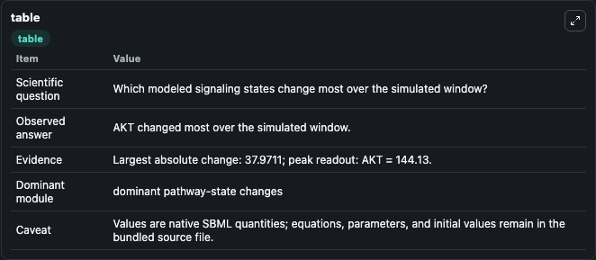
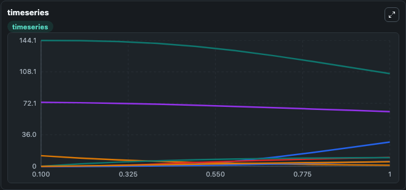
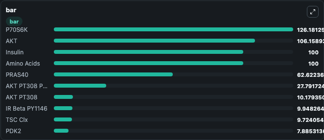

# DallePezze2012 - TSC-independent mTORC2 regulation

This Biosimulant lab wraps `DallePezze2012 - TSC-independent mTORC2 regulation` as a runnable signaling model with a companion visualization module.
Clean Biosimulant lab for systems signaling model: DallePezze2012 - TSC-independent mTORC2 regulation. It can be used to explore second-messenger and pathway-signaling dynamics and compare scenario outcomes across configurations.

## What You'll See

The lab asks: How does DallePezze2012 - TSC-independent mTORC2 regulation express its source-modeled signaling motif over the baseline run? It runs for 1.0 time units with a communication step of 0.1. The run uses the model defaults declared by the curated SBML wrapper. The generated visualizations focus on insulin receptor beta response parameter, insulin receptor beta response parameter P Y1146, insulin receptor beta response parameter Refractory, Insulin, Amino Acids, and sink species, and related outputs, combining trajectory, endpoint-comparison, and summary-table views from one completed dark-mode run.

In this captured run, **AKT** moved from 144.1 to 106.2 across 1.0 simulation windows.

<!-- BIOSIMULANT_VISUALS_START -->
### Output Visualizations



*Summary table for DallePezze2012 - TSC-independent mTORC2 regulation, reporting the scientific question, observed answer, dominant module, and caveat.*



*Trajectories of AKT, AKT PT308 PS473, IR Beta, PRAS40, AKT PT308, and IR Beta PY1146 across the 1.0 simulation. In this run **AKT PT308 PS473** climbed from 0 to 27.792 and **AKT** fell from 144.1 to 106.2 — the largest movements among the focused observables.*



*Largest-excursion ranking of the focused observables — the absolute movement magnitude during the run. Top 3: **P70S6K** = 126.2, **AKT** = 106.2, **Insulin** = 100.0, with 7 more observables below.*

<!-- BIOSIMULANT_VISUALS_END -->

## Model Context

- Core model: `models/core`
- Visualization model: `models/visualisation`
- Standard: `other`
- Upstream source: `biomodels_ebi:BIOMD0000000581`
- License: `CC0`
- Visual scope: phosphorylation and regulatory motif dynamics
- Caveat: Values are native SBML quantities; equations, parameters, units, and initial values remain in the bundled source file.

## Inputs

| Input | Maps To | Default | Notes |
|---|---|---|---|
| Initial Amino Acids | `signaling_sbml_dallepezze2012_tsc_independent_mtorc2_regulation_biomd0000000581_model.initial_amino_acids` |  | Initial level of Amino Acids. Maps to SBML symbol `species_28`; exposed as a traceable initial-condition perturbation. |
| Initial Insulin | `signaling_sbml_dallepezze2012_tsc_independent_mtorc2_regulation_biomd0000000581_model.initial_insulin` |  | Initial level of Insulin. Maps to SBML symbol `species_41`; exposed as a traceable initial-condition perturbation. |
| Initial PI3K | `signaling_sbml_dallepezze2012_tsc_independent_mtorc2_regulation_biomd0000000581_model.initial_pi3k` |  | Initial level of PI3K. Maps to SBML symbol `species_23`; exposed as a traceable initial-condition perturbation. |

## Outputs

| Output | Maps To | Role |
|---|---|---|
| `akt_p_t308` | `signaling_sbml_dallepezze2012_tsc_independent_mtorc2_regulation_biomd0000000581_model.akt_p_t308` | AKT P T308. |
| `pras40` | `signaling_sbml_dallepezze2012_tsc_independent_mtorc2_regulation_biomd0000000581_model.pras40` | PRAS40. |
| `pras40_p_s183` | `signaling_sbml_dallepezze2012_tsc_independent_mtorc2_regulation_biomd0000000581_model.pras40_p_s183` | PRAS40 P S183. |
| `state` | `signaling_sbml_dallepezze2012_tsc_independent_mtorc2_regulation_biomd0000000581_model.state` | Available to the visualization model and downstream workflows. |
| `summary` | `signaling_sbml_dallepezze2012_tsc_independent_mtorc2_regulation_biomd0000000581_model.summary` | Available to the visualization model and downstream workflows. |
| `species_labels` | `signaling_sbml_dallepezze2012_tsc_independent_mtorc2_regulation_biomd0000000581_model.species_labels` | Available to the visualization model and downstream workflows. |

## Runtime

- Duration: `1.0`
- Communication step: `0.1`

## Running Locally

```bash
biosimulant labs serve .
```
