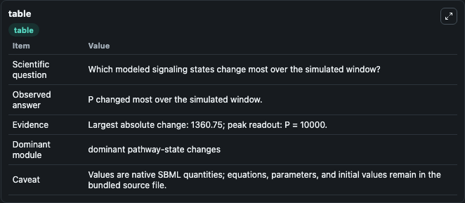
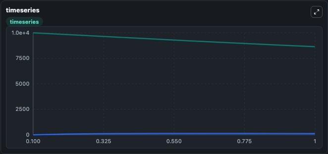
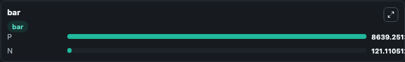

# Dasgupta2020 - Reduced model of receptor clusturing and aggregation

This Biosimulant lab wraps `Dasgupta2020 - Reduced model of receptor clusturing and aggregation` as a runnable signaling model with a companion visualization module.
Clean Biosimulant lab for systems signaling model: Dasgupta2020 - Reduced model of receptor clusturing and aggregation. It can be used to explore second-messenger and pathway-signaling dynamics and compare scenario outcomes across configurations.

## What You'll See

The lab asks: How does Dasgupta2020 - Reduced model of receptor clusturing and aggregation route receptor activity into cAMP/PKA-linked readouts? It runs for 1.0 time units with a communication step of 0.1. The run uses the model defaults declared by the curated SBML wrapper. The generated visualizations focus on source-defined P state, and source-defined N state, combining trajectory, endpoint-comparison, and summary-table views from one completed dark-mode run.

In this captured run, **P** moved from 1e+04 to 8639.3 across 1.0 simulation windows.

<!-- BIOSIMULANT_VISUALS_START -->
### Output Visualizations



*Summary table for Dasgupta2020 - Reduced model of receptor clusturing and aggregation, reporting the scientific question, observed answer, dominant module, and caveat.*



*Trajectories of P, and N across the 1.0 simulation. In this run **N** climbed from 0 to 121.1 and **P** fell from 1e+04 to 8639.3 — the largest movements among the focused observables.*



*Largest-excursion ranking of the focused observables — the absolute movement magnitude during the run. Top 2: **P** = 8639.3, **N** = 121.1.*

<!-- BIOSIMULANT_VISUALS_END -->

## Model Context

- Core model: `models/core`
- Visualization model: `models/visualisation`
- Standard: `other`
- Upstream source: `biomodels_ebi:BIOMD0000000973`
- License: `CC0`
- Visual scope: GPCR and cAMP/PKA signaling
- Caveat: Values are native SBML quantities; equations, parameters, units, and initial values remain in the bundled source file.

## Inputs

| Input | Maps To | Default | Notes |
|---|---|---|---|
| Initial source-defined P state | `signaling_sbml_dasgupta2020_reduced_model_of_receptor_clusturin_biomd0000000973_model.initial_source_defined_p_state` |  | Initial level of source-defined P state. Maps to SBML symbol `P`; exposed as a traceable initial-condition perturbation. |

## Outputs

| Output | Maps To | Role |
|---|---|---|
| `source_defined_p_state` | `signaling_sbml_dasgupta2020_reduced_model_of_receptor_clusturin_biomd0000000973_model.source_defined_p_state` | source-defined P state. |
| `source_defined_n_state` | `signaling_sbml_dasgupta2020_reduced_model_of_receptor_clusturin_biomd0000000973_model.source_defined_n_state` | source-defined N state. |
| `state` | `signaling_sbml_dasgupta2020_reduced_model_of_receptor_clusturin_biomd0000000973_model.state` | Available to the visualization model and downstream workflows. |
| `summary` | `signaling_sbml_dasgupta2020_reduced_model_of_receptor_clusturin_biomd0000000973_model.summary` | Available to the visualization model and downstream workflows. |
| `species_labels` | `signaling_sbml_dasgupta2020_reduced_model_of_receptor_clusturin_biomd0000000973_model.species_labels` | Available to the visualization model and downstream workflows. |

## Runtime

- Duration: `1.0`
- Communication step: `0.1`

## Running Locally

```bash
biosimulant labs serve .
```
