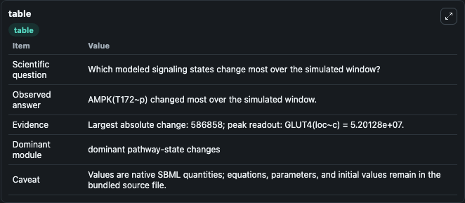
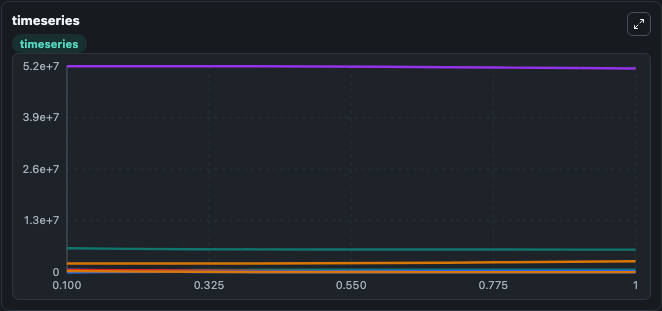
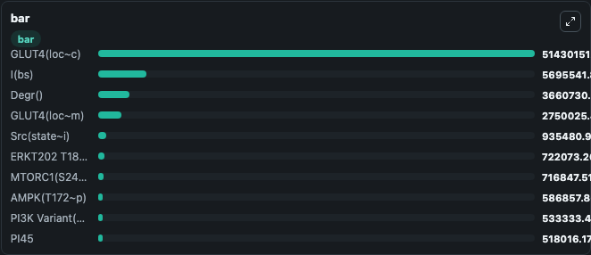

# DiCamillo2016 - Insulin signalling pathway - Rule-based model

This Biosimulant lab wraps `DiCamillo2016 - Insulin signalling pathway - Rule-based model` as a runnable signaling model with a companion visualization module.
Clean Biosimulant lab for metabolic and hormone-linked signaling. It can be used to explore second-messenger and pathway-signaling dynamics and compare scenario outcomes across configurations.

## What You'll See

The lab asks: How does DiCamillo2016 - Insulin signalling pathway - Rule-based model shift hormone-linked signaling readouts? It runs for 1.0 time units with a communication step of 0.1. The run uses the model defaults declared by the curated SBML wrapper. The generated visualizations focus on source-defined I(BS) state, insulin receptor NPXY Y999 U Alpha beta response parameter Loc M, insulin receptor NPXY Y999 U Alpha beta response parameter Loc C, IRS1 S636 U Y U Y896 YXXM, PI3K SH2, and PI3K Variant Y U, and related outputs, combining trajectory, endpoint-comparison, and summary-table views from one completed dark-mode run.

In this captured run, **AMPK(T172~p)** moved from 0 to 5.87e+05 across 1.0 simulation windows.

<!-- BIOSIMULANT_VISUALS_START -->
### Output Visualizations



*Summary table for DiCamillo2016 - Insulin signalling pathway - Rule-based model, reporting the scientific question, observed answer, dominant module, and caveat.*



*Trajectories of AMPK(T172~p), AMPK(T172~u), GLUT4(loc~m), GLUT4(loc~c), IRS1(S636~u,Y~u,Y896,YXXM), and I(bs) across the 1.0 simulation. In this run **AMPK(T172~p)** climbed from 0 to 5.87e+05 and **AMPK(T172~u)** fell from 5.87e+05 to 57.251 — the largest movements among the focused observables.*



*Largest-excursion ranking of the focused observables — the absolute movement magnitude during the run. Top 3: **GLUT4(loc~c)** = 5.14e+07, **I(bs)** = 5.7e+06, **Degr()** = 3.66e+06, with 7 more observables below.*

<!-- BIOSIMULANT_VISUALS_END -->

## Model Context

- Core model: `models/core`
- Visualization model: `models/visualisation`
- Standard: `other`
- Upstream source: `biomodels_ebi:BIOMD0000000833`
- License: `CC0`
- Visual scope: metabolic and hormone signaling response
- Caveat: Values are native SBML quantities; equations, parameters, units, and initial values remain in the bundled source file.

## Inputs

| Input | Maps To | Default | Notes |
|---|---|---|---|
| Amino Acids Input | `signaling_sbml_dicamillo2016_insulin_signalling_pathway_rule_ba_biomd0000000833_model.initial_amino_acids_input` |  | Amino Acids Input source parameter. Maps to SBML symbol `Amino_Acids_input` and preserves the bundled default. |

## Outputs

| Output | Maps To | Role |
|---|---|---|
| `akt_s474_u_t309_u` | `signaling_sbml_dicamillo2016_insulin_signalling_pathway_rule_ba_biomd0000000833_model.akt_s474_u_t309_u` | AKT S474 U T309 U. |
| `gs_sh2_state_a` | `signaling_sbml_dicamillo2016_insulin_signalling_pathway_rule_ba_biomd0000000833_model.gs_sh2_state_a` | GS SH2 State A. |
| `ras_gap_bs` | `signaling_sbml_dicamillo2016_insulin_signalling_pathway_rule_ba_biomd0000000833_model.ras_gap_bs` | RAS GAP Bs. |
| `state` | `signaling_sbml_dicamillo2016_insulin_signalling_pathway_rule_ba_biomd0000000833_model.state` | Available to the visualization model and downstream workflows. |
| `summary` | `signaling_sbml_dicamillo2016_insulin_signalling_pathway_rule_ba_biomd0000000833_model.summary` | Available to the visualization model and downstream workflows. |
| `species_labels` | `signaling_sbml_dicamillo2016_insulin_signalling_pathway_rule_ba_biomd0000000833_model.species_labels` | Available to the visualization model and downstream workflows. |

## Runtime

- Duration: `1.0`
- Communication step: `0.1`

## Running Locally

```bash
biosimulant labs serve .
```
