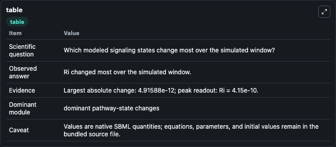
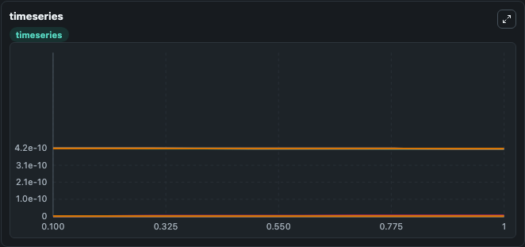
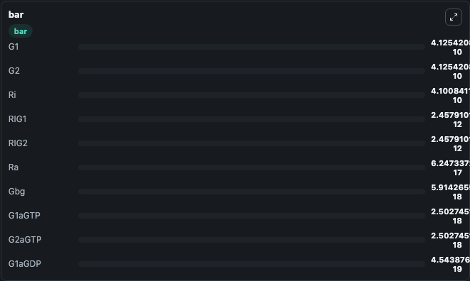

# Dual G protein Model

This Biosimulant lab wraps `Dual G protein Model` as a runnable signaling model with a companion visualization module.
Clean Biosimulant lab for systems signaling model: Dual G protein Model. It can be used to explore second-messenger and pathway-signaling dynamics and compare scenario outcomes across configurations.

## What You'll See

The lab asks: How does Dual G protein Model route receptor activity into cAMP/PKA-linked readouts? It runs for 1.0 time units with a communication step of 0.1. The run uses the model defaults declared by the curated SBML wrapper. The generated visualizations focus on source-defined L state, inactive ligand-receptor complex, source-defined RI state, source-defined RA state, active ligand-receptor complex, and source-defined G1 state, and related outputs, combining trajectory, endpoint-comparison, and summary-table views from one completed dark-mode run.

In this captured run, **Ri** moved from 4.15e-10 to 4.1e-10 across 1.0 simulation windows.

<!-- BIOSIMULANT_VISUALS_START -->
### Output Visualizations



*Summary table for Dual G protein Model, reporting the scientific question, observed answer, dominant module, and caveat.*



*Trajectories of Ri, G1, G2, RIG1, RIG2, and Ra across the 1.0 simulation. In this run **RIG1** climbed from 0 to 2.46e-12 and **Ri** fell from 4.15e-10 to 4.1e-10 — the largest movements among the focused observables.*



*Largest-excursion ranking of the focused observables — the absolute movement magnitude during the run. Top 3: **G1** = 4.13e-10, **G2** = 4.13e-10, **Ri** = 4.1e-10, with 7 more observables below.*

<!-- BIOSIMULANT_VISUALS_END -->

## Model Context

- Core model: `models/core`
- Visualization model: `models/visualisation`
- Standard: `other`
- Upstream source: `biomodels_ebi:MODEL2306210001`
- License: `CC0`
- Visual scope: GPCR and cAMP/PKA signaling
- Caveat: Values are native SBML quantities; equations, parameters, units, and initial values remain in the bundled source file.

## Inputs

| Input | Maps To | Default | Notes |
|---|---|---|---|
| Ligand Conc Added | `signaling_sbml_dual_g_protein_model_model2306210001_model.initial_ligand_conc_added_level` |  | Ligand Conc Added source parameter. Maps to SBML symbol `LigandConcAdded` and preserves the bundled default. |

## Outputs

| Output | Maps To | Role |
|---|---|---|
| `inactive_ligand_receptor_complex` | `signaling_sbml_dual_g_protein_model_model2306210001_model.inactive_ligand_receptor_complex` | inactive ligand-receptor complex. |
| `active_ligand_receptor_complex` | `signaling_sbml_dual_g_protein_model_model2306210001_model.active_ligand_receptor_complex` | active ligand-receptor complex. |
| `source_defined_rig1_state` | `signaling_sbml_dual_g_protein_model_model2306210001_model.source_defined_rig1_state` | source-defined RIG1 state. |
| `state` | `signaling_sbml_dual_g_protein_model_model2306210001_model.state` | Available to the visualization model and downstream workflows. |
| `summary` | `signaling_sbml_dual_g_protein_model_model2306210001_model.summary` | Available to the visualization model and downstream workflows. |
| `species_labels` | `signaling_sbml_dual_g_protein_model_model2306210001_model.species_labels` | Available to the visualization model and downstream workflows. |

## Runtime

- Duration: `1.0`
- Communication step: `0.1`

## Running Locally

```bash
biosimulant labs serve .
```
