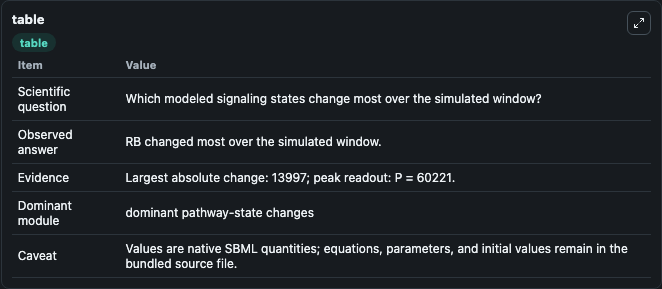
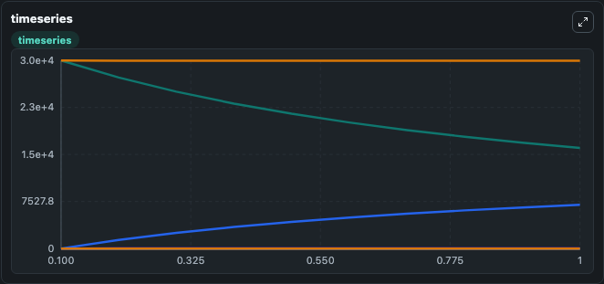
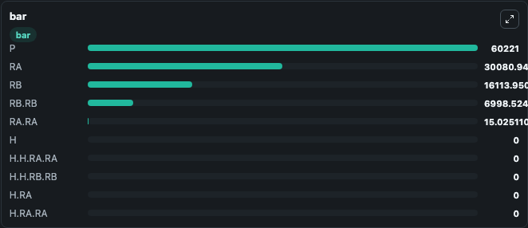

# Dupeux2011_ABAreceptor_Dimer

This Biosimulant lab wraps `Dupeux2011_ABAreceptor_Dimer` as a runnable signaling model with a companion visualization module.
Clean Biosimulant lab for systems signaling model: Dupeux2011_ABAreceptor_Dimer. It can be used to explore second-messenger and pathway-signaling dynamics and compare scenario outcomes across configurations.

## What You'll See

The lab asks: How does Dupeux2011 ABAreceptor Dimer route receptor activity into cAMP/PKA-linked readouts? It runs for 1.0 time units with a communication step of 0.1. The run uses the model defaults declared by the curated SBML wrapper. The generated visualizations focus on S0 0, H H RA RA, H H RB RB, source-defined H.RA state, H RA RA, and source-defined H.RB state, and related outputs, combining trajectory, endpoint-comparison, and summary-table views from one completed dark-mode run.

In this captured run, **RB** moved from 3.01e+04 to 1.61e+04 across 1.0 simulation windows.

<!-- BIOSIMULANT_VISUALS_START -->
### Output Visualizations



*Summary table for Dupeux2011_ABAreceptor_Dimer, reporting the scientific question, observed answer, dominant module, and caveat.*



*Trajectories of RB, RB.RB, RA, RA.RA, H, and H.H.RA.RA across the 1.0 simulation. In this run **RB.RB** climbed from 0 to 6998.5 and **RB** fell from 3.01e+04 to 1.61e+04 — the largest movements among the focused observables.*



*Largest-excursion ranking of the focused observables — the absolute movement magnitude during the run. Top 3: **P** = 6.02e+04, **RA** = 3.01e+04, **RB** = 1.61e+04, with 7 more observables below.*

<!-- BIOSIMULANT_VISUALS_END -->

## Model Context

- Core model: `models/core`
- Visualization model: `models/visualisation`
- Standard: `other`
- Upstream source: `biomodels_ebi:MODEL1202030000`
- License: `CC0`
- Visual scope: GPCR and cAMP/PKA signaling
- Caveat: Values are native SBML quantities; equations, parameters, units, and initial values remain in the bundled source file.

## Inputs

| Input | Maps To | Default | Notes |
|---|---|---|---|
| Initial S0 0 | `signaling_sbml_dupeux2011_abareceptor_dimer_model1202030000_model.initial_s0_0` |  | Initial level of S0 0. Maps to SBML symbol `s0_0`; exposed as a traceable initial-condition perturbation. |

## Outputs

| Output | Maps To | Role |
|---|---|---|
| `h_h_ra_ra` | `signaling_sbml_dupeux2011_abareceptor_dimer_model1202030000_model.h_h_ra_ra` | H H RA RA. |
| `h_h_rb_rb` | `signaling_sbml_dupeux2011_abareceptor_dimer_model1202030000_model.h_h_rb_rb` | H H RB RB. |
| `source_defined_h_ra_state` | `signaling_sbml_dupeux2011_abareceptor_dimer_model1202030000_model.source_defined_h_ra_state` | source-defined H.RA state. |
| `state` | `signaling_sbml_dupeux2011_abareceptor_dimer_model1202030000_model.state` | Available to the visualization model and downstream workflows. |
| `summary` | `signaling_sbml_dupeux2011_abareceptor_dimer_model1202030000_model.summary` | Available to the visualization model and downstream workflows. |
| `species_labels` | `signaling_sbml_dupeux2011_abareceptor_dimer_model1202030000_model.species_labels` | Available to the visualization model and downstream workflows. |

## Runtime

- Duration: `1.0`
- Communication step: `0.1`

## Running Locally

```bash
biosimulant labs serve .
```
