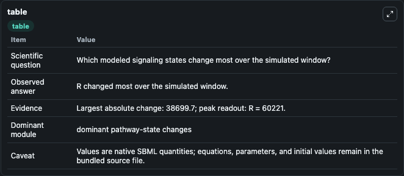
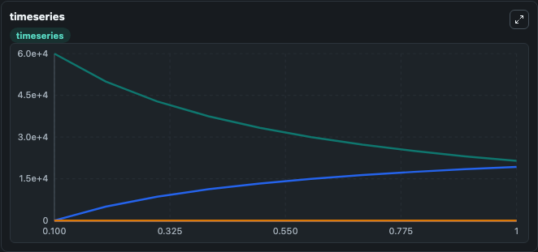
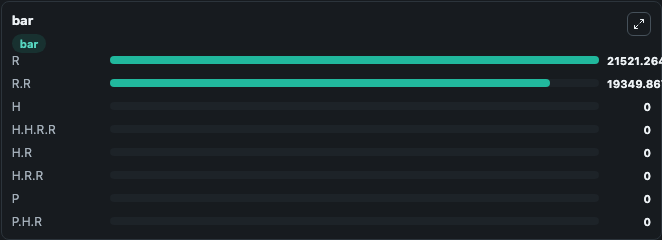

# Dupeux2011_ABAreceptor_Monomer

This Biosimulant lab wraps `Dupeux2011_ABAreceptor_Monomer` as a runnable signaling model with a companion visualization module.
Clean Biosimulant lab for systems signaling model: Dupeux2011_ABAreceptor_Monomer. It can be used to explore second-messenger and pathway-signaling dynamics and compare scenario outcomes across configurations.

## What You'll See

The lab asks: How does Dupeux2011 ABAreceptor Monomer route receptor activity into cAMP/PKA-linked readouts? It runs for 1.0 time units with a communication step of 0.1. The run uses the model defaults declared by the curated SBML wrapper. The generated visualizations focus on S0 0, source-defined H.H.R.R state, source-defined H.R state, source-defined H.R.R state, S0 4, and source-defined P.H.R state, and related outputs, combining trajectory, endpoint-comparison, and summary-table views from one completed dark-mode run.

In this captured run, **R** moved from 6.02e+04 to 2.15e+04 across 1.0 simulation windows.

<!-- BIOSIMULANT_VISUALS_START -->
### Output Visualizations



*Summary table for Dupeux2011_ABAreceptor_Monomer, reporting the scientific question, observed answer, dominant module, and caveat.*



*Trajectories of R, R.R, H, H.H.R.R, H.R, and H.R.R across the 1.0 simulation. In this run **R.R** climbed from 0 to 1.93e+04 and **R** fell from 6.02e+04 to 2.15e+04 — the largest movements among the focused observables.*



*Largest-excursion ranking of the focused observables — the absolute movement magnitude during the run. Top 3: **R** = 2.15e+04, **R.R** = 1.93e+04, **H** = 0, with 5 more observables below.*

<!-- BIOSIMULANT_VISUALS_END -->

## Model Context

- Core model: `models/core`
- Visualization model: `models/visualisation`
- Standard: `other`
- Upstream source: `biomodels_ebi:MODEL1202030001`
- License: `CC0`
- Visual scope: GPCR and cAMP/PKA signaling
- Caveat: Values are native SBML quantities; equations, parameters, units, and initial values remain in the bundled source file.

## Inputs

| Input | Maps To | Default | Notes |
|---|---|---|---|
| Initial S0 0 | `signaling_sbml_dupeux2011_abareceptor_monomer_model1202030001_model.initial_s0_0` |  | Initial level of S0 0. Maps to SBML symbol `s0_0`; exposed as a traceable initial-condition perturbation. |

## Outputs

| Output | Maps To | Role |
|---|---|---|
| `source_defined_h_h_r_r_state` | `signaling_sbml_dupeux2011_abareceptor_monomer_model1202030001_model.source_defined_h_h_r_r_state` | source-defined H.H.R.R state. |
| `source_defined_h_r_state` | `signaling_sbml_dupeux2011_abareceptor_monomer_model1202030001_model.source_defined_h_r_state` | source-defined H.R state. |
| `source_defined_h_r_r_state` | `signaling_sbml_dupeux2011_abareceptor_monomer_model1202030001_model.source_defined_h_r_r_state` | source-defined H.R.R state. |
| `state` | `signaling_sbml_dupeux2011_abareceptor_monomer_model1202030001_model.state` | Available to the visualization model and downstream workflows. |
| `summary` | `signaling_sbml_dupeux2011_abareceptor_monomer_model1202030001_model.summary` | Available to the visualization model and downstream workflows. |
| `species_labels` | `signaling_sbml_dupeux2011_abareceptor_monomer_model1202030001_model.species_labels` | Available to the visualization model and downstream workflows. |

## Runtime

- Duration: `1.0`
- Communication step: `0.1`

## Running Locally

```bash
biosimulant labs serve .
```
