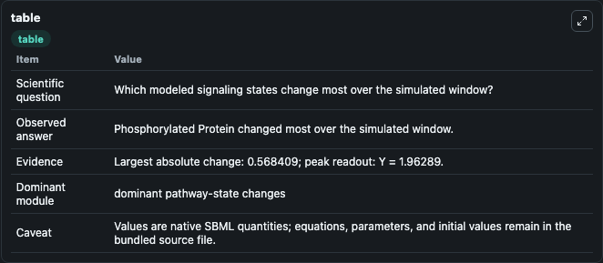
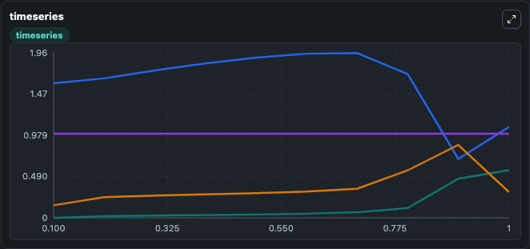
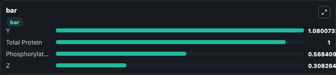

# Dupont1992_Ca_dpt_protein_phospho

This Biosimulant lab wraps `Dupont1992_Ca_dpt_protein_phospho` as a runnable signaling model with a companion visualization module.
Clean Biosimulant lab for systems signaling model: Dupont1992_Ca_dpt_protein_phospho. It can be used to explore second-messenger and pathway-signaling dynamics and compare scenario outcomes across configurations.

## What You'll See

The lab asks: How does Dupont1992 Ca dpt protein phospho express its source-modeled signaling motif over the baseline run? It runs for 1.0 time units with a communication step of 0.1. The run uses the model defaults declared by the curated SBML wrapper. The generated visualizations focus on Source Defined Z State, Source Defined Y State, Total Protein, and Phosphorylated Protein, combining trajectory, endpoint-comparison, and summary-table views from one completed dark-mode run.

In this captured run, **Phosphorylated Protein** moved from 0 to 0.5684 across 1.0 simulation windows.

<!-- BIOSIMULANT_VISUALS_START -->
### Output Visualizations



*Summary table for Dupont1992_Ca_dpt_protein_phospho, reporting the scientific question, observed answer, dominant module, and caveat.*



*Trajectories of Phosphorylated Protein, Y, Z, and Total Protein across the 1.0 simulation. In this run **Phosphorylated Protein** climbed from 0 to 0.5684 and **Y** fell from 1.600 to 1.080 — the largest movements among the focused observables.*



*Largest-excursion ranking of the focused observables — the absolute movement magnitude during the run. Top 3: **Y** = 1.080, **Total Protein** = 1.000, **Phosphorylated Protein** = 0.5684, with 1 more observable below.*

<!-- BIOSIMULANT_VISUALS_END -->

## Model Context

- Core model: `models/core`
- Visualization model: `models/visualisation`
- Standard: `other`
- Upstream source: `biomodels_ebi:BIOMD0000000113`
- License: `CC0`
- Visual scope: phosphorylation and regulatory motif dynamics
- Caveat: Values are native SBML quantities; equations, parameters, units, and initial values remain in the bundled source file.

## Inputs

| Input | Maps To | Default | Notes |
|---|---|---|---|
| Initial source-defined Z state | `signaling_sbml_dupont1992_ca_dpt_protein_phospho_biomd0000000113_model.initial_source_defined_z_state` |  | Initial level of source-defined Z state. Maps to SBML symbol `Z`; exposed as a traceable initial-condition perturbation. |

## Outputs

| Output | Maps To | Role |
|---|---|---|
| `phosphorylated_protein` | `signaling_sbml_dupont1992_ca_dpt_protein_phospho_biomd0000000113_model.phosphorylated_protein` | Phosphorylated Protein. |
| `total_protein` | `signaling_sbml_dupont1992_ca_dpt_protein_phospho_biomd0000000113_model.total_protein` | Total Protein. |
| `source_defined_z_state` | `signaling_sbml_dupont1992_ca_dpt_protein_phospho_biomd0000000113_model.source_defined_z_state` | Source Defined Z State. |
| `state` | `signaling_sbml_dupont1992_ca_dpt_protein_phospho_biomd0000000113_model.state` | Available to the visualization model and downstream workflows. |
| `summary` | `signaling_sbml_dupont1992_ca_dpt_protein_phospho_biomd0000000113_model.summary` | Available to the visualization model and downstream workflows. |
| `species_labels` | `signaling_sbml_dupont1992_ca_dpt_protein_phospho_biomd0000000113_model.species_labels` | Available to the visualization model and downstream workflows. |

## Runtime

- Duration: `1.0`
- Communication step: `0.1`

## Running Locally

```bash
biosimulant labs serve .
```
